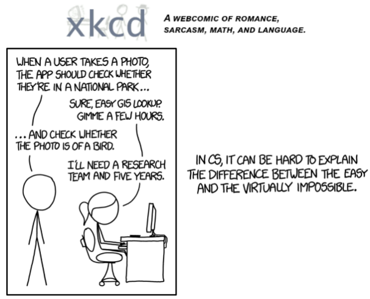
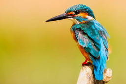
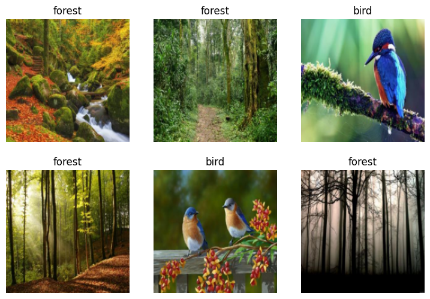

# 它是一只鸟吗？ 从您自己的数据创建模型

```python
#NB: Kaggle requires phone verification to use the internet or a GPU. If you haven't done that yet, the cell below will fail
#    This code is only here to check that your internet is enabled. It doesn't do anything else.
#    Here's a help thread on getting your phone number verified: https://www.kaggle.com/product-feedback/135367

import socket,warnings
try:
    socket.setdefaulttimeout(1)
    socket.socket(socket.AF_INET, socket.SOCK_STREAM).connect(('1.1.1.1', 53))
except socket.error as ex: raise Exception("STOP: No internet. Click '>|' in top right and set 'Internet' switch to on")
```


```python
# It's a good idea to ensure you're running the latest version of any libraries you need.
# `!pip install -Uqq <libraries>` upgrades to the latest version of <libraries>
# NB: You can safely ignore any warnings or errors pip spits out about running as root or incompatibilities
import os
iskaggle = os.environ.get('KAGGLE_KERNEL_RUN_TYPE', '')

if iskaggle:
    !pip install -Uqq fastai 'duckduckgo_search>=6.2'
```

2015 年，创建一个可以识别鸟类的计算机系统的想法被认为非常具有挑战性，以至于它成为这个 XKCD 笑话的基础：



但今天，我们只需几分钟就可以使用完全免费的资源做到这一点！
我们将采取的基本步骤是：

1. 使用 DuckDuckGo 搜索“鸟照片”的图片
2. 使用 DuckDuckGo 搜索“森林照片”的图片
3. 微调预训练的神经网络以识别这两组
4. 尝试在鸟的图片上运行此模型，看看它是否有效。
## Step 1: 下载鸟类和非鸟类的图像


```python
from duckduckgo_search import DDGS #DuckDuckGo has changed the api so we need to update 
from fastcore.all import *

def search_images(keywords, max_images=200): return L(DDGS().images(keywords, max_results=max_images)).itemgot('image')
import time, json
```

让我们从搜索鸟照片开始，看看我们得到什么样的结果。我们首先从搜索中获取 URL：

```python
#NB: `search_images` depends on duckduckgo.com, which doesn't always return correct responses.
#    If you get a JSON error, just try running it again (it may take a couple of tries).
urls = search_images('bird photos', max_images=1)
urls[0]
```

```
'https://images.pexels.com/photos/326900/pexels-photo-326900.jpeg?cs=srgb&dl=wood-flight-bird-326900.jpg&fm=jpg'
```

...然后下载图片并查看它：
```python
from fastdownload import download_url
dest = 'bird.jpg'
download_url(urls[0], dest, show_progress=False)

from fastai.vision.all import *
im = Image.open(dest)
im.to_thumb(256,256)
```




现在让我们下载“森林照片”并压缩事情：

```python
download_url(search_images('forest photos', max_images=1)[0], 'forest.jpg', show_progress=False)
Image.open('forest.jpg').to_thumb(256,256)
```


我们搜索到了想要的结果，所以让我们再多下载一些“鸟”和“森林”的照片，并将它们保存到不同的文件夹中：
```python
searches = 'forest','bird'
path = Path('bird_or_not')

for o in searches:
    dest = (path/o)
    dest.mkdir(exist_ok=True, parents=True)
    download_images(dest, urls=search_images(f'{o} photo'))
    time.sleep(5)
    resize_images(path/o, max_size=400, dest=path/o)
```

## Step 2: 训练我们的模型

有些照片可能无法正确下载，这可能会导致模型训练失败，因此需要删除它们：
```python
failed = verify_images(get_image_files(path))
failed.map(Path.unlink)
len(failed)
```

为了训练模型，我们需要 `DataLoaders`，它是一个包含训练集（用于创建模型的图像）和验证集（用于检查模型准确性的图像--训练期间未使用的数据）。 在 `fastai` 中，我们可以使用 `DataBlock` 轻松创建它，并从中查看示例图像：
```python
dls = DataBlock(
    blocks=(ImageBlock, CategoryBlock), 
    get_items=get_image_files, 
    splitter=RandomSplitter(valid_pct=0.2, seed=42),
    get_y=parent_label,
    item_tfms=[Resize(192, method='squish')]
).dataloaders(path, bs=32)

dls.show_batch(max_n=6)
```



每个 `DataBlock` 参数的含义如下：

```
blocks=(ImageBlock, CategoryBlock),

```

我们模型的输入是图像，输出是类别（在本例中为“鸟”或“森林”）。

```
get_items=get_image_files, 

```

要查找模型的所有输入，请运行 `get_image_files` 函数（它返回路径中所有图像文件的列表）。

```
splitter=RandomSplitter(valid_pct=0.2, seed=42),

```

将数据随机分为训练集和验证集，使用 20% 的数据作为验证集。`seed`是随机数种子，一般是一个固定的整数，它用来初始化生成随机数的算法。通过设置相同的种子，你可以确保在不同的机器或者不同的时间执行相同的代码时，得到相同的随机结果。42 是一个常见的随机数种子（也许有些人觉得它是一个“神秘的”数字），其实可以使用任何整数值，只要它们固定，就能保证一致的划分结果。

```
get_y=parent_label,

```

标签（`y` 值）是每个文件的 `parent` 的名称（即它们所在的文件夹的名称，可以是 `bird` 或 `forest`）。

```
item_tfms=[Resize(192, method='squish')]

```

Before training, resize each image to 192x192 pixels by "squishing" it (as opposed to cropping it).  
在训练之前，通过`squish`图像（而不是裁剪图像）将每个图像的大小调整为 192x192 像素。

现在我们准备好训练我们的模型了。 最快广泛使用的计算机视觉模型是`resnet18`。 即使在 CPU 上，也可以在几分钟内对其进行训练！ （在 GPU 上，通常需要不到 10 秒......）

`fastai` 附带了一个有用的 `fine_tune()` 方法，该方法自动使用最佳实践来微调预训练模型，因此我们将使用它。

```python
learn = vision_learner(dls, resnet18, metrics=error_rate)
learn.fine_tune(3)
```
• 参数3表示: 这个参数表示微调的训练轮数（epochs）。在这里，模型会在数据集上进行 3 个训练周期（epochs）的微调。

```
Downloading: "https://download.pytorch.org/models/resnet18-f37072fd.pth" to /root/.cache/torch/hub/checkpoints/resnet18-f37072fd.pth
100%|██████████| 44.7M/44.7M [00:00<00:00, 84.4MB/s]
```

|epoch|train_loss|valid_loss|error_rate|time|
|---|---|---|---|---|
|0|0.783741|0.634016|0.214286|00:01|

|epoch|train_loss|valid_loss|error_rate|time|
|---|---|---|---|---|
|0|0.045509|0.020604|0.000000|00:01|
|1|0.026428|0.000642|0.000000|00:01|
|2|0.017754|0.000184|0.000000|00:01|

一般来说，当我运行此程序时，我会看到验证集的准确性为 100%（尽管每次运行可能会有所不同）。
“微调”模型意味着我们从其他人使用其他数据集训练的模型（称为预训练模型）开始，并稍微调整权重，以便模型学会识别您的特定数据集。 在本例中，预训练模型经过训练，可以识别 imagenet 中的照片以及广泛使用的计算机视觉数据集，其中图像涵盖 1000 个类别）有关微调的详细信息及其重要性，请查看免费的 [fast.ai课程](https://course.fast.ai/)。

## Step 3: 第 3 步：使用我们的模型（构建您自己的模型！）

让我们看看我们的模型对我们一开始下载的那只鸟有什么看法：

```python
is_bird,_,probs = learn.predict(PILImage.create('bird.jpg'))
print(f"This is a: {is_bird}.")
print(f"Probability it's a bird: {probs[0]:.4f}")
```


```
This is a: bird.
Probability it's a bird: 1.0000
```

Good job, resnet18

因此，正如所看到的，在几年的时间里，创建计算机视觉分类模型已经从“难得像一个笑话”变成了“非常简单且免费”！
这不仅仅是在计算机视觉领域。 得益于深度学习，计算机现在可以做许多几年前看似不可能的事情，包括[创作令人惊叹的艺术品](https://openai.com/dall-e-2/)和[解释笑话](https://www.datanami.com/2022/04/22/googles-massive-new-language-model-can-explain-jokes/)。 它的发展速度如此之快，以至于即使是该领域的专家也很难预测它在未来几年将如何影响社会。
有一点很明确——我们所有人都必须尽力理解这项技术，这一点很重要，否则我们就会落后！

现在轮到你了。 单击[此页面](https://www.kaggle.com/code/jhoward/is-it-a-bird-creating-a-model-from-your-own-data)的“Copy & Edit”并尝试使用您自己的图像搜索创建您自己的图像分类器！

如果您喜欢这个，请考虑点击右上角的“投票”按钮——知道人们何时欣赏我们的工作对我们笔记本作者来说是非常鼓舞人心的。