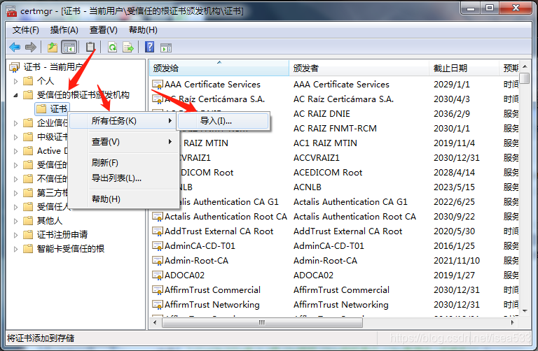

## 生成 CA 证书

```shell
# 生成 KEY
openssl genrsa -out ca.key 4096

# 生成证书
openssl req -x509 -new -nodes -sha512 -days 3650 \
    -subj "/C=CN/ST=省/L=市/O=组织/OU=组织单位/CN=常用名(或域名)" \
    -key ca.key \
    -out ca.crt
```

## 导入 CA 证书


内部人员需要把该 ca.crt 证书添加到受信任的根证书中，这样通过改 CA 证书生成的其他证书也会被信任。

### Windows

Windows 运行输入 certmgr.msc 然后添加。操作如下图所示：



### CentOS导入 CA 证书

```shell
# 如果没有 ca-certificates 就安装
yum install -y ca-certificates

# 把 ca.crt 证书放到下面目录
/etc/pki/ca-trust/source/anchors

# 执行下面命令更新证书
update-ca-trust

# 如果根证书是以 *.pem 结尾，需要转换成crt，然后再执行上述步骤。命令如下：
openssl x509 -in ca.pem -inform PEM -out ca.crt
```

### Debian导入CA证书

```shell
# 一般情况下应该是已经有安装的了
apt-get install ca-certificates

# 建立local目录是为了方便区分这是自己填加的证书，可以自定义，但一定要在/usr/share/ca-certificates目录下
mkdir -p /usr/share/ca-certificates/local 

# 如果根证书是以 *.pem 结尾，需要转换成crt，然后再执行上述步骤。命令如下：
openssl x509 -in ca.pem -inform PEM -out ca.crt

# 将CA证书复制至/usr/share/ca-certificates/local目录

# 执行下面命令后会进入一个图形化界面，第一个界面选yes，然后选中刚刚添加的证书，回车即可
dpkg-reconfigure ca-certificates 
```

## 使用 CA 证书生成其他证书

例如生成泛域名证书：

```shell
# 生成 KEY
openssl genrsa -out *.majiang.com.key 4096

# 生成证书请求
openssl req -sha512 -new \
  -subj "/C=CN/ST=河北省/L=石家庄市/O=MJ/OU=MJ/CN=*.majiang.com" \
  -key *.majiang.com.key \
  -out *.majiang.com.csr

# 设置证书信息，主要是泛域名时，可以指定额外的 x.com
cat > majiang.com.ext <<-EOF
authorityKeyIdentifier=keyid,issuer
basicConstraints=CA:FALSE
keyUsage = digitalSignature, nonRepudiation, keyEncipherment, dataEncipherment
extendedKeyUsage = serverAuth 
subjectAltName = @alt_names

[alt_names]
DNS.1=*.majiang.com
DNS.2=majiang.com
EOF

# 使用 CA 证书生成具体的证书
openssl x509 -req -sha512 -days 3650 \
    -extfile majiang.com.ext \
    -CA ca.crt -CAkey ca.key -CAcreateserial \
    -in *.majiang.com.csr \
    -out *.majiang.com.crt
```


操作过程中生成的下面两个关键的文件：

私钥：`*.majiang.com.key`
公钥：`*.majiang.com.crt`
网站配置使用上面两个文件即可。

参考链接

https://blog.csdn.net/isea533/article/details/106397248

https://github.com/goharbor/harbor/blob/v1.9.3/docs/configure_https.md
https://gist.github.com/Soarez/9688998