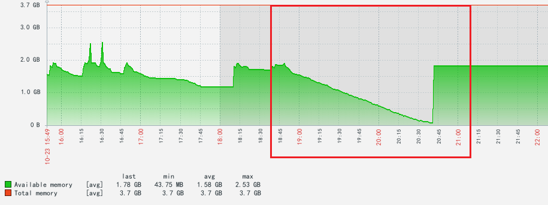
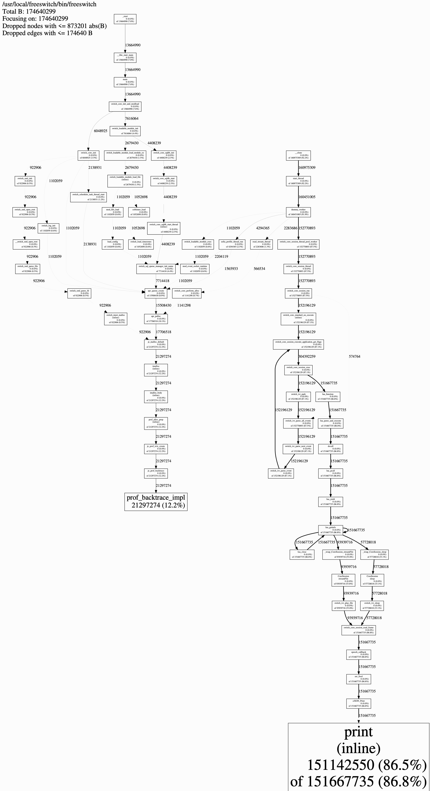

## 背景

公司的一台 Freeswitch 软交换机在之前开发了一个自定义的基于 Websocket 的 ASR 模块。

这个模块会在每次拨打机器人外呼时运行，监听电话的语音流，通过 Websocket 发送给 ASR 接口。并同时监听 WebSocket 的返回，如果有返回则通过 Freeswitch 的 ASR 模块扩展接口触发 Lua 的回调函数，Lua 回调会发送 Event 事件通知 Java 服务。

这个模块在运行一段时间之后发现 Freeswitch 就会崩溃。通过 Zabbix 发现机器的可用内存会持续降低。




并且排查系统日志，看到相同时间 Freeswitch 被系统 Kill 掉。可以确认是因为 Freeswitch内存泄漏导致的。

```sh
[root@wyn-fs-02 ~]# dmesg | grep -i "kill"
[87068.056478] in:imjournal invoked oom-killer: gfp_mask=0x201da, order=0, oom_score_adj=0
[87068.060698]  [<ffffffffa49cd3c5>] oom_kill_process+0x2d5/0x4a0
[87068.061095]  [<ffffffffa49ccd8d>] ? oom_unkillable_task+0xcd/0x120
[87068.132781] Out of memory: Kill process 1705 (freeswitch) score 482 or sacrifice child
[87068.133635] Killed process 1705 (freeswitch), UID 0, total-vm:3770896kB, anon-rss:1925484kB, file-rss:0kB, shmem-rss:0kB
[87068.140076] in:imjournal invoked oom-killer: gfp_mask=0x201da, order=0, oom_score_adj=0
[87068.147021]  [<ffffffffa49cd3c5>] oom_kill_process+0x2d5/0x4a0
[87068.147658]  [<ffffffffa49ccd8d>] ? oom_unkillable_task+0xcd/0x120
[87068.236909] Out of memory: Kill process 1727 (freeswitch) score 483 or sacrifice child
[87068.237622] Killed process 1727 (freeswitch), UID 0, total-vm:3770896kB, anon-rss:1928716kB, file-rss:0kB, shmem-rss:0kB
[100910.662047] gmain invoked oom-killer: gfp_mask=0x201da, order=0, oom_score_adj=0
[100910.668484]  [<ffffffffa49cd3c5>] oom_kill_process+0x2d5/0x4a0
[100910.669139]  [<ffffffffa49ccd8d>] ? oom_unkillable_task+0xcd/0x120
[100910.782806] Out of memory: Kill process 6691 (freeswitch) score 489 or sacrifice child
[100910.784072] Killed process 6691 (freeswitch), UID 0, total-vm:3826532kB, anon-rss:1952492kB, file-rss:0kB, shmem-rss:0kB
[203440.310492] in:imjournal invoked oom-killer: gfp_mask=0x201da, order=0, oom_score_adj=0
[203440.316740]  [<ffffffffa49cd3c5>] oom_kill_process+0x2d5/0x4a0
[203440.317352]  [<ffffffffa49ccd8d>] ? oom_unkillable_task+0xcd/0x120
[203440.390917] Out of memory: Kill process 16512 (freeswitch) score 476 or sacrifice child
[203440.391793] Killed process 16512 (freeswitch), UID 0, total-vm:3896204kB, anon-rss:1902280kB, file-rss:0kB, shmem-rss:0kB
```

并且用 htop 监控 Freeswitch 的进程发现只要一开启 ASR 模块，内存占用就开始往上涨并且不会下降。


## 解决过程

看到上述问题，初步怀疑是模块使用的 Websocket 库 [Websocketpp](https://github.com/zaphoyd/websocketpp) 的相关对象等可能没有手动回收内存。开始着手检查。

### 问题1 链接关闭时没有销毁相关的消息列表

经过检查，发现Websocket 库的 Client 及相关链接对象都是使用的C++11的`shared_ptr`或 `weak_ptr`等智能指针标准库进行管理。

不过，在 Websocket Client 对象当中有一个自定义属性`std::vector<std::string> m_messages;` 这个队列记录了接收到的所有消息，但是在链接关闭时没有清空，需要手动清空。在重启 Freeswitch 后发现内存还是会一直增长，但是会有一些回收，虽然造成了一些内存泄漏，但是不是主要原因。这个问题也比较容易发现，可以直接查找代码发现。

### 问题2 CJSON 的 CJSON_Print 方法转换的字符串需要手动清除


在发现还有问题后，检查了一遍代码，感觉只是看代码是检查不出来了。通过调研，先是使用的valgrind来查内存泄漏。

> Valgrind 是一款综合性的程序分析工具，主要用于内存管理的调试、内存泄漏检测、并发错误检测和性能分析。它适用于 C、C++、Fortran 等语言编写的程序，帮助开发者发现程序中的各种隐蔽问题。Valgrind 本质上是一个虚拟化的执行环境，它将你的程序加载进一个动态二进制翻译器中执行，并对内存的使用情况进行监控。


#### valgrind

Contenos直接使用`yum install valgrind`进行安装。

安转完成后，运行下面的指令检查

```sh
valgrind --leak-check=full freeswitch
```

检查结果

```sh
==11979== Memcheck, a memory error detector
==11979== Copyright (C) 2002-2017, and GNU GPL'd, by Julian Seward et al.
==11979== Using Valgrind-3.15.0 and LibVEX; rerun with -h for copyright info
==11979== Command: freeswitch
==11979==
Cannot lock pid file /usr/local/freeswitch/run/freeswitch.pid.
==11979==
==11979== HEAP SUMMARY:
==11979==     in use at exit: 46,272 bytes in 25 blocks
==11979==   total heap usage: 29 allocs, 4 frees, 120,232 bytes allocated
==11979==
==11979== LEAK SUMMARY:
==11979==    definitely lost: 0 bytes in 0 blocks
==11979==    indirectly lost: 0 bytes in 0 blocks
==11979==      possibly lost: 24,576 bytes in 3 blocks
==11979==    still reachable: 21,696 bytes in 22 blocks
==11979==         suppressed: 0 bytes in 0 blocks
==11979== Rerun with --leak-check=full to see details of leaked memory
==11979==
==11979== For lists of detected and suppressed errors, rerun with: -s
==11979== ERROR SUMMARY: 0 errors from 0 contexts (suppressed: 0 from 0)
```

可以看到没有检测出来 `definitely` 的明确内存泄漏，都是一些“一次性”的泄漏。。所以猜测是一些“still reachable”的内存越来越多导致的，“still reachable”指的是能被引用的内存，内存泄漏是内存无法被引用到，但是能被引用的内存不一定是还在使用的内存，比如不断向一个链表里面写数据而没有删除动作，那么这个链表就会一直增大，虽然可能只有最新的10个数据有在用，但是没有把旧的数据释放，这个虽然不是严格的内存泄漏，但也会造成了内存不断增大。

目前来看就是借助其他办法分析现在 Freeswitch 的内存分布。


#### jemalloc

Google 了一番，找到一个C++内存分析工具 [jemalloc](https://github.com/jemalloc/jemalloc)。该工具能分析 C++程序的内存分布，帮助检查哪个环节分配了过多的内存。

> jemalloc 是一个高效的内存分配库，设计用于提升系统性能、减少内存碎片和优化多线程程序的内存管理。最初由 Facebook 开发，jemalloc 被广泛应用于需要高性能和高并发支持的环境，如数据库系统、Web 服务器和缓存服务。以下是 jemalloc 的一些关键特点：
>
> 1. **内存碎片优化**：jemalloc 使用分级分配策略和延迟归还内存技术，以有效减少内存碎片问题，特别是在需要频繁分配和释放内存的应用中，表现出更稳定的内存使用率。
>
> 2. **多线程优化**：jemalloc 针对多线程环境进行了深度优化，通过线程本地缓存（thread-local caching）技术大幅减少了内存锁竞争，提升了多线程程序的并发性能。
>
> 3. **分配效率高**：jemalloc 使用多级分配池（arenas）和分级桶（bins）来高效管理不同大小的内存分配需求，减少了内存分配器的开销。
>
> 4. **诊断工具支持**：jemalloc 提供了丰富的调试和诊断功能，可以生成内存分配日志和统计数据，帮助开发人员分析内存分配情况和优化程序内存使用。
>
> 5. **与 glibc 兼容**：在 Linux 系统上，jemalloc 可作为 glibc 的替代内存分配器使用，应用程序只需简单配置即可使用 jemalloc 而无需代码修改。


##### 安装步骤

```sh
wget https://github.com/jemalloc/jemalloc/releases/download/5.3.0/jemalloc-5.3.0.tar.bz2
bzip2 -d jemalloc-5.3.0.tar.bz2
tar -xf jemalloc-5.3.0.tar
cd jemalloc-5.3.0
./autogen.sh
./configure --prefix=/usr/local --enable-prof
make
make install
```

内存分布接转出 PDF 需要依赖这两个工具，直接通过`yum`安装。

```sh
yum install graphviz
yum install ghostscript
```

##### 使用

要在应用中使用 jemalloc，一般可以通过 LD_PRELOAD 将其加载，或在编译阶段直接链接 jemalloc 库。例如，在 Linux 上可以使用以下命令强制应用使用 jemalloc：

```sh
MALLOC_CONF=prof:true,lg_prof_interval:27 LD_PRELOAD=/usr/local/lib/libjemalloc.so.2 freeswitch
```

> 命令详解
>
> **1. MALLOC_CONF 环境变量**
>
> jemalloc 支持通过 MALLOC_CONF 环境变量传递配置选项，这里使用了以下参数：
>
> ​	•prof:true：开启内存分配分析（profiling）功能，帮助检测和分析应用中的内存使用情况。
>
> ​	•lg_prof_interval:27：设置内存分配采样间隔的对数值。27 表示间隔为 2^27 字节，即每分配 128MB 内存进行一次采样。
>
> **2. LD_PRELOAD 环境变量**
>
> ​	•LD_PRELOAD=/usr/local/lib/libjemalloc.so.2：指定在程序启动时预加载 jemalloc 库，以替换默认的内存分配函数 (malloc、free 等)。/usr/local/lib/libjemalloc.so.2 是 jemalloc 库的路径。
>
> **3. freeswitch**
>
> ​	•freeswitch：启动 Freeswitch 应用程序，应用上述 jemalloc 设置。

运行下面的命令可以把单次采样文件转换为 PDF 内存报告

```sh
jeprof --show_bytes --pdf /usr/local/freeswitch/bin/freeswitch  jeprof.1842.42.i42.heap > output1.pdf
```

注意这里有一个坑，可执行文件的路径必须是执行文件的绝对路径，不能是 bin 目录下的软连接。

##### 报告

下面是报告的完整截图，可以看到每个方法分配的内存大小还有层级调用关系。



可以看到 `Print(inline) `方法分配了 86% 的内存。该方法的调用栈是 `cJson_Print` -> `asr_feed`。`asr_feed`方法会通过 Websocket 发送所有音频数据，每帧音频都是通过使用 JSON 格式发送，通过`cJSON_Print `将 JSON 数据结构转换为一个字符串，并返回一个动态分配的字符串指针。但是由于这个返回的字符串是通过 `malloc` 或 `realloc` 直接分配在堆上，所以必须使用 `free()` 函数手动释放，否则，这部分内存将会造成内存泄露。

即使 `cJSON_Print` 的指针是局部变量，并且已经销毁了这个指针，内存仍然会保留在堆上，并且依然是标记为“可达到的”（reachable）状态。这就是内存泄露的主要原因。

##### 可达到内存

“**Reachable（可达到）**” 是内存的概念，通常出现在内存泄漏检查工具（例如 Valgrind）的报告中，表示虽然程序不再需要使用这部分内存，或者已经没有明确的指针指向它，但从技术上讲，内存管理系统仍然可以找到它并访问它。

要理解这个问题，我们可以从内存管理和指针的生命周期两个方面来分析：

**1. 堆内存的分配和释放**

在调用 `cJSON_Print()` 时，它返回一个动态分配的字符串，内存分配是在 **堆** 上完成的。这意味着，程序员必须手动释放这块内存（通过 free()）。即使局部变量指针已经销毁，这块堆内存仍然会存在，直到被明确释放或程序结束。

```c
// json_str 是局部变量，指向堆上的内存

char *json_str = cJSON_Print(json_data); // 堆内存分配
```

当你离开这个函数或作用域时，json_str 指针本身可能会被销毁或失效，但堆上的内存依然存在。这就是为什么它仍然会被视为**reachable**：因为堆上分配的内存没有释放，操作系统或内存管理器可以通过堆的内存结构访问它。

**2. 可达到 vs 不可达到**

​	•**可达到 (reachable)**：指分配的内存块在程序中**尚未被释放**，并且从技术上，内存管理器仍然可以通过某些方式找到它们，尽管它们可能不再被局部变量或指针直接引用。

​	•**不可达到 (unreachable)**：如果没有任何指针或引用指向这块内存，而且你无法通过正常的编程手段找到这块内存，那么这部分内存就变成“不可达到”的了。此时，它会被标记为未使用内存，等到程序结束时才会回收。


