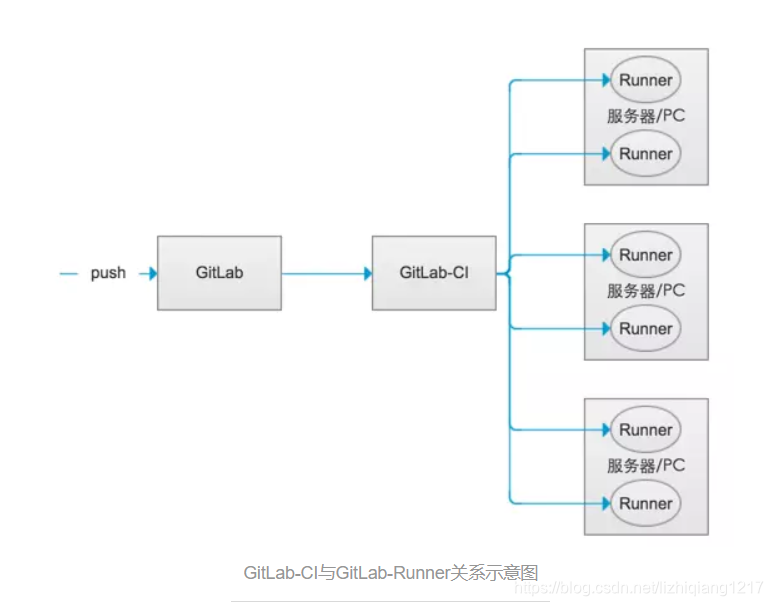

GitLab CI/CD 是一个内置在GitLab中的工具，用于通过持续方法进行软件开发：

- Continuous Integration (CI) 持续集成
- Continuous Delivery (CD)   持续交付
- Continuous Deployment (CD)  持续部署

持续集成的工作原理是将小的代码块推送到Git仓库中托管的应用程序代码库中，并且每次推送时，都要运行一系列脚本来构建、测试和验证代码更改，然后再将其合并到主分支中。

持续交付和部署相当于更进一步的CI，可以在每次推送到仓库默认分支的同时将应用程序部署到生产环境。

这些方法使得可以在开发周期的早期发现bugs和errors，从而确保部署到生产环境的所有代码都符合为应用程序建立的代码标准。

GitLab CI/CD 由一个名为 .gitlab-ci.yml 的文件进行配置，改文件位于仓库的根目录下。文件中指定的脚本由GitLab Runner执行。

它涉及到在每次小的迭代中就不断地构建、测试和部署代码更改，从而减少了基于已经存在bug或失败的先前版本开发新代码的机会。

###### Continuous Integration（持续集成）

假设一个应用程序，其代码存储在GitLab的Git仓库中。开发人员每天都要多次推送代码更改。对于每次向仓库的推送，你都可以创建一组脚本来自动构建和测试你的应用程序，从而减少了向应用程序引入错误的机会。这种做法称为持续集成，对于提交给应用程序（甚至是开发分支）的每项更改，它都会自动连续进行构建和测试，以确保所引入的更改通过你为应用程序建立的所有测试，准则和代码合规性标准。 

###### Continuous Delivery（持续交付）

持续交付是超越持续集成的更进一步的操作。应用程序不仅会在推送到代码库的每次代码更改时进行构建和测试，而且，尽管部署是手动触发的，但作为一个附加步骤，它也可以连续部署。此方法可确保自动检查代码，但需要人工干预才能从策略上手动触发以必输此次变更。

###### Continuous Deployment（持续部署）

与持续交付类似，但不同之处在于，你无需将其手动部署，而是将其设置为自动部署。完全不需要人工干预即可部署你的应用程序。 

 ## 基本 CI/CD 工作流程

一旦你将提交推送到远程仓库的分支上，那么你为该项目设置的CI/CD管道将会被触发。GitLab CI/CD 的执行步骤如下图所示： 


通过GitLab UI所有的步骤都是可视化的。

深入研究基本工作流程，则可以在DevOps生命周期的每个阶段看到GitLab中可用的功能，如下图所示：


1. Verify

- 通过持续集成自动构建和测试你的应用程序
- 使用GitLab代码质量（GitLab Code Quality）分析你的源代码质量
- 通过浏览器性能测试（Browser Performance Testing）确定代码更改对性能的影响
- 执行一系列测试，比如Container Scanning , Dependency Scanning , JUnit tests
- 用Review Apps部署更改，以预览每个分支上的应用程序更改 

2. Package

- 用Container Registry存储Docker镜像
- 用NPM Registry存储NPM包
- 用Maven Repository存储Maven artifacts
- 用Conan Repository存储Conan包 

3. Release

- 持续部署，自动将你的应用程序部署到生产环境
- 持续交付，手动点击以将你的应用程序部署到生产环境
- 用GitLab Pages部署静态网站
- 仅将功能部署到一个Pod上，并让一定比例的用户群通过Canary Deployments访问临时部署的功能（PS：即灰度发布）
- 在Feature Flags之后部署功能
- 用GitLab Releases将发布说明添加到任意Git tag
- 使用Deploy Boards查看在Kubernetes上运行的每个CI环境的当前运行状况和状态
- 使用Auto Deploy将应用程序部署到Kubernetes集群中的生产环境 

使用GitLab CI/CD，还可以：

- 通过Auto DevOps轻松设置应用的整个生命周期
- 将应用程序部署到不同的环境
- 安装你自己的GitLab Runner
- Schedule pipelines
- 使用安全测试报告（Security Test reports）检查应用程序漏洞 

# GitLab Runner

1. GitLab-CI
    GitLab-CI就是一套配合GitLab使用的持续集成系统（当然，还有其它的持续集成系统，同样可以配合GitLab使用，比如Jenkins）。而且GitLab8.0以后的版本是默认集成了GitLab-CI并且默认启用的。
2. GitLab-Runner
    GitLab-Runner是配合GitLab-CI进行使用的。GitLab里面的每一个工程都会定义一个属于这个工程的软件集成脚本，用来自动化地完成一些软件集成工作。当这个工程的仓库代码发生变动时，比如有人push了代码，GitLab就会将这个变动通知GitLab-CI。这时GitLab-CI会找出与这个工程相关联的Runner，并通知这些Runner把代码更新到本地并执行预定义好的执行脚本。
       所以，GitLab-Runner就是一个用来执行软件集成脚本的东西。你可以想象一下：Runner就像一个个的工人，而GitLab-CI就是这些工人的一个管理中心，所有工人都要在GitLab-CI里面登记注册，并且表明自己是为哪个工程服务的。当相应的工程发生变化时，GitLab-CI就会通知相应的工人执行软件集成脚本。如下图所示：



​	GitLab-Runner可以分类三种类型：Shared （共享）、Group（组私有）、Specific （库私有）。
  	Shared：这种Runner是所有工程都能够用的。只有系统管理员能够创建Shared类型的Runner。

​			Group：指定组私有的runner，需要有组对应的权限。

  	Specific：这种Runner只能为指定的工程服务。拥有该工程访问权限的人都能够为该工程创建Shared类型的runner。

## GitLab Runner安装

一般来说，构建任务都会占用很多的系统资源 (如编译代码)，而 GitLab CI 又是 GitLab 的一部分，如果由 GitLab CI 来运行构建任务的话，在执行构建任务的时候，GitLab 的性能会大幅下降。

所以GitLab Runner可以安装到不同的机器上，所以在构建任务运行期间并不会影响到 GitLab 的性能。

关于GitLab Runner的安装基本上分为三种方式:

- 直接安装在物理机当中
- 安装在Docker容器当中
- 通过Helm安装在Kubernetes集群当中

### Helm安装GitLab Runner

添加 GitLab Helm 存储库:

```shell
helm repo add gitlab https://charts.gitlab.io
```

> 如果使用 Helm 2，你必须初始化 Helm:
>
> ```shell
> helm init
> ```

配置GitLab Runner安装所需的配置文件`values.yaml `

```yaml
## Specify a imagePullPolicy
##
imagePullPolicy: IfNotPresent
## The GitLab Server URL (with protocol) that want to register the runner against
## ref: https://docs.gitlab.com/runner/commands/README.html#gitlab-runner-register
##
gitlabUrl: https://gitlab.example.com/

## The registration token for adding new Runners to the GitLab server. This must
## be retrieved from your GitLab instance.
## ref: https://docs.gitlab.com/ee/ci/runners/
##
runnerRegistrationToken: ""

## Set the certsSecretName in order to pass custom certificates for GitLab Runner to use
## Provide resource name for a Kubernetes Secret Object in the same namespace,
## this is used to populate the /etc/gitlab-runner/certs directory
## ref: https://docs.gitlab.com/runner/configuration/tls-self-signed.html#supported-options-for-self-signed-certificates
## 如果GitLab使用了自签名的ssl证书则需要指定secret，详情见下一小节
#certsSecretName:

## Configure the maximum number of concurrent jobs
## ref: https://docs.gitlab.com/runner/configuration/advanced-configuration.html#the-global-section
##
concurrent: 10

## Defines in seconds how often to check GitLab for a new builds
## ref: https://docs.gitlab.com/runner/configuration/advanced-configuration.html#the-global-section
##
checkInterval: 30

## For RBAC support:
## create 为false则不默认创建账户，推荐自动创建
rbac:
  create: false
  serviceAccountName: your-service-account

  ## Run the gitlab-bastion container with the ability to deploy/manage containers of jobs
  ## cluster-wide or only within namespace
  clusterWideAccess: false

  ## If RBAC is disabled in this Helm chart, use the following Kubernetes Service Account name.
  ##
  # serviceAccountName: default

## Configuration for the Pods that the runner launches for each new job
##
runners:
  ## Default container image to use for builds when none is specified
  ##
  image: ubuntu:20.04
  
  ## Configuration for the Pods that that the runner launches for each new job
  config: |
      [[runners]]
          pre_clone_script = "echo '10.10.10.224 git.netstar.com' >> /etc/hosts"
          [runners.kubernetes]
            helper_image = "harbor.wangxingcloud.com/system/gitlab-runner-helper:x86_64-e95f89a0"
            image = "ubuntu:20.04"
            privileged = true
          [[runners.kubernetes.volumes.empty_dir]]
            name = "docker-certs"
            mount_path = "/certs/client"
            medium = "Memory"
          [[runners.kubernetes.volumes.host_path]]
            name = "docker"
            mount_path = "/var/run/docker.sock"
            read_only = true
            host_path = "/var/run/docker.sock"
            
  ## Run all containers with the privileged flag enabled
  ## This will allow the docker:stable-dind image to run if you need to run Docker
  ## commands. Please read the docs before turning this on:
  ## ref: https://docs.gitlab.com/runner/executors/kubernetes.html#using-docker-dind
  ##
  privileged: true

  ## Namespace to run Kubernetes jobs in (defaults to 'default')
  ##
  # namespace:
  
  ## Build Container specific configuration
  ##
  builds:
    # cpuLimit: 200m
    # memoryLimit: 256Mi
    cpuRequests: 100m
    memoryRequests: 128Mi

  ## Service Container specific configuration
  ##
  services:
    # cpuLimit: 200m
    # memoryLimit: 256Mi
    cpuRequests: 100m
    memoryRequests: 128Mi

  ## Helper Container specific configuration
  ##
  helpers:
    # cpuLimit: 200m
    # memoryLimit: 256Mi
    cpuRequests: 100m
    memoryRequests: 128Mi
## Affinity for pod assignment
## Ref: https://kubernetes.io/docs/concepts/configuration/assign-pod-node/#affinity-and-anti-affinity
## 主机调度-亲和性
affinity: 
 nodeAffinity:
  requiredDuringSchedulingIgnoredDuringExecution:
   nodeSelectorTerms:
   - matchExpressions:
     - key: kubernetes.io/os
       operator: In
       values:
        - linux
```

> values.yaml全部配置参数详情查看:
>
> https://gitlab.com/gitlab-org/charts/gitlab-runner/blob/master/values.yaml

配置文件保存后输入如下命令

```shell
# For Helm 2
helm install --namespace <NAMESPACE> --name gitlab-runner -f <CONFIG_VALUES_FILE> gitlab/gitlab-runner

# For Helm 3
helm install --namespace <NAMESPACE> gitlab-runner -f <CONFIG_VALUES_FILE> gitlab/gitlab-runner
```

> - `<NAMESPACE>` 是你想要安装 GitLab Runner 的 Kubernetes 名称空间
>   
>   - 运行`kubectl create namespace <NAMESPACE>` 创建新的命名空间
>   
> - `<CONFIG_VALUES_FILE>` 是包含自定义配置的值文件的路径。参见[ 使用 Helm Chart 配置 GitLab Runner](https://docs.gitlab.com/runner/install/kubernetes.html#configuring-gitlab-runner-using-the-helm-chart) 来创建它
>
> - 值得注意的是配置文件的第三项，如果GitLab使用的是自生成的证书则需要配置`certsSecretName`的值，配置值为同一命名空间的Kubernetes secret的值
>
> - 运行runner的时候报错`ERROR: Job failed (system failure): secrets is forbidden: User "system:serviceaccount:gitlab:default" cannot create resource "secrets" in API group "" in the namespace "gitlab"`原因是没有特别指定serviceaccount 那么将使用默认账户 system:serviceaccount:<NAMESPACE>:default
>   最终的原因就是没有创建 对应 namespaces 的 集群角色绑定`clusterrolebinding`
>   执行命令，创建`clusterrolebinding`解决
>
>   ```shell
>   kubectl create clusterrolebinding gitlab-cluster-admin --clusterrole=cluster-admin --group=system:serviceaccounts --namespace=<NAMESPACE>
>   ```

#### 向gitLab Runner提供访问gitLab的自生成证书

需要向 GitLab Runner Helm Chart 配置文件提供一个 Kubernetes Secret，它将会挂载在容器的 `/etc/GitLab-Runner/certs`目录。

运行如下命令创建Kubernetes secret

```shell
kubectl
  --namespace <NAMESPACE>
  create secret generic <SECRET_NAME>
  --from-file=<CERTIFICATE_FILENAME>
```

> - 使用`.crt`结尾的文件必须为`gitlab.your-domain.com.crt`的固定格式
> - `SECRET_NAME` Kubernetes 的资源名称(例如:`gitlab-domain-cert`)
> - `<CERTIFICATE_FILENAME>`.crt结尾的证书文件
> - 如果源文件` <CERTIFICATE_FILENAME>` 不遵循 `<gitlab-hostname.crt>` 格式，那么有必要指定在目标文件中使用的文件名:

最后在`values.yaml`配置文件中配置secret的名称

```yaml
## Set the certsSecretName in order to pass custom certificates for GitLab Runner to use
## Provide resource name for a Kubernetes Secret Object in the same namespace,
## this is used to populate the /etc/gitlab-runner/certs directory
## ref: https://docs.gitlab.com/runner/configuration/tls-self-signed.html#supported-options-for-self-signed-certificates
##
certsSecretName: <SECRET NAME>
```

> 参考资料
>
> https://docs.gitlab.com/runner/install/kubernetes.html#providing-a-custom-certificate-for-accessing-gitlab

### 使用Helm Chart更新GitLab Runner

```shell
helm upgrade --namespace <NAMESPACE> -f <CONFIG_VALUES_FILE> <RELEASE-NAME> gitlab/gitlab-runner
```

> -  `<RELEASE-NAME>`是你在安装GitLab Runner时给出的名字，参考[ 使用Helm安装 GitLab Runner](https://docs.gitlab.com/runner/install/kubernetes.html#installing-gitlab-runner-using-the-helm-chart) 时使用的是`gitlab-runner`。
>
> - 如果你想更新到 GitLab Runner Helm Chart 的特定版本而不是最新的版本，在你的 Helm upgrade 命令中添加参数
>
>   ```shell
>   -version < Runner Helm Chart version >
>   ```

### 使用Helm Chart删除GitLab Runner

要卸载 GitLab Runner Chart，请运行以下命令:

```shell
helm delete --namespace <NAMESPACE> <RELEASE-NAME>
```

> 参考资料
>
> https://docs.gitlab.com/runner/install/kubernetes.html#required-configuration

## 离线安装Gitlab-runner

离线环境使用helm安装gitlab-runner。需要先将所需的docker镜像导入到离线环境的harbor中。

在有网络的环境，运行下面命令生成k8s资源的yml文件

```shell
helm template --namespace <NAMESPACE> gitlab-runner -f <CONFIG_VALUES_FILE> gitlab/gitlab-runner > values.yaml
```

讲生成的yml文件复制到要离线安装的k8s环境后，运行`kubectl apply -f values.yaml`命令

> - 目前生成的`template.yaml`文件中的所有资源没有命名空间的相关配置，需要手动添加
>
> - 离线方式运行gitlab-runner需要重新指定执行器的gitlab-runner-helper镜像的位置 `image: gitlab/gitlab-runner:alpine-v13.4.1`
>
> - `serviceAccountName: your-service-account` 需要修改
>
>   ```toml
>   bash
>   [[runners]]
>   (...)
>   executor = "docker"
>   [runners.kubernetes]
>   (...)
>   helper_image = "my.registry.local/gitlab/gitlab-runner-helper:tag"
>   ```
>
>   参考https://www.cnblogs.com/wu-wu/p/13269950.html


## gitlab-runner安装当中需要注意的问题

本章节记录介绍安装当中的坑以及解决办法

### kubernetes集群有污点导致执行器无法启动的问题及解决办法

因为本次使用的kubernetes的机器中有污点`taint`并且无法删除。在无法删除的情况下，需要给执行器启动的pos添加默认配置的污点容忍。这个问题只能通过修改gitlab-runner的`config.toml`文件来解决,helm安装gitlab-runner的配置文件`values.yaml`无法进行相关配置，并且因为使用helm安装的gitlab-runner的配置文件`config.toml`是通过`values.yaml`自动生成的，导致无法挂载数据卷进行配置。

#### 解决方案

gitlab-runner 容器启动时会运行脚本`/bin/bash /scripts/entrypoint`。

```shell
#!/bin/bash
set -e
mkdir -p /home/gitlab-runner/.gitlab-runner/
cp /scripts/config.toml /home/gitlab-runner/.gitlab-runner/

# Register the runner
# 中间部分省略......
# Run pre-entrypoint-script
if ! bash /scripts/pre-entrypoint-script; then
  exit 1
fi
# 增加hosts域名解析
sed -i '9r /scripts/hosts' /home/gitlab-runner/.gitlab-runner/config.toml
# 固定主机调度
sed -i '38r /scripts/affinity.txt' /home/gitlab-runner/.gitlab-runner/config.toml

cat >>/home/gitlab-runner/.gitlab-runner/config.toml <<EOF
           [[runners.kubernetes.volumes.host_path]]
            name = "gitlab-runner-cache"
            mount_path = "/opt/cache"
            read_only = false
            host_path = "/data/gitlab-runner/cache"
            [[runners.kubernetes.volumes.host_path]]
              name = "docker"
              mount_path = "/var/run/docker.sock"
              read_only = true
              host_path = "/var/run/docker.sock"
           [runners.kubernetes.node_tolerations]
             "cattle.io/os=linux" = "NoSchedule"
EOF
# Start the runner
exec /entrypoint run --user=gitlab-runner \
  --working-directory=/home/gitlab-runner
```

该脚本在gitlab-runner绑定的配置映射中进行配置。在该脚本的末尾追加以下内容

```toml
[runners.kubernetes.node_tolerations]
"cattle.io/os=linux" = "NoSchedule"
```

> 参考资料
>
> https://docs.gitlab.com/runner/executors/kubernetes.html#define-keywords-in-the-configuration-toml
>
> https://gitlab.com/gitlab-org/gitlab-runner/-/issues/2578

### 关于Helm安装的gitlab-runner所启动的执行器经常因为Could not resolve host:git.domain.com报错的问题

helm安装的gitlab-runner所启动的执行器为k8s中的pod。会有pod容器内无法解析gitlab所dns的域名的问题，并且是间歇性的，80%左右是会解析不到的。并且这些配置需要修改`config.toml`。helm安装的gitlab-runner目前无法修改配置文件。

目前解决办法同上，在配置映射的`entrypoint`脚本的末尾添加命令`sed -i '9r /scripts/hosts' /home/gitlab-runner/.gitlab-runner/config.toml`

hosts的内容为

```toml
pre_clone_script = "echo '10.10.0.18 git.wx.com' >> /etc/hosts"	
```

> 参考资料
>
> https://gitlab.com/gitlab-org/gitlab-runner/-/issues/4129
>
> https://gitlab.com/gitlab-org/charts/gitlab-runner/-/merge_requests/265

### 在容器中构建时使用docker

在容器中进行构建时如果需要用到docker时，目前采用的是操纵宿主机docker的方式，需要给runner启动的执行器挂载数据卷，`config.toml`配置文件，在配置映射的`entrypoint`脚本的末尾追加

```toml
[[runners.kubernetes.volumes.host_path]]
  name = "docker"
  mount_path = "/var/run/docker.sock"
  read_only = true
  host_path = "/var/run/docker.sock"
```

> 参考资料
>
> https://docs.gitlab.com/runner/executors/kubernetes.html#using-docker-in-your-builds

### 缓存相关配置

GitLab Runner对缓存方案的支持有限，目前采用挂载Volume的方式做缓存。安装GitLab Runner时默认使用`/opt/cache`目录作为缓存空间。挂载数据卷并且，配置主机调度至固定节点（以上操作需要修改配置映射中的`entrypoint`文件，`entrypoint`文件详情见上面）

配置固定主机节点

```yaml
[runners.kubernetes.affinity.node_affinity]
         [[runners.kubernetes.affinity.node_affinity.preferred_during_scheduling_ignored_during_execution]]
            weight = 100
            [runners.kubernetes.affinity.node_affinity.preferred_during_scheduling_ignored_during_execution.preference]
              [[runners.kubernetes.affinity.node_affinity.preferred_during_scheduling_ignored_during_execution.preference.match_expressions]]
               key = "kubernetes.io/hostname"
               operator = "In"
               values = ["rancher-node2"]
```

挂载数据卷

```toml
[[runners.kubernetes.volumes.host_path]]
  name = "gitlab-runner-cache"
  mount_path = "/opt/cache"
  read_only = false
  host_path = "/data/gitlab-runner/cache"
```

> 参考资料
>
> https://help.aliyun.com/document_detail/106968.html?aly_as=b8lTvr8V
>
> https://blog.csdn.net/xichenguan/article/details/101439395
>
> https://www.cnblogs.com/5bug/p/12733755.html

### gitlab-runner 部署到k8s时报错:deployment.extensions demo is forbidden: user "system:serviceaccount:gitlab:default" cannot get resource deployments in api group extensions in the namespace default

原因为：k8s使用的RBAC权限访问控制，当前对namespace default 没有操作权限。默认对每一个命名空间有一个默认的serviceaccount ：default

如果在CI里面没有特别指定serviceaccount 那么将使用默认账户 system:serviceaccount:gitlab:default
最终的原因就是没有创建 对应 namespaces 的 集群角色绑定clusterrolebinding
解决办法：
执行一下命令，创建clusterrolebinding即可

```shell
kubectl create clusterrolebinding gitlab-cluster-admin --clusterrole=cluster-admin --group=system:serviceaccounts --namespace=default
```

## GitLab CI/CD 的使用文档

为了使用GitLab CI/CD，你需要一个托管在GitLab上的应用程序代码库，并且在根目录中的`.gitlab-ci.yml`文件中指定构建、测试和部署的脚本。

在这个文件中，你可以定义要运行的脚本，定义包含的依赖项，选择要按顺序运行的命令和要并行运行的命令，定义要在何处部署应用程序，以及指定是否 要自动运行脚本或手动触发脚本。 

为了可视化处理过程，假设添加到配置文件中的所有脚本与在计算机的终端上运行的命令相同。

一旦你已经添加了`.gitlab-ci.yml`到仓库中，GitLab将检测到该文件，并使用名为GitLab Runner的工具运行你的脚本。该工具的操作与终端类似。

这些脚本被分组到作业（jobs），它们共同组成一个流水线（pipeline）。流水线就是一次构建的完整的执行流程。

### .gitlab-ci.yml

该文件规定了一个流水线(pipeline)，流水线中可以有多个作业（job），每个作业必须具有唯一的名称（不能使用关键字），每个作业时独立执行的。每个作业至少包含一个`script`。

#### job

##### before_script

定义shell脚本，该脚本在每个作业之前运行。该关键字也可以定义在文件的开头，作为全局默认执行。该关键字定义的脚本和`script`定义的脚本在一个shell当中串联执行，如果失败导致整个作业的失败，其他作业将不再执行。但是作业失败不会影响`after_script`运行。

##### script

指定运行的shell脚本，每个作业至少包含一个`script`。可以是一条命令也可以是多条命令

```yaml
job:
  script:
    - unname -a
    - bundle exec rspec
```

`script`命令将需要用单引号和双引号引起来。例如，包含冒号命令`:`需要加引号，以便被YAML解析器当作字符串来解析。而不是一个`key: value`。需要注意的特殊字符有:`:`,`{ }`,`[ ]`,`,`,`&`,`*`,`#`,`?`,`|`,`-`,`< >`,`=`,`!`,`%`,`@`

##### after_script

定义作业之后运行的命令（包括失败的作业），指定脚本在新的shell中执行，与`before_script`和`script`分开。

##### tags

用于指定作业所运行的runner。（结合runner配置的标签来使用）

##### allow_failure

允许作业失败，默认值为`false`。

##### when

控制作业运行。

- `on_success` 前面阶段中的所有作业都成功时才执行，默认值。
- `on_failure`前面的阶段出现失败时运行。
- `always`总是执行。
- `manual`手动执行。
- `delayed`延迟执行作业。`start_in`指定延迟时间（秒）。

##### timeout

```yaml
build:
  script: build.sh
  timeout: 3 hours 30 minutes
test:
  script: rspec
  timeout: 3h 30m
```

作业级别的超时可以覆盖项目级别的超时，但不能超过runner特定的超时。

##### only&except

该关键字逐渐被`rules`替代

- `only`定义构建哪些分支或标签的时会执行的作业。
- `except`定义构建哪些分支或标签的时不会执行的作业。

##### rules 

构建规则，rules不能和`only`&`except`组合使用

可用规则

- if

  ```yaml
  variables:
    domain: example.com
  condescan:
    stage: codescan
    tags: 
      - build
    script:
      - echo "codescan"
      - sleep 5;
    rules:
      - if: "$domain == 'example.com'"
        when: manual
      - when: on_success ## 默认执行
  ```

  如果domain的值匹配，则需要手动运行。

  不匹配on_sucess。

  条件判断从上到下，匹配成功则不会判断接下来的if。

  多条件匹配可以使用 `&&` `||`。

- changes （指定文件发生变化）

  接收一个文件路径的数组（指定代码库根路径的相对路径）

  ```yaml
  rules:
    - changes:
      - Jenkinsfile
  ```

- exists (指定文件存在)

##### artifacts

编译时生成的文件统称为gitlab的制品，作业完成后制品将被发送到gitlab，可在gitlab ui中下载。

```yaml
release:
  script:
    - mvn package -U
  artifacts:
    # 用于再和并请求 UI中公开作业制品，每个合并请求最多公开10个作业制品
    expose_as: 'artifact 1' 
    # 通过name指定所创建的制品的名称。默认名称为artifacts
    # name: "$CI_JOB_NAME" # 作业名称
    name: "$CI_COMMIT_REF_NAME" # 分支名称
    # 保存时间，默认30天
    expire_in: '10' # 10秒
    # expire_in: '3 week'
    paths:
      - target/*.jar ## 可以是文件也可以是目录。也可以是通配符
```

##### dependencies 

获取制品，定义要获取制品的列表，只能从当前阶段之前的阶段获取。 

```yaml
unittest
  dependencies:
    - build # 定义作业名称
```

##### extends

继承引入配置文件的作业

```yml
include:
  - project: 'cidevops/cddevops-gitlabci-service'
    ref: master
    file: 'job/build.yml'
build:
  stage: build
  extends: .build
```

.build 的内容

```yml
build:
    stage: build
    tags:
        - build
    script:
        - $BUILD_SHELL
        - ls
```

#### stages

用于定义作业可以使用的阶段，并且是全局定义。同一阶段的作业并行运行，不同阶段的作业顺序执行。

##### `.pre`&`.post`

`.pre`和`.post`无需定义默认存在的阶段，`.pre`始终是整个流水线的第一个运行阶段。`.post`始终是最后一个运行阶段。用户定义的阶段都在两者之间运行。

#### stage

指定job所运行的阶段。依赖于全局定义的`stages`。并且同一个`stage`的作业可以并行执行。（同时运行需要注意runner配置的最大同时运行数）

#### variables

定义变量，可以在全局定义。也可以在作业中定义。

> .gitlab-ci.yml 预设变量参考
>
> https://blog.csdn.net/github_35631540/article/details/107864258

关于变量方面的坑和问题 https://gitlab.com/gitlab-org/gitlab/-/issues/233289

#### workflow

顶级关键字用于是否创建整个流水线

```yaml
variables:
  domain: example.com
workflow:
  rules:
    - if: "$domain == 'example.com'"
      when: always ## 可以设置为always或never，默认值为always。
    - when: never
```

#### cache

存储编译项目所需的运行时依赖项，指定项目工作空间中需要在作业之间缓存的文或目录。

全局cache定义在作业之外，针对所有作业生效，作业中定义的cache优先级更高。

```yaml
cache:
  paths:
    - my/files
build:
  script: echo "hello"
  cache:
    # 可以配置特定分支的缓存，为每个不同的作业配置cache:key时，会为每个作业分配独立的cache。key可以使用任何预定义的变量，默认为default。
    key: build
    paths:
      - target/
  # 缓存策略，默认在执行作业开始时下载文件，并在结束时重新上传文件。
  policy: pull # 跳过下载步骤
  # policy: push # 跳过上传步骤
```

 #### include

- local

  引入外部yaml或yml文件。引入同一代码库的文件，使用相对于根目录的路径进行引入，需要与配置文件在同一分支上。 （如果引入的配置文件和原文件有重复的部分则重复的部分不会生效）

  ```yml
  include:
    local: 'ci/localci.yml'
  ```

- file

  引入其他项目某一分支的文件

  ```yaml
  include:
    - project: demo/demo-java-service
      ref: master # 分支
      file: ".gitlab-ci.yml"
  ```

- template

  引入官方提供的[模板](https://gitlab.com/gitlab-org/gitlab/tree/master/lib/gitlab/ci/templates)

  ```yaml
  include:
    - template:Auto-DevOps.gitlab-ci.yml
  ```

- remote

  引入远程配置，通过http/https引入。引入的文件必须可以通过get请求公开访问，不支持身份验证

  ```yaml
  include：
    - remote: "https://gitlab.com/awesome-project/raw/master.gitlab-ci-template.yml"
  ```

> 自定义CI配置文件路径
>
> 默认情况下会在项目的根目录查找`.gitlab-ci.yml`文件，可以指定目录，也包括项目外的位置
>
> - .gitlab-ci.yml #default
> - .my/path/.gitlab-ci.yml
> - http://example.com/generate/ci/config.yml
> - .gitlab-ci.yml@mygroup/another-project # 文件名@项目名称

#### image

执行器为docker或k8s时，默认在注册runner的时候需要填写一个基础镜像。如果指定了全局image则所有作业使用此image创建容器并在其中运行。如果全局未指定，则会查看作业中是否有指定，如果有则此job按照指定镜像创建容器并运行，没有则使用默认镜像。

#### services

工作期间启动另一个docker容器，并link到image定义的docker容器。这样两个镜像会互通，服务镜像可以运行任何应用程序，但是最常见的是运行数据库，如mysql。

如果在运行单元测试时需要数据库则可以指定。

#### trigger

触发器。定义当前job执行完成后触发其他项目的流水线

注意，触发器不能使用变量

#### environment

如果在作业中定义环境，则gitlab可以去追踪。可以在gitlab ui的运维-》环境中去查看，如果environment指定且不存在该名称下的环境，则将自动创建一个新环境。

```yaml
deploy：
  stage： deploy
  script: 
    - echo "deploy"
  environment:
    name: production # 环境名称
    url: http://example.com 环境地址
```

### 实战:GitLab CI/CD 自动化部署推送到Harbor

```yaml
stages:
    - package
    - docker_build
# maven打包
package:
    image: maven:3.6.3-openjdk-11
    stage: package
    script: 
        - ${PACKAGE}
        - cp target/demo-0.0.1-SNAPSHOT.jar /opt/cache/
    only:
        - master
# 将jar包build为新的镜像并更新到k8s集群
docker_build:
    image: 10.10.10.233/system/docker-kubectl:latest
    stage: docker_build
    script: 
        - FULL_IMAGE_NAME=10.10.10.233/test/demo:0.0.1-${CI_PIPELINE_ID}
        - mkdir -p ${BUILD_DIR}
        - echo ${FULL_IMAGE_NAME}
        - cp /opt/cache/demo-0.0.1-SNAPSHOT.jar ${BUILD_DIR}/app.jar
        - cp Dockerfile ${BUILD_DIR}/Dockerfile
        - echo build $FULL_IMAGE_NAME
        - docker build -t $FULL_IMAGE_NAME ./${BUILD_DIR}
        - docker login 10.10.10.233 -u${HARBOR_USERNAME} -p${HARBOR_PASSWORD}
        - docker push $FULL_IMAGE_NAME
        - sh ./apply_deployment.sh ${FULL_IMAGE_NAME}
    only:
        - master
# 定义变量
variables:
    PACKAGE: 'mvn clean package -Dmaven.repo.local=/opt/cache/.m2/repository' # 构建命令
    BUILD_DIR: 'docker_build'
```

Dockerfile

```dockerfile
FROM 10.10.10.233/system/openjdk:11.0.5-jdk-stretch-tools-arthas
COPY app.jar /opt/dubbo-app/app.jar
WORKDIR /opt/dubbo-app
EXPOSE 20880
CMD java -server ${JAVA_DEBUG_OPTS} ${JAVA_OPTS} ${JMX_OPTS} ${JAVA_AGENT_OPTS} -XX:+DisableExplicitGC -verbose:gc --add-opens=java.base/java.lang=ALL-UNNAMED --add-opens=java.base/java.lang.invoke=ALL-UNNAMED --add-opens=java.base/java.math=ALL-UNNAMED --add-opens=java.base/java.math=ALL-UNNAMED -Xlog:gc*:gc.log::filecount=10,filesize=1048576 -jar app.jar
```

部署到k8s脚本

```shell
#!/bin/bash
mkdir -p /etc/deploy
echo 'YXBpVmV....' |base64 -d > /etc/deploy/config # 字符串内容为kubeconfig文件的base64编码
kubectl -n default get Deployment demo
if [[ $? -eq 0 ]]; then
 echo "工作负载存在，更新负载镜像"
 kubectl set image --record=true Deployment/demo demo=${1}
else
 echo "工作负载不存在，创建新工作负载"
 kubectl apply -f Service.yml
 kubectl apply -f Deployment.yml
fi
```

> 在gitlab-runner的k8s执行器容器内如果要访问k8s集群时，如果直接挂载数据卷的方式指定使用之前安装k8s时生成的config配置文件会存在间歇性访问不到k8s集群的情况，原因未知。
>
> 以上访问方式是将config文件通过base64编码后再解码后访问的方式。
>
> 输入以下命令讲config文件编码`echo $(cat ~/.kube/config | base64) | tr -d " "`
>
> 参考https://help.aliyun.com/document_detail/106968.html?aly_as=b8lTvr8V

# gitlab CI/CD集成 SonarQube质量平台

**SonarQube**（曾用名**Sonar**（声纳）[[1\]](https://zh.wikipedia.org/wiki/SonarQube#cite_note-1)）是一个[开源](https://zh.wikipedia.org/wiki/开源)的[代码质量](https://zh.wikipedia.org/wiki/软件质量)管理系统。

- 支持超过25种编程语言[[2\]](https://zh.wikipedia.org/wiki/SonarQube#cite_note-2)：[Java](https://zh.wikipedia.org/wiki/Java)、[C](https://zh.wikipedia.org/wiki/C语言)/[C++](https://zh.wikipedia.org/wiki/C%2B%2B)、[C#](https://zh.wikipedia.org/wiki/C♯)、[PHP](https://zh.wikipedia.org/wiki/PHP)、[Flex](https://zh.wikipedia.org/wiki/Apache_Flex)、[Groovy](https://zh.wikipedia.org/wiki/Groovy)、[JavaScript](https://zh.wikipedia.org/wiki/JavaScript)、[Python](https://zh.wikipedia.org/wiki/Python)、[PL/SQL](https://zh.wikipedia.org/wiki/PL/SQL)、[COBOL](https://zh.wikipedia.org/wiki/COBOL)等。（不过有些是[商业软件](https://zh.wikipedia.org/wiki/商业软件)插件）
- 可以在Android开发中使用
- 提供[重复代码](https://zh.wikipedia.org/wiki/重复代码)、[编码标准](https://zh.wikipedia.org/wiki/代码风格)、[单元测试](https://zh.wikipedia.org/wiki/单元测试)、[代码覆盖率](https://zh.wikipedia.org/wiki/代碼覆蓋率)、[代码复杂度](https://zh.wikipedia.org/wiki/循環複雜度)、[潜在Bug](https://zh.wikipedia.org/wiki/防御性编程)、[注释](https://zh.wikipedia.org/wiki/注释_(计算机语言))和[软件设计](https://zh.wikipedia.org/wiki/软件设计)报告[[3\]](https://zh.wikipedia.org/wiki/SonarQube#cite_note-methodsandtools-3)[[4\]](https://zh.wikipedia.org/wiki/SonarQube#cite_note-sonarinaction-4)
- 提供了指标历史记录、计划图（“时间机器”）和微分查看
- 提供了完全自动化的分析：与[Maven](https://zh.wikipedia.org/wiki/Apache_Maven)、[Ant](https://zh.wikipedia.org/wiki/Apache_Ant)、[Gradle](https://zh.wikipedia.org/wiki/Gradle)和[持续集成](https://zh.wikipedia.org/wiki/持续集成)工具（[Atlassian Bamboo](https://zh.wikipedia.org/w/index.php?title=Atlassian_Bamboo&action=edit&redlink=1)、[Jenkins](https://zh.wikipedia.org/wiki/Jenkins_(软件))、[Hudson](https://zh.wikipedia.org/wiki/Hudson_(软件))等）[[5\]](https://zh.wikipedia.org/wiki/SonarQube#cite_note-jteam-5)[[6\]](https://zh.wikipedia.org/wiki/SonarQube#cite_note-g3global-6)[[7\]](https://zh.wikipedia.org/wiki/SonarQube#cite_note-slideshare-7)
- 与[Eclipse](https://zh.wikipedia.org/wiki/Eclipse)开发环境集成
- 与[JIRA](https://zh.wikipedia.org/wiki/JIRA)、[Mantis](https://zh.wikipedia.org/wiki/Mantis)、[LDAP](https://zh.wikipedia.org/wiki/LDAP)、[Fortify](https://zh.wikipedia.org/w/index.php?title=Fortify&action=edit&redlink=1)等外部工具集
- 支持扩展插件[[8\]](https://zh.wikipedia.org/wiki/SonarQube#cite_note-zauber-8)[[9\]](https://zh.wikipedia.org/wiki/SonarQube#cite_note-infoq-9)
- 利用[SQALE](https://zh.wikipedia.org/w/index.php?title=SQALE&action=edit&redlink=1)计算[技术债务](https://zh.wikipedia.org/wiki/技术债务)[[10\]](https://zh.wikipedia.org/wiki/SonarQube#cite_note-10)
- 支持[Tomcat](https://zh.wikipedia.org/wiki/Apache_Tomcat)。不过计划从SonarQube 4.1起终止对Tomcat的支持[[11\]](https://zh.wikipedia.org/wiki/SonarQube#cite_note-11)。

## SonarQube的安装

SonarQube需要依赖Postgresql数据库，都使用docker进行安装

```sh
# 创建数据卷相关的目录
mkdir -p /data/postgresql/data
mkdir -p /var/lib/postgresql
ln -s /data/postgresql/data/ /var/lib/postgresql/data
# 运行镜像
docker run --name postgresql -p 5432:5432 -e POSTGRES_USER=sonar -e POSTGRES_PASSWORD=sonar -e POSTGRE_DB=sonar -v /data/postgresql/data:/var/lib/postgresql/data -d postgres

# 创建数据卷相关的目录
mkdir -p /data/sonarqube/data
mkdir -p /data/sonarqube/extensions
mkdir -p /data/sonarqube/logs
mkdir -p /opt/sonarqube/extensions/plugins
chmod -R 777 /data/sonarqube/
chmod -R 777 /opt/sonarqube/
ln -s /data/sonarqube /opt/sonarqube

# 运行镜像
docker run --name sonarqube \
--link postgresql \
-e SONARQUBE_JDBC_URL=jdbc:postgresql://postgresql:5432/sonar \
-e SONAR_JDBC_USERNAME=sonar \
-e SONAR_JDBC_PASSWORD=sonar \
-p 9000:9000 \
-d \
-v /data/sonarqube/data:/opt/sonarqube/data \
-v /data/sonarqube/extensions:/opt/sonarqube/extensions \
-v /data/sonarqube/logs:/opt/sonarqube/logs \
sonarqube
```

> docker镜像启动报错：Elasticsearch: Max virtual memory areas vm.max_map_count [65530] is too low, increase to at least [262144]
>
> 在镜像启动的物理机运行如下命令
>
> ```sh
> sysctl -w vm.max_map_count=262144
> ```
>
> [参考自StackOverflow](https://stackoverflow.com/questions/51445846/elasticsearch-max-virtual-memory-areas-vm-max-map-count-65530-is-too-low-inc)

## SonarQube整合gitlab CI/CD 分析Java代码

该分析基于sonar-scanner的maven插件。

**全局配置**

首先修改maven的全局配置文件`settings.xml`，添加下图示例内容

```xml
<settings>
    <pluginGroups>
        <pluginGroup>org.sonarsource.scanner.maven</pluginGroup>
    </pluginGroups>
    <profiles>
        <profile>
            <id>sonar</id>
            <activation>
                <activeByDefault>true</activeByDefault>
            </activation>
            <properties>
                <!-- Optional URL to server. Default value is http://localhost:9000 -->
                <sonar.host.url>
                  http://myserver:9000
                </sonar.host.url>
            </properties>
        </profile>
     </profiles>
</settings>
```

**分析**

需要在`.gitlab-ci.yml`添加如下`stage`

```yml
code_analysis:
 image: maven:3.6.3-openjdk-11
 stage: code_analysis
 script: |
  mvn clean verify sonar:sonar \
  -Dsonar.projectKey=${CI_PROJECT_NAME} \
  -Dsonar.host.url=http://10.10.10.236:31548 \
  -Dsonar.login=username \
  -Dsonar.password=password \
  -Dmaven.repo.local=/opt/cache/.m2/repository \
  --settings /opt/cache/settings.xml
```

参考自[官方文档](https://docs.sonarqube.org/latest/analysis/scan/sonarscanner-for-maven/)


## 在gitlab CI/CD使用当中遇到的问题

### trigger触发器不能使用变量去定义

```yml
# 使用变量去填充是不行的，只能直接写死
server-deploy:
	stage: server-deploy
	trigger: ${TEST}/${TEST}-server
	only:
		master
# 直接写死才能正确触发
server-deploy:
	stage: server-deploy
	trigger: ndp/foo-server
	only:
		master
```

### 在同一个流水线当中的job之间变量无法传递

解决方法参考如下

https://gitlab.com/gitlab-org/gitlab/-/issues/233289