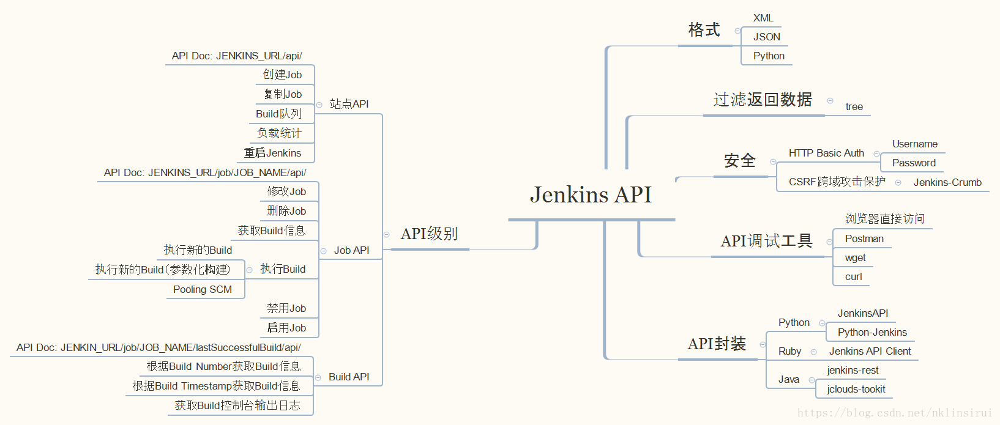

​	Jenkins具有丰富的插件生态，足以满足我们日常工作的需求，但如果我们想通过具体的Jenkins任务直接对外提供服务，而不想将内部的具体实现对外暴露(否则，需添加对应的用户权限，通过页面执行job)；可以对外直接提供接口，第三方直接调用接口（比如提供给开发，提测前回归冒烟用例集），执行相应的Jenkins任务并获取任务结果。

​	Jenkins API没有统一的入口，而是采用“…/api/” 的REST API样式，其中”…” 表示Jenkins资源的URL。

​	常见的Jenkins资源包括：站点（实例）、Job和Build。

​	Jenkins的Remote API以REST-like的形式进行提供，通过对特定的API执行POST请求即可。

​	可以提前提供job的config的ftl模板，然后使用freemarker自动生成对应的job模板。后台调用jenkins RESTApi接口动态创建不同的JOB。

> 官方文档地址
>
> https://wiki.jenkins.io/display/JENKINS/Remote+access+API 
>
> 


## REST API

站点所有支持的API都可以通过地址http://jenkins.dev.com/api 获取大致描述

#### JOB API

###### 获取JOB的相关信息

​		我们通过url直接获取job的相关信息，生成xml格式或者JSON，如获取job的信息，要获取json的地址

​		`http://jenkins.dev.com/job/service-sample/api/json`

​		可以获取name，build等的所有信息。将url中的json改为xml则可以获取xml格式的相关信息

###### 获取build的信息

​		刚才我们获取的是job所有的相关信息，可能我们还需要获取某一次build的信息

   	 则可以通过地址`http://jenkins.dev.com/job/service-sample/{build_number}/api/json`获取

###### 执行build

​		不带参数执行，POST请求

​		`http://jenkins.dev.com/job/service-sample/build` 

​		带参数执行，POST请求

​		`http://jenkins.dev.com/job/service-sample/buildWithParameters`

###### 获取config.xml

​		JOB的配置信息，通过地址`http://jenkins.dev.com/job/service-sample/config.xml`获取到的是一个xml的格式，这个里面包括了详细的配置信息。

###### 信息过滤

​		Jenkins API将Jenkins资源模型抽象为树形结构，可以通过tree来指定返回Jenkins资源的层次。之前获取的所有相关信息，可以通过添加参数tree=XXX[]，来过滤出你所感兴趣的节点，类似于正则表达式    详细的可以参考，http://jenkins.dev.com/api的"Controlling the amount of data you fetch"这一节

> 假设通过`http://jenkins.dev.com/job/service-sample/api/json` 会获取所有的信息 ，那么添加   `tree=builds[*]  `可以获取所有builds下的节点 
>
> 直接http get请求 `http://192.168.6.224:8080/job/pythontest/api/json?tree=builds[*]`

#### 站点 API

###### 站点信息查询

`http://jenkins.dev.com/api/json`可以查询到站点中所有的job信息

> 查询同样支持，通过tree进行过滤，通过请求` http://jenkins.dev.com/api/json?&tree=jobs[name[*]] ` 可以过滤出所有jobs的name

###### 创建JOB

​		要创建一个Job，首先要明白每个Job的配置信息都保存在config.xml中。假设我们要新创建一个job,叫 `testjob`    那么第一步，要在Jenkins的安装目录下，找到子目录`\jobs`，创建一个名为`testjob`的目录。如果不创建这个目录，直接调用API，会失败。

​		然后准备config.xml文件，作为job的配置信息，可以从刚才的service-sample配置直接拷贝得到，然后简单修改下name。举例通过Postman进行，访问的API地址，请求方法为POST，需要身份验证。

`http://192.168.6.224:8080/createItem?name=testjob ` 

Content-Type值为`application/xml `

请求的Boyd中类型选择为binary。选择config.xml文件。

## 安全 

在调用Jenkins API 时需要以HTTP Basic Auth验证方式提供用户名和密码。

另外，在Jenkins 2之后默认开启CSRF protection （跨域访问伪造保护），对有些Jenkins API的调用还需要提供Jenkins-Crumb；否则会出现”403 No valid crumb was included in the request“ 的错误。

**获取Jenkins生成的crumb值**:

1. 通过浏览器直接打开：http://jenkins.dev.com/crumbIssuer/api/xml

2. 返回结果类似：

   ```xml
   <defaultCrumbIssuer _class="hudson.security.csrf.DefaultCrumbIssuer">
   <crumb>068ab0b4e0622b374d8822b22cee8b18</crumb>
   <crumbRequestField>Jenkins-Crumb</crumbRequestField>
   </defaultCrumbIssuer>1234
   ```

**以通过Postman”执行一次新的build“为例:**

1. 选择HTTP POST方法
2. 输入URL: http://jenkins.dev.com/job/service-sample/build
3. 选择Authorization Type为Basic Auth，并输入Username和Password （Jenkins用户名和密码）
4. 在Headers中填入一个新的header:
   - Key为Jenkins-Crumb
   - Value为上面一步获取到的Jenkins生成的crumb值

## JAVA API

```xml
<dependency>
  <groupId>com.offbytwo.jenkins</groupId>
  <artifactId>jenkins-client</artifactId>
  <version>0.3.8</version>
</dependency>
```

​		JAVA API使用Jenkins Client

```java
JenkinsServer jenkins = new JenkinsServer(new URI("http://jenkins.dev.com/"), "admin", "password")
```

​		JenkinsServer 类提供了进入 API 的主入口点。您可以根据 Jenkins 服务器的位置和(可选)用户名和密码/令牌创建对它的引用。

```java
Map<String, Job> jobs = jenkins.getJobs();
```

​		返回所有job，job的名称（小写）为key的Map。Job 类仅提供摘要信息(名称和 url)。

```
JobWithDetails job = jobs.get("My Job").details();
```

​		获取指定job。JobWithDetails 类提供了Job的相信信息。

#### 使用JAVA API构建

​		示例代码

```java
JobWithDetails job = jenkinsServer.getJob("service-sample");
// 执行参数
Map<String,String> params = new HashMap<>();
params.put("dev","true");
params.put("BRANCH","master");
QueueReference reference = job.build(params,true);
// 获取构建的queueItem
QueueItem queueItem = jenkinsServer.getQueueItem(new QueueReference(queuePart));
// 获取执行对象，如果为空则还没有构建结束
Executable executable = queueItem.getExecutable();
// 构建结束后获取构建结果和构建日志,构建没有结束则会报错
Build build = jenkinsServer.getBuild(queueItem);
BuildWithDetails details = build.details();
BuildResult result = details.getResult();
String logs =  details.getConsoleOutputText();
```

#### JAVA API创建JOB

​		示例代码

```java
/**
 * 配置文件为xml格式以字符串类型传入
 */
jenkinsServer.createJob("jobName", configXmlStr, true);
```


> 参考资料
>
> https://blog.csdn.net/nklinsirui/article/details/80832005#%E5%AE%98%E6%96%B9%E6%96%87%E6%A1%A3
>
> https://www.cnblogs.com/zjsupermanblog/archive/2017/07/26/7238422.html
