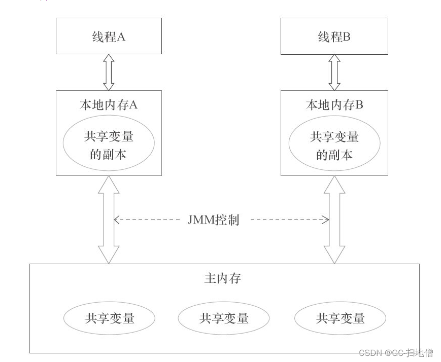

# 深入理解 Java 内存模型（JMM）与锁机制

  

## 一、Java 内存模型（JMM）

​	Java 内存模型的设计目的是解决多线程下共享内存的一致性问题。不同于强一致性硬件模型，现代 CPU 和编译器会对内存操作进行各种优化和重排序 。在没有规范约束时，不同处理器的缓存和乱序执行会导致线程间看到的共享变量值不一致，严重影响并发正确性 。Java 提供了跨平台的内存模型（JMM）来定义一套规则，使得 volatile、synchronized 等同步原语能在任何硬件架构上实现一致语义，保障“Write Once, Run Anywhere”原则 。



​	Java 内存模型示意：每个线程都有自己的工作内存（Local Memory），通过主内存（Main Memory）进行交互 。线程 A 要把修改写入共享变量，必须先把工作内存中的更新**刷新**到主内存；线程 B 要读取，则必须从主内存将值**读取**到其工作内存后才使用。JMM 通过控制这个读-写流程，为 Java 程序提供了内存可见性的保证 。下面示例说明了没有同步时指令重排序可能带来的问题：

```java
class ReorderExample {
    int x = 0, y = 0;
    // 线程 A 执行
    void writer() { x = 1; y = 2; }
    // 线程 B 执行
    void reader() { int a = y; int b = x; } 
}
```

若线程 B 在 reader() 中首先读到 y == 2，按程序原序理应读到 x == 1；但由于编译器/CPU 可重排序写操作，上述代码可能实际执行为 y=2 后才 x=1，导致 B 看到 a==2 而 b==0 。JMM 引入 happens-before 规则来避免这类问题。

  **Happens-before 原则：** 在 JMM 中，若操作 A happens-before 操作 B，则操作 A 的结果对操作 B 可见，并且执行 A 的语义在语句顺序上排在 B 之前 。常见的具体规则包括：

- **程序顺序规则（Program Order）：** 同一线程内，按代码顺序的每个操作 happens-before 于该线程中任意后续操作 。
  
- **监视器锁规则（Monitor Lock）：** 对一个锁的 _释放_（unlock）操作 happens-before 于随后对同一锁的 _获取_（lock）操作 。这保证了进入同步块后可见之前在该锁保护下的修改。
  
- **volatile 变量规则：** 对一个 volatile 域的写操作 happens-before 于任意后续对同一 volatile 域的读操作 。这意味着写入 volatile 的值对后续读取立即可见，同时禁止了该写操作与读操作间的重排序。
  
- **线程启动规则：** 如果线程 A 调用了 Thread.start() 启动线程 B，则线程 A 在 start() 之后的操作 happens-before 线程 B 中的任何操作 。
  
- **线程终结规则：** 如果线程 A 调用了 Thread.join() 等待线程 B 完成，则线程 B 中的任意操作 happens-before 线程 A 从 join() 返回之后的操作 。
  
- **传递性：** 如果 A happens-before B 且 B happens-before C，则 A happens-before C 。

以上规则保证了关键同步操作之间的先后关系。例如，释放锁的写操作通过内存屏障将缓存数据刷新到主内存，随后的获取锁操作则从主内存重新读取，从而保证了锁保护块内存可见性；对 volatile 字段的写也会立刻被刷新，而读操作则从主内存读取最新值 。


### **可见性、有序性、原子性问题**

JMM 主要解决可见性和有序性问题。_可见性_ 指一个线程对共享变量的修改是否能及时被其他线程看到；_有序性_指在多线程环境下保证特定操作的执行顺序。通过 happens-before 规则，JMM 能保证关键操作的顺序性和可见性。**原子性**问题方面，JMM 保证对基本类型的单次读/写（除 long/double 在旧版本中）的操作具有原子性，但复合操作（如 i++）并非原子。若需保证原子性，就必须使用同步手段或原子类。Java 提供了 java.util.concurrent.atomic 包中的原子类（如 AtomicInteger），它们使用 CAS + volatile 来实现线程安全的原子更新 。

```java
// 示例：使用 volatile 保证可见性
class VolatileExample {
    int a = 0;        // 普通变量
    volatile int flag = 0;
    void writer() { a = 10; flag = 1; }
    void reader() {
        if (flag == 1) {
            // 如果读到 flag=1，则能保证看到 a=10
            System.out.println(a);
        }
    }
}
```

在上例中，flag 是 volatile 字段，写线程先写 a=10 再写 flag=1，读线程读取到 flag==1 时，通过 happens-before 规则可见先前写的 a 值 。若去掉 volatile，这种可见性就不能被保障，可能读到过时的 a 值。

  

## **二、HotSpot JVM 的锁升级机制**

Java 的 synchronized 锁在 HotSpot JVM 中有多种状态优化，以减少无竞争情况下的加锁开销 。JDK6 之后，锁主要有四种状态：**无锁**、**偏向锁**、**轻量级锁**、**重量级锁** 。对象头（Object Header）中的 Mark Word 用于标记当前锁状态和相关指针（如线程 ID、锁记录指针等） 。

- **无锁状态：** 对象未被任何线程锁定。Mark Word 保存的是对象哈希码和年龄等信息 。
  
- **偏向锁：** 适用于对象只被一个线程反复访问的场景。第一次加锁时，JVM 会将该线程的 ID 写入对象头，之后该线程可无竞争地多次进入同步块而无需 CAS 自旋 。如果其他线程竞争此锁（或出现必须撤销偏向的情况），JVM 会撤销偏向锁并升级为轻量级锁 。
  
- **轻量级锁（自旋锁）：** 当偏向锁被撤销后，或并发程度较低时使用。线程获取锁时通过 CAS 将对象头指向自己栈帧中的 _Lock Record_（锁记录），若失败则在用户态进行自旋重试 。轻量级锁可以在短期竞争中避免进入内核阻塞，提升性能。
  
- **重量级锁（监视器锁）：** 当自旋仍无法获得锁（如自旋次数超过阈值或阻塞时间过长）时，JVM 会将锁升级为重量级锁。此时线程挂起，转入内核态由操作系统调度 。重量级锁的获取成本较高，但适用于高度竞争场景。

下面的示意图展示了典型的锁状态转换流程：

  

对象锁状态转换图：HotSpot JVM 中对象锁的状态升级通常按无锁→偏向锁→轻量级锁→重量级锁的顺序进行 。例如，新对象创建后处于无锁；第一次线程访问若开启偏向锁，则进入偏向锁状态；当另一线程竞争时，偏向锁被撤销并升级为轻量级锁；若自旋多次仍未获取锁，则进一步膨胀为重量级锁 。


### **对象头与 Mark Word**

每个对象头（Object Header）包含 Mark Word 和类型指针（klass pointer）等元数据。Mark Word 存储对象运行时数据：平时包含对象的哈希码、GC 年龄等 ；加锁时则被修改为锁标记和相关指针 。下表示意了 Mark Word 的不同锁态编码：

|**锁状态**|**Mark Word 内容**|**低位标志位**|
|---|---|---|
|无锁|23bit 保存哈希码等，age，最低2位为 01|01|
|偏向锁|线程ID、Epoch、age，高位标志位为 1，最低2位 01|01|
|轻量级锁|指向栈上 Lock Record 的指针，最低2位 00|00|
|重量级锁|指向 Monitor 对象的指针，最低2位 10|10|

> _（上述表格源自 HotSpot 对象头结构，简化说明）_


### **锁升级触发条件与过程**

锁的升级（膨胀）通常由以下条件触发：

- **无锁→偏向锁：** 在对象首次被线程访问时，若启用偏向锁，JVM 会将线程 ID 写入对象头标记为偏向 。
  
- **偏向锁→轻量级锁：** 若在偏向锁状态下有第二线程尝试获取该锁，则检测到竞争，偏向锁被撤销并升级为轻量级锁 。撤销时需要安全点（safepoint），此过程将对象头转为指向申请锁的线程的 Lock Record，实现 CAS 自旋锁 。
  
- **轻量级锁→重量级锁：** 如果在轻量级锁状态下竞争仍然激烈（例如自旋等待超过一定次数或线程挂起等待），JVM 会膨胀为重量级锁 。一般来说，超过处理器核心数的一半或固定自旋阈值时，就会升级为重量级锁 。

下面是锁升级过程的简单 Java 示例：

```java
class Counter {
    private int count = 0;
    public synchronized void syncIncrement() {
        count++;
    }
}
```

上例中，syncIncrement 初次被线程调用时可能处于无锁或偏向锁（只记录线程ID），当另一个线程并发调用时，偏向锁将撤销并切换到轻量级锁；若后续竞争继续，可能升级为重量级锁。读者可以使用 -XX:+PrintSafepointStatistics 等 JVM 参数或 Profiling 工具观察实际执行过程。

  

### **偏向锁的撤销与回退**

偏向锁撤销过程复杂：当检测到竞争需要撤销时，JVM 必须在所有线程停止（safepoint）时完成撤销操作 。撤销时一般会将对象头恢复为无锁状态或直接升级为轻量级锁状态 。常见触发情形包括：当前线程调用 Object.hashCode()、执行 wait/notify/monitorexit、JNI 的 MonitorEnter/MonitorExit、Unsafe.monitorEnter 等，都可能强制撤销偏向锁并转为重量级锁 。例如，在撤销偏向锁后，如果发现原偏向线程还在同步块中，则转换为轻量级锁；若偏向线程已经退出同步块，则可将其恢复为无锁或轻量级锁 。

需要注意的是，锁一旦升级为重量级锁后**不会自动回退**为轻量级或偏向锁；只有在类级别触发批量重偏向（_rebias_）或关闭偏向锁时，未来新对象才能再次使用偏向锁 。在需要性能分析时，可使用 JVM 提供的工具（如 jstack、Java Flight Recorder、JVMTI 接口或 JVisualVM 的锁监控功能）来查看锁竞争和升级情况，直观了解不同锁状态下的行为。

  

## **三、各种锁的关系与适用场景**

Java 提供了多种锁机制：内置的 synchronized 关键字、java.util.concurrent.locks 包下的锁（如 ReentrantLock、ReentrantReadWriteLock）以及原子操作（CAS）等。它们之间的关系和适用场景如下：

- **Synchronized 与 ReentrantLock：** 两者本质都是可重入的互斥锁。synchronized 是 Java 关键字，在 JVM 层面通过监视器（monitorenter/monitorexit）实现，不需要显式释放锁，执行完同步块后自动解锁；而 ReentrantLock 是 JDK 1.5 引入的锁实现，需要手动 lock() / unlock() 。从底层实现看，synchronized 利用了 JDK6+ 的锁优化（偏向锁、自旋、重量级锁等），而 ReentrantLock 基于 AQS 框架，使用 CAS + 自旋和队列实现 。
  - ReentrantLock 支持**公平锁**和**非公平锁**模式（构造函数中可选），而 synchronized 只支持非公平调度 。
      
    - ReentrantLock 可以响应中断（ **lockInterruptibly()** ）或尝试超时获取锁（ **tryLock(long, TimeUnit)** ），而 synchronized 不支持线程中断获取锁 。
      
    - ReentrantLock 支持绑定 Condition（条件队列），可实现更灵活的等待/通知，而 synchronized 只能使用 Object.wait()/notify() 机制 。
      
    

```java
// synchronized 示例
public synchronized void incrementSync() {
    // 自动加锁和释放
}

// ReentrantLock 示例
private Lock lock = new ReentrantLock(true); // true 表示公平锁
public void incrementLock() {
    lock.lock();
    try {
        // 需要手动释放锁
    } finally {
        lock.unlock();
    }
}
```

- 在高并发场景下，ReentrantLock 提供了更灵活的特性，因此通常推荐使用 。例如，可以选择非公平模式以提高吞吐量，也可以在需要时使用超时或可中断锁。但 synchronized 使用更简单，JVM 优化极好，在无竞争或轻度竞争时性能也非常高 。

> **非公平锁为什么比公平锁吞吐量高**：
>
> - 非公平锁**减少了线程切换**：
>   - 新线程直接竞争成功就进入临界区，少一次上下文切换。
> - 公平锁需要：
>   - 判断自己是否是队列头（多一次检查）。
>   - 如果不是，就必须等待——导致线程更多地陷入等待/唤醒，增加系统负担。
> - 非公平锁利用**随机性**：系统调度新线程拿到锁后，可能比排队线程更快执行完，从而总体提高吞吐量。

- **乐观锁 vs 悲观锁（CAS vs 同步锁）：** 悲观锁假设会发生冲突，每次访问共享数据前都会上锁（如 synchronized、ReentrantLock） ；乐观锁则假设冲突很少，仅在提交时通过某种机制验证（如 CAS）是否成功 。Java 的原子类（如 AtomicInteger）即使用 CAS + volatile 来实现非阻塞的乐观并发。

```java
// CAS 乐观锁示例：AtomicInteger
AtomicInteger counter = new AtomicInteger(0);
counter.incrementAndGet(); // 底层使用 CAS 保证原子性
```

> 在 AtomicInteger 内部，核心实现依赖于 **sun.misc.Unsafe** 类（JDK 9+ 是 jdk.internal.misc.Unsafe）。
>
> Unsafe 提供了底层的 compareAndSwapInt 等方法。
>
> 来看一个简化版伪代码：
>
> ```java
> class AtomicInteger {
>     private volatile int value;
> 
>     public final int incrementAndGet() {
>         for (;;) { // 无限循环直到成功
>             int current = get();
>             int next = current + 1;
>             if (compareAndSet(current, next))
>                 return next;
>         }
>     }
> 
>     public final boolean compareAndSet(int expect, int update) {
>         // compare and swap 缩写 CAS
>         return unsafe.compareAndSwapInt(this, valueOffset, expect, update);
>     }
> }
> ```
>
> **具体过程**：
>
> - 当线程 A 调用 incrementAndGet() 时：
>   - 会先 get() 当前值：这里要读取 value
>   - 另一个线程 B 也可能修改 value
> - 因为 value 是 volatile：
>   - 保证了线程 A 读取 value 时，一定能读到主内存中**最新**的值（而不是线程本地工作内存的旧值）
>   - 当线程 B 更新 value 后，立即对线程 A 可见
> - 然后 CAS 操作：
>   - compareAndSwapInt 在比较时，也能保证看到最新的值
>
> **为什么保证原子性**:
>
> - compareAndSwapInt 是 CPU 的原子指令，不可被打断
> - 无论多少线程同时执行，只有一个线程的 CAS 能成功
> - 失败的线程检测到值变化，就重试，直到成功
> - volatile 保证 value 的读取永远是最新值

- CAS 的优点是不涉及操作系统阻塞，适合竞争不激烈、多核场景下的高吞吐量操作 ；缺点是循环重试可能导致 CPU 空转，并存在 ABA 问题。悲观锁则通过阻塞等待保证安全，多用于写操作频繁的场景 。实际应用中，可视情况混合使用：读多写少时可采用读写锁，更新计数等操作可使用 LongAdder/AtomicInteger 等原子类。

- **自旋锁与阻塞锁：** 轻量级锁本质是一种自旋锁，它让等待的线程在用户态循环尝试获取锁而不进入内核阻塞 。自旋锁适用于锁持有时间极短的场景，可减少线程切换开销，但若持锁时间较长或线程数过多，会浪费大量 CPU。与之相对，重量级锁采用阻塞（park）机制，适合长时间等待但会有上下文切换开销。

- **读写锁（ReentrantReadWriteLock）：** 读写锁维护一对锁，一个读锁一个写锁。多个读线程可同时持有读锁（共享），而写锁是独占的。持有写锁的线程可以降级为读锁（即先获取写锁再获取读锁，然后释放写锁） 。读写锁通常用于读多写少的场景，可显著提高并发性能。但若写操作很多，则读写锁的开销可能高于普通互斥锁，因为需要维护更多状态。

```java
// ReentrantReadWriteLock 示例：读多写少场景
ReentrantReadWriteLock rwLock = new ReentrantReadWriteLock();
Lock readLock = rwLock.readLock();
Lock writeLock = rwLock.writeLock();

// 读方法
public void doRead() {
    readLock.lock();
    try {
        // 读共享资源
    } finally {
        readLock.unlock();
    }
}

// 写方法
public void doWrite() {
    writeLock.lock();
    try {
        // 写共享资源
    } finally {
        writeLock.unlock();
    }
}
```

- **公平锁 vs 非公平锁：** 公平锁（new ReentrantLock(true)）按照线程请求顺序授予锁，避免饥饿；非公平锁则可能让新线程“插队”抢锁，从而通常具有更高的吞吐量。synchronized 以及默认的 ReentrantLock 为非公平策略。高并发场景下，非公平锁性能更优，但在需要严格顺序时应使用公平锁 。

综上所述，在高并发/低延迟系统中，**选择合适的锁策略非常关键**：volatile 适合于简单的状态标志；原子类（CAS）适合于无锁计数；synchronized 简洁高效、自动释放，适合锁竞争较轻或场景简单；ReentrantLock 则提供更多特性和可调性；读写锁适用于读多写少场景；自旋锁（如轻量级锁）适合短时锁定，否则应切换到阻塞锁避免资源浪费。具体使用时应权衡吞吐量与延迟开销，比如在超低延迟场合尽量避免阻塞、使用非公平锁；在公平性要求高的场合选择公平锁或其他协调方式。

**参考资料：** 对于 JMM 和锁机制的深入原理，可参考 JSR-133 提案和 OpenJDK 文档，以及相关文章 等。上述讨论结合实际例子和 HotSpot 实现机制。