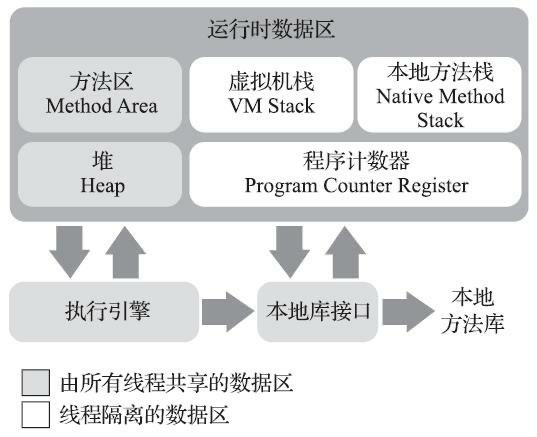
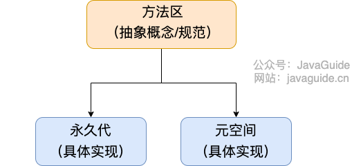
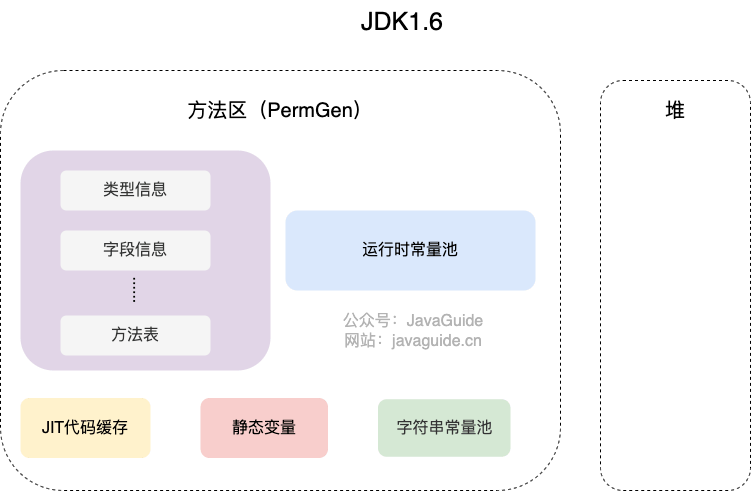
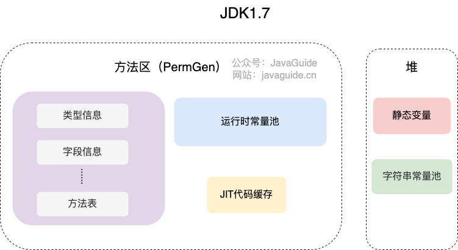
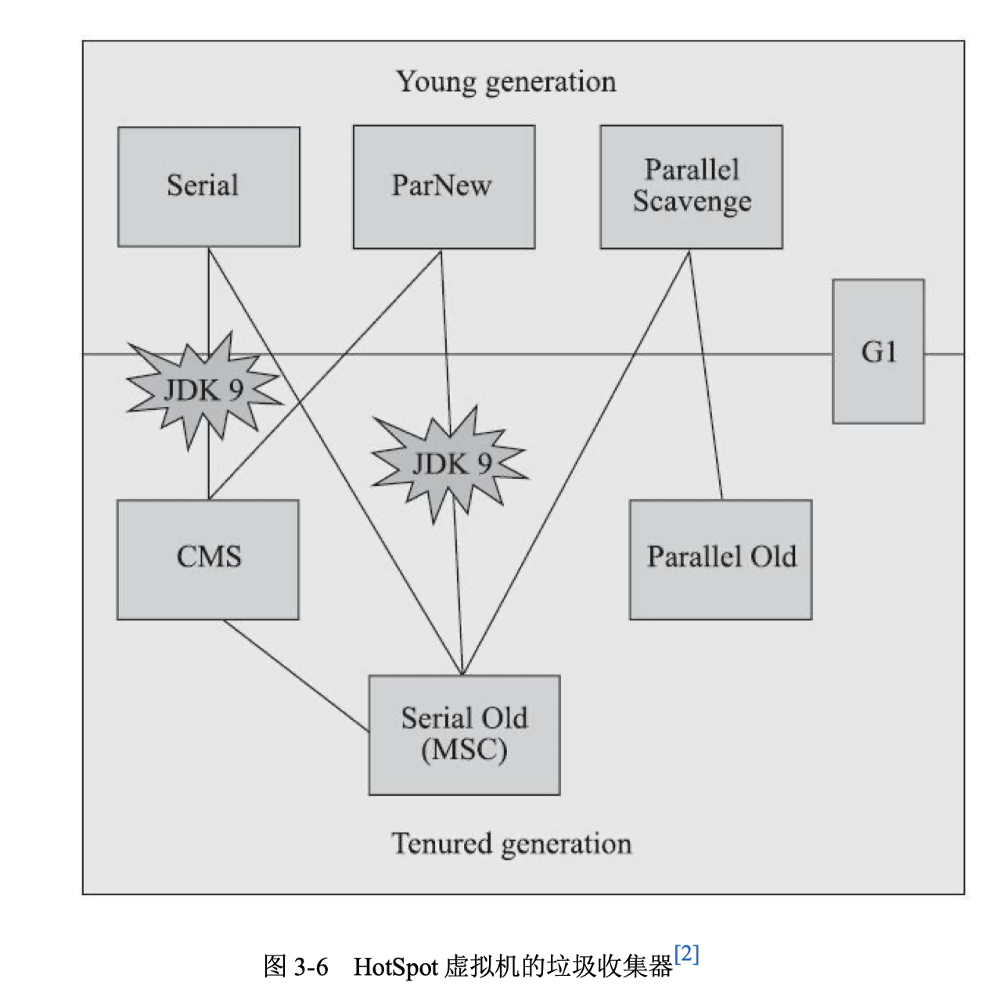
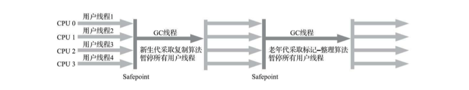
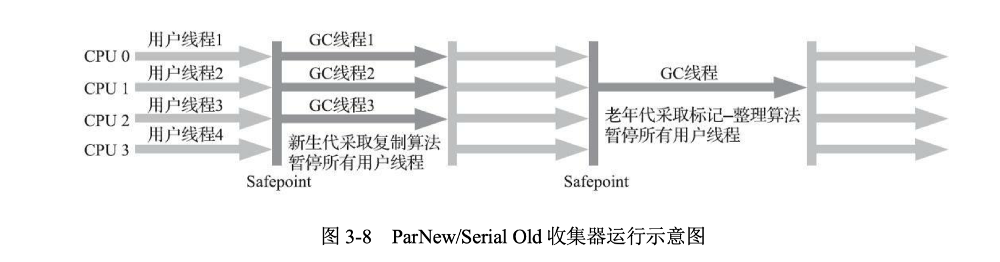
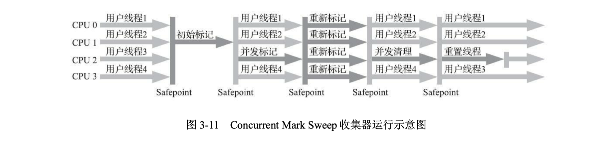

Java 与 C++之间有一堵由内存动态分配和垃圾收集技术所围成的高墙，墙外面的人 想进去，墙里面的人却想出来。

对于从事 C、C++程序开发的开发人员来说，在内存管理领域，他们既是拥有最高 权力的“皇帝”，又是从事最基础工作的劳动人民——既拥有每一个对象的“所有权”，又 担负着每一个对象生命从开始到终结的维护责任。

对于 Java 程序员来说，在虚拟机自动内存管理机制的帮助下，不再需要为每一个 new 操作去写配对的 delete/free 代码，不容易出现内存泄漏和内存溢出问题，看起来由 虚拟机管理内存一切都很美好。不过，也正是因为 Java 程序员把控制内存的权力交给了 Java 虚拟机，一旦出现内存泄漏和溢出方面的问题，如果不了解虚拟机是怎样使用内存 的，那排查错误、修正问题将会成为一项异常艰难的工作。

## Java内存区域及相关异常

Java 虚拟机在执行 Java 程序的过程中会把它所管理的内存划分为若干个不同的数据 区域。这些区域有各自的用途，以及创建和销毁的时间，有的区域随着虚拟机 进程的启 动而一直存在，有些区域则是依赖用户线程的启动和结束而建立和销毁。根据《Java虚拟机规范》的规定，Java 虚拟机所管理的内存将会包括以下几个运行时数据区域，如图



#### 程序计数器

程序计数器（Program Counter Register）是一块较小的内存空间，它可以看作是当 前线程所执行的字节码的行号指示器。在 Java 虚拟机的概念模型里 ，字节码解释器工 作时就是通过改变这个计数器的值来选取下一条需要执行的字节码指令，它是程序控制流的指示器，分支、循环、跳转、异常处理、线程恢复等基础功能都需要依赖这个计数 器来完成。

由于 Java 虚拟机的多线程是通过线程轮流切换、分配处理器执行时间的方式来实现的，在任何一个确定的时刻，一个处理器（对于多核处理器来说是一个内核）都只会执行一条线程中的指令。因此，为了线程切换后能恢复到正确的执行位置，每条线程都需 要有一个独立的程序计数器，各条线程之间计数器互不影响，独立存储，我们称这类内 存区域为“线程私有”的内存。

如果线程正在执行的是一个 Java 方法，这个计数器记录的是正在执行的虚拟机字节码指令的地址；如果正在执行的是本地（Native）方法，这个计数器值则应为空（Undefined）。此内存区域是唯一一个在《Java虚拟机规范》中没有规定任何 OutOfMemoryError 情况的区域。

#### Java虚拟机栈

与程序计数器一样，Java 虚拟机栈（Java Virtual Machine Stack）也是线程私有的， 它的生命周期与线程相同。虚拟机栈描述的是 Java 方法执行的线程内存模型：每个方法被执行的时候，Java 虚拟机都会同步创建一个**栈帧（Stack Frame）用于存储局部变量表、操作数栈、动态连接、方法出口等信息**。每一个方法被调用直至执行完毕的过程， 就对应着一个栈帧在虚拟机栈中从入栈到出栈的过程。也就是说， **栈帧随着方法调用而创建，随着方法结束而销毁。无论方法正常完成还是异常完成都算作方法结束。**

经常有人把 Java 内存区域笼统地划分为堆内存（Heap）和栈内存（Stack），虽然这种在 Java 语言里就显得有些粗糙了，实际的内存区域划分要比这更复杂。不过这种划分方式的流行也间接说明了程序员最关注的、与对象内存分配关系最密切的区域是“堆”和“栈”两块。其中，“堆”在稍后会讲述，而“栈”通常就是指这里讲的虚拟机栈，或者更多的情况下只是指虚拟机栈中局部变量表部分。

**局部变量表存放了编译期可知的各种 Java 虚拟机基本数据类型（`boolean`、`byte`、 `char`、`short`、`int`、 `float`、`long`、`double`）、对象引用（`reference` 类型，它并不等同于对象 本身，可能是一个指向对象起始地址的引用指针，也可能是指向一个代表对象的句柄或者其他与此对象相关的位置）和 `returnAddress`类型**（指向了一条字节码指令的地址）。

这些数据类型在局部变量表中的存储空间以局部变量槽（Slot）来表示，其中 64 位 长度的 long 和 double 类型的数据会占用两个变量槽，其余的数据类型只占用一个。局 部变量表所需的内存空间在编译期间完成分配，当进入一个方法时，这个方法需要在栈帧中分配多大的局部变量空间是完全确定的，在方法运行期间不会改变局部变量表的变量槽数量。请注意，实际上虚拟机真正使用多大的内存空间 （譬如按照 1 个变量槽占用 32 个比特、64 个比特，或者更多）来实现一个变量槽，这是完全由具体的虚拟机实现自行决定，不同的虚拟机或不同虚拟机版本都有可能不一致（也可通过`-Xss`参数手动设置）。 

在《Java虚拟机规范》中，对这个内存区域规定了两类异常状况：如果线程请求的栈深度大于虚拟机所允许的深度，将抛出 `StackOverflowError` 异常；当线程无法申请到足够的栈空间会抛出`OutOfMemoryError` 异常。

#### 本地方法栈

本地方法栈（Native Method Stacks）与虚拟机栈所发挥的作用是非常相似的，其**区别只是虚拟机栈为虚拟机执行 Java 方法（也就是字节码）服务，而本地方法栈则是为虚拟机使用到的本地（Native）方法服务**。

本地方法被执行的时候，在本地方法栈也会创建一个栈帧，用于存放该本地方法的局部变量表、操作数栈、动态链接、出口信息。

与虚拟机栈一样，本地方法栈也会在栈深度溢出或者栈扩展失败时分别抛出 `StackOverflowError` 和 `OutOfMemoryError` 异常。

#### Java 堆

对于 Java 应用程序来说，Java 堆（Java Heap）是虚拟机所管理的内存中最大的一块。Java 堆是被所有线程共享的一块内存区域，在虚拟机启动时创建。**此内存区域的唯 一目的就是存放对象实例**，Java 世界里“几乎”所有的对象实例都在这里分配内存。在 《Java 虚拟机规范》中对 Java 堆的描述是：“所有的对象实例以及数组都应当在堆上分配”。

Java 堆是垃圾收集器管理的内存区域，因此一些资料中它也被称作“GC 堆” （Garbage Collected Heap）。

在 JDK 7 版本及 JDK 7 版本之前，堆内存被通常分为下面三部分

1. 新生代内存(Young Generation)
2. 老生代(Old Generation)
3. 永久代(Permanent Generation)

下图所示的 Eden 区、两个 Survivor 区 S0 和 S1 都属于新生代，中间一层属于老年代，最下面一层属于永久代。


**JDK 8 版本之后 PermGen(永久) 已被 Metaspace(元空间) 取代，元空间使用的是直接内存**

大部分情况，对象都会首先在 Eden 区域分配，在一次新生代垃圾回收后，如果对象还存活，则会进入 S0 或者 S1，并且对象的年龄还会加 1(Eden 区->Survivor 区后对象的初始年龄变为 1)，当它的年龄增加到一定程度（默认为 15 岁），就会被晋升到老年代中。对象晋升到老年代的年龄阈值，可以通过参数 `-XX:MaxTenuringThreshold` 来设置。

> 在十年之前（以 G1 收集器的出现为分界），作为业界绝对主 流的 HotSpot 虚拟机，它内部的垃圾收集器全部都基于“经典分代”来设计，需要新生代、老年代收集器搭配才能工作，在这种背景下，上述说法还算是不会产生太大歧义。 但是到了今天，垃圾收集器技术与十年前已不可同日而语，HotSpot 里面也出现了不采用分代设计的新垃圾收集器，再按照上面的提法就有很多需要商榷的地方了。

堆这里最容易出现的就是 `OutOfMemoryError` 错误，并且出现这种错误之后的表现形式还会有几种，比如：

1. **`java.lang.OutOfMemoryError: GC Overhead Limit Exceeded`** ： 当 JVM 花太多时间执行垃圾回收并且只能回收很少的堆空间时，就会发生此错误。
2. **`java.lang.OutOfMemoryError: Java heap space`** :假如在创建新的对象时, 堆内存中的空间不足以存放新创建的对象, 就会引发此错误。(和配置的最大堆内存有关，且受制于物理内存大小。最大堆内存可通过`-Xmx`参数配置，若没有特别配置，将会使用默认值，详见：[Default Java 8 max heap sizeopen in new window](https://stackoverflow.com/questions/28272923/default-xmxsize-in-java-8-max-heap-size))

#### 方法区

方法区（Method Area）与 Java 堆一样，属于是 JVM 运行时数据区域的一块逻辑区域，是各个线程共享的内存区域。

虽然《Java 虚拟机规范》中把方法区描述为堆的一个逻辑部分，但是它却有一个别名叫作“非堆”（Non-Heap），目的是与 Java 堆区分开来。

《Java 虚拟机规范》只是规定了有方法区这么个概念和它的作用，方法区到底要如何实现那就是虚拟机自己要考虑的事情了。也就是说，在不同的虚拟机实现上，方法区的实现是不同的。

当虚拟机要使用一个类时，它需要读取并解析 Class 文件获取相关信息，再将信息存入到方法区。方法区会存储已被虚拟机加载的 **类信息、字段信息、方法信息、常量、静态变量、即时编译器编译后的代码缓存等数据**。

说到方法区，不得不提一下“永久代”这个概念，尤其是在 JDK 8 以前，许多 Java 程序员都习惯在 HotSpot 虚拟机上开发、部署程序，很多人都更愿意把方法区称呼为“永久 代”（Permanent Generation），或将两者混为一谈。本质上这两者并不是等价的，因为仅 仅是当时的 HotSpot 虚拟机设计团队选择把收集器的分代设计扩展至方法区，或者说使 用永久代来实现方法区而已，这样使得 HotSpot 的垃圾收集器能够像管理 Java 堆一样管 理这部分内存，省去专门为方法区编写内存管理代码的工作。但是对于其他虚拟机实 现，譬如 BEA JRockit、IBM J9 等来说，是不存在永久代的概念的。原则上如何实现方 法区属于虚拟机实现细节，不受《Java 虚拟机规范》管束，并不要求统一。



但现在回头来看，当年使用永久代来实现方法区的决定并不是一个好主意。

1. 这种设计导致了 Java 应 用更容易遇到内存溢出的问题（永久代有-XX：MaxPermSize 的上限，即使不设置也有 默认大小，而 J9 和 JRockit 只要没有触碰到进程可用内存的上限，例如 32 位系统中的 4GB 限制，就不会出问题）。
2. 当 Oracle 收购 BEA 获得了 JRockit （JRockit 从来没有一个叫永久代的东西）的所有权后， 准备把 JRockit 中的优秀功能，譬如 Java Mission Control 管理工具，移植到 HotSpot 虚拟机时，但因为两者对方法区实现的差异导致两者的代码合并起来较为困难。
3. 考虑到 HotSpot 未来的发 展，在 JDK 6 的时候 HotSpot 开发团队就有放弃永久代，逐步改为采用本地内存 （Native Memory）来实现方法区的计划了([JEP 122-Remove the Permanent Generation](http://openjdk.java.net/jeps/122)) ，到了 JDK 7 的 HotSpot，已经把原本放在 永久代的字符串常量池、静态变量等移出，而到了 JDK 8，终于完全废弃了永久代的概念，改用与 JRockit、J9 一样在本地内存中实现的元空间（Metaspace）来代替，把 JDK 7 中永久代还剩余的内容（主要是类型信息）全部移到元空间中。

**造成以上问题的原因是**：

《Java 虚拟机规范》对方法区的约束是非常宽松的，除了和 Java 堆一样不需要连续 的内存和可以选择固定大小或者可扩展外，甚至还可以选择不实现垃圾收集。相对而言，垃圾收集行为在这个区域的确是比较少出现的，但并非数据进入了方法区就如永久代的名字一样“永久”存在了。这区域的内存回收目标主要是针对常量池的回收和对类型的卸载，一般来说这个区域的回收效果比较难令人满意，尤其是类型的卸载，条件相当苛刻，但是这部分区域的回收有时又确实是必要的。以前 Sun 公司的 Bug 列表中，曾出现过的若干个严重的 Bug 就是由于低版本的 HotSpot 虚拟机对此区域未完全回收而导致内存泄漏。

**方法区常用参数有哪些？**

JDK 1.8 之前永久代还没被彻底移除的时候通常通过下面这些参数来调节方法区大小。

```java
-XX:PermSize=N //方法区 (永久代) 初始大小
-XX:MaxPermSize=N //方法区 (永久代) 最大大小,超过这个值将会抛出 OutOfMemoryError 异常:java.lang.OutOfMemoryError: PermGen
```

相对而言，垃圾收集行为在这个区域是比较少出现的，但并非数据进入方法区后就“永久存在”了。

JDK 1.8 的时候，方法区（HotSpot 的永久代）被彻底移除了，取而代之是元空间，元空间使用的是直接内存。下面是一些常用参数：

```java
-XX:MetaspaceSize=N //设置 Metaspace 的初始（和最小大小）
-XX:MaxMetaspaceSize=N //设置 Metaspace 的最大大小
```

与永久代很大的不同就是，如果不指定大小的话，随着更多类的创建，虚拟机会耗尽所有可用的系统内存。

根据《Java 虚拟机规范》的规定，如果方法区无法满足新的内存分配需求时，将抛出 OutOfMemoryError 异常。

#### 运行时常量池

运行时常量池（Runtime Constant Pool）是方法区的一部分。

Class 文件中除了有类的版本、字段、方法、接口等描述信息外，还有用于存放编译期生成的各种字面量（Literal）和符号引用（Symbolic Reference）的**常量池表(Constant Pool Table)**，这部分内容将在类加载后存放到方法区的运行时常量池中。

字面量是源代码中的固定值的表示法，即通过字面我们就能知道其值的含义。字面量包括整数、浮点数和字符串字面量，符号引用包括类符号引用、字段符号引用、方法符号引用和接口方法符号引用。

既然运行时常量池是方法区的一部分，自然受到方法区内存的限制，当常量池无法再申请到内存时会抛出 `OutOfMemoryError` 异常。

#### 字符串常量池

**字符串常量池** 是 JVM 为了提升性能和减少内存消耗针对字符串（String 类）专门开辟的一块区域，主要目的是为了避免字符串的重复创建。

```java
// 在堆中创建字符串对象”ab“
// 将字符串对象”ab“的引用保存在字符串常量池中
String aa = "ab";
// 直接返回字符串常量池中字符串对象”ab“的引用
String bb = "ab";
System.out.println(aa==bb);// true
```

HotSpot 虚拟机中字符串常量池的实现是 `src/hotspot/share/classfile/stringTable.cpp` ,`StringTable` 本质上就是一个`HashSet<String>` ,容量为 `StringTableSize`（可以通过 `-XX:StringTableSize` 参数来设置）。

**`StringTable` 中保存的是字符串对象的引用，字符串对象的引用指向堆中的字符串对象。**

JDK1.7 之前，字符串常量池存放在永久代。JDK1.7 字符串常量池和静态变量从永久代移动了 Java 堆中。





**JDK 1.7 为什么要将字符串常量池移动到堆中？**

主要是因为永久代（方法区实现）的 GC 回收效率太低，只有在整堆收集 (Full GC)的时候才会被执行 GC。Java 程序中通常会有大量的被创建的字符串等待回收，将字符串常量池放到堆中，能够更高效及时地回收字符串内存。

相关问题：[JVM 常量池中存储的是对象还是引用呢？ - RednaxelaFX - 知乎open in new window](https://www.zhihu.com/question/57109429/answer/151717241)

最后再来分享一段周志明老师在[《深入理解 Java 虚拟机（第 3 版）》样例代码&勘误open in new window](https://github.com/fenixsoft/jvm_book) Github 仓库的 [issue#112open in new window](https://github.com/fenixsoft/jvm_book/issues/112) 中说过的话：

> **运行时常量池、方法区、字符串常量池这些都是不随虚拟机实现而改变的逻辑概念，是公共且抽象的，Metaspace、Heap 是与具体某种虚拟机实现相关的物理概念，是私有且具体的。**

#### 直接内存

直接内存（Direct Memory）并不是虚拟机运行时数据区的一部分，也不是《Java 虚 拟机规范》中定义的内存区域。但是这部分内存也被频繁地使用，而且也可能导致 OutOfMemoryError 异常出现，

JDK1.4 中新加入的 **NIO(New Input/Output) 类**，引入了一种基于**通道（Channel）与缓存区（Buffer）**的 I/O 方式，它可以直接使用 Native 函数库直接分配堆外内存，然后通过一个存储在 Java 堆中的 DirectByteBuffer 对象作为这块内存的引用进行操作。这样就能在一些场景中显著提高性能，因为**避免了在 Java 堆和 Native 堆之间来回复制数据**。

本机直接内存的分配不会受到 Java 堆的限制，但是，既然是内存就会受到本机总内存大小以及处理器寻址空间的限制。

## HotSpot 虚拟机对象探秘

通过上面的介绍我们大概知道了虚拟机的内存情况，下面我们来详细的了解一下 HotSpot 虚拟机在 Java 堆中对象分配、布局和访问的全过程。

### 对象的创建

Java 对象的创建过程我建议最好是能默写出来，并且要掌握每一步在做什么。

##### Step1:类加载检查

虚拟机遇到一条 new 指令时，首先将去检查这个指令的参数是否能在常量池中定位到这个类的符号引用，并且检查这个符号引用代表的类是否已被加载过、解析和初始化过。如果没有，那必须先执行相应的类加载过程。

##### Step2:分配内存

在**类加载检查**通过后，接下来虚拟机将为新生对象**分配内存**。对象所需的内存大小在类加载完成后便可确定，为对象分配空间的任务等同于把一块确定大小的内存从 Java 堆中划分出来。**分配方式**有 **“指针碰撞”** 和 **“空闲列表”** 两种，**选择哪种分配方式由 Java 堆是否规整决定，而 Java 堆是否规整又由所采用的垃圾收集器是否带有压缩整理功能决定（压缩功能取决于收集算法是"标记-清除"，还是"标记-整理"，值得注意的是，复制算法内存也是规整的）**。

**内存分配的两种方式** （补充内容，需要掌握）：

- 指针碰撞 ： 
  - 适用场合 ：堆内存规整（即没有内存碎片）的情况下。
  - 原理 ：用过的内存全部整合到一边，没有用过的内存放在另一边，中间有一个分界指针，只需要向着没用过的内存方向将该指针移动对象内存大小位置即可。
  - 使用该分配方式的 GC 收集器：Serial, ParNew
- 空闲列表 ： 
  - 适用场合 ： 堆内存不规整的情况下。
  - 原理 ：虚拟机会维护一个列表，该列表中会记录哪些内存块是可用的，在分配的时候，找一块儿足够大的内存块儿来划分给对象实例，最后更新列表记录。
  - 使用该分配方式的 GC 收集器：CMS

**内存分配并发问题**

在创建对象的时候有一个很重要的问题，就是线程安全，因为在实际开发过程中，创建对象是很频繁的事情，即使仅仅修改一个指针所指向的位置，在并发情况下也并不是线程安 全的，可能出现正在给对象 A 分配内存，指针还没来得及修改，对象 B 又同时使用了 原来的指针来分配内存的情况，作为虚拟机来说，必须要保证线程是安全的，通常来讲，虚拟机采用两种方式来保证线程安全：

- **CAS+失败重试：** CAS 是乐观锁的一种实现方式。所谓乐观锁就是，每次不加锁而是假设没有冲突而去完成某项操作，如果因为冲突失败就重试，直到成功为止。**虚拟机采用 CAS 配上失败重试的方式保证更新操作的原子性。**
- **TLAB：** 为每一个线程预先在 Eden 区分配一块儿内存，JVM 在给线程中的对象分配内存时，首先在 TLAB 分配，当对象大于 TLAB 中的剩余内存或 TLAB 的内存已用尽时，再采用上述的 CAS 进行内存分配（虚拟机是否使用 TLAB，可以通过`XX：+/-UseTLAB` 参数来设定）

##### Step3:初始化零值

内存分配完成后，虚拟机需要将分配到的内存空间都初始化为零值（不包括对象头），这一步操作保证了对象的实例字段在 Java 代码中可以不赋初始值就直接使用，程序能访问到这些字段的数据类型所对应的零值。

##### Step4:设置对象头

初始化零值完成之后，**虚拟机要对对象进行必要的设置**，例如这个对象是哪个类的实例、如何才能找到类的元数据信息、对象的哈希码、对象的 GC 分代年龄等信息。 **这些信息存放在对象头中。** 另外，根据虚拟机当前运行状态的不同，如是否启用偏向锁等，对象头会有不同的设置方式。

##### Step5:执行 init 方法

在上面工作都完成之后，从虚拟机的视角来看，一个新的对象已经产生了，但从 Java 程序的视角来看，对象创建才刚开始，`<init>` 方法还没有执行，所有的字段都还为零。所以一般来说，执行 new 指令之后会接着执行 `<init>` 方法，把对象按照程序员的意愿进行初始化，这样一个真正可用的对象才算完全产生出来。

### 对象的内存布局

在 HotSpot 虚拟机里，对象在堆内存中的存储布局可以划分为三个部分：对象头 （Header）、实例数据（Instance Data）和对齐填充（Padding）。

**对象头 （Header）**

HotSpot 虚拟机对象的对象头部分包括两类信息。

1. 用于存储对象自身的运 行时数据，如哈希码（HashCode）、GC 分代年龄、锁状态标志、线程持有的锁、偏向 线程 ID、偏向时间戳等，这部分数据的长度在 32 位和 64 位的虚拟机（未开启压缩指针）中分别为 32 个比特和 64 个比特，官方称它为“Mark Word”。在 32 位的 HotSpot 虚拟机中，如对象未 被同步锁锁定的状态下，Mark Word 的 32 个比特存储空间中的 25 个比特用于存储对象 哈希码，4 个比特用于存储对象分代年龄，2 个比特用于存储锁标志位，1 个比特固定为 0。
2. 对象头的另外一部分是类型指针，即对象指向它的类型元数据的指针，Java 虚拟机通过这个指针来确定该对象是哪个类的实例。此外，如果对象是一个 Java 数组，那在对象头中还必须有一 块用于记录数组长度的数据，因为虚拟机可以通过普通 Java 对象的元数据信息确定 Java 对象的大小，但是如果数组的长度是不确定的，将无法通过元数据中的信息推断出数组的大小。

**实例数据（Instance Data）**

**实例数据部分是对象真正存储的有效信息**，也是在程序中所定义的各种类型的字段内容。

HotSpot 虚拟机默认的分配顺序为 longs/doubles、ints、shorts/chars、 bytes/booleans、oops（Ordinary Object Pointers，OOPs），从以上默认的分配策略中可以 看到，相同宽度的字段总是被分配到一起存放，在满足这个前提条件的情况下，在父类 中定义的变量会出现在子类之前。如果 HotSpot 虚拟机的+XX：CompactFields 参数值为 true（默认就为 true），那子类之中较窄的变量也允许插入父类变量的空隙之中，以节省出一点点空间。

**对齐填充（Padding）**

**这部分不是必然存在的，也没有什么特别的含义，仅仅起占位作用。** 因为 Hotspot 虚拟机的自动内存管理系统要求对象起始地址必须是 8 字节的整数倍，换句话说就是对象的大小必须是 8 字节的整数倍。而对象头部分正好是 8 字节的倍数（1 倍或 2 倍），因此，当对象实例数据部分没有对齐时，就需要通过对齐填充来补全。

### 对象的访问定位

创建对象自然是为了后续使用该对象。由于 reference 类型在《Java 虚拟机规范》里面只规定了它是 一个指向对象的引用，并没有定义这个引用应该通过什么方式去定位、访问到堆中对象 的具体位置，所以对象访问方式也是由虚拟机实现而定的，主流的访问方式主要有两种：**使用句柄**、**直接指针**。

1. 句柄

   如果使用句柄的话，那么 Java 堆中将会划分出一块内存来作为句柄池，reference 中存储的就是对象的句柄地址，而句柄中包含了对象实例数据与对象类型数据各自的具体地址信息

   

2. 直接指针

   如果使用直接指针访问，reference 中存储的直接就是对象的地址。

   

这两种对象访问方式各有优势，使用句柄来访问的最大好处就是 reference 中存储的 是稳定句柄地址，在对象被移动（垃圾收集时移动对象是非常普遍的行为）时只会改变 句柄中的实例数据指针，而 reference 本身不需要被修改。

使用直接指针来访问最大的好处就是速度更快，它节省了一次指针定位的时间开销，由于对象访问在 Java 中非常频繁，因此这类开销积少成多也是一项极为可观的执行成本，就 HotSpot 虚拟机而言，它主要使用第二种方式进行对象访问，但从整个软件开发的范围来看，在各种语言、框架中使用句柄来访问的情 况也十分常见。

## 实战：OutOfMemoryError 异常

在《Java 虚拟机规范》的规定里，除了程序计数器外，虚拟机内存的其他几个运行 时区域都有发生 OutOfMemoryError（下文称 OOM）异常的可能，接下来将通过若干实例 来验证异常实际发生的代码场景，并且将初步介绍若干最基本的与自动内存管理子系统相关的 HotSpot 虚拟机参数。

### 堆溢出

Java 堆用于储存对象实例，我们只要不断地创建对象，并且保证 GC Roots 到对象 之间有可达路径来避免垃圾回收机制清除这些对象，那么随着对象数量的增加，总容量 触及最大堆的容量限制后就会产生内存溢出异常。

以下代码中限制 Java 堆的大小为 20MB，不可扩展（将堆的最小值`-Xms` 参数 与最大值`-Xmx` 参数设置为一样即可避免堆自动扩展），通过参数 `-XX:+HeapDumpOnOutOf-MemoryError` 可以让虚拟机在出现内存溢出异常的时候 Dump 出当前的内存堆转储快照以便进行事后分析 。

```java
/**
 * VM Args：-Xms20m -Xmx20m -XX:+HeapDumpOnOutOfMemoryError *
 *
 * @author zzm
 */
public class HeapOOM {

    static class OOMObject {

    }

    public static void main(String[] args) {

        List<OOMObject> list = new ArrayList<OOMObject>();

        while (true) {
            list.add(new OOMObject());
        }
    }
}
```

运行结果

```java
java.lang.OutOfMemoryError: Java heap space
Dumping heap to java_pid38436.hprof ...
Heap dump file created [27710387 bytes in 0.093 secs]
```

Java 堆内存的 OutOfMemoryError 异常是实际应用中最常见的内存溢出异常情况。 出现 Java 堆内存溢出时，异常堆栈信息“java.lang.OutOfMemoryError”会跟随进一步提示 “Java heap space”。

要解决这个内存区域的异常，常规的处理方法是首先通过内存映像分析工具（如 Eclipse Memory Analyzer）对 Dump 出来的堆转储快照进行分析。第一步首先应确认内 存中导致 OOM 的对象是否是必要的，也就是要先分清楚到底是出现了内存泄漏 （Memory Leak）还是内存溢出（Memory Overflow）。

如果是内存泄漏，可进一步通过工具查看泄漏对象到 GC Roots 的引用链，找到泄 漏对象是通过怎样的引用路径、与哪些 GC Roots 相关联，才导致垃圾收集器无法回收 它们，根据泄漏对象的类型信息以及它到 GC Roots 引用链的信息，一般可以比较准确 地定位到这些对象创建的位置，进而找出产生内存泄漏的代码的具体位置。

如果不是内存泄漏，换句话说就是内存中的对象确实都是必须存活的，那就应当检 查 Java 虚拟机的堆参数（`-Xmx` 与`-Xms`）设置，与机器的内存对比，看看是否还有向上调整的空间。再从代码上检查是否存在某些对象生命周期过长、持有状态时间过长、存储结构设计不合理等情况，尽量减少程序运行期的内存消耗。

### 虚拟机栈和本地方法栈溢出

《Java 虚拟机规范》明确允许 Java 虚拟机实现自行选择是否支持栈的动态扩展，而 HotSpot 虚拟机的选择是不支持扩展，因此对于 HotSpot 来说，`-Xoss` 参数（设置本地方法栈大小）虽然存在，但实际上是没有任何效果的，栈容量只能由 `-Xss` 参数来设定。

关于虚拟机栈和本地方法栈。在《Java 虚拟机规范》中描述了两种异常

1) 如果线程请求的栈深度大于虚拟机所允许的最大深度，将抛出 `StackOverflowError` 异常。
2) 如果虚拟机的栈内存允许动态扩展，当扩展栈容量无法申请到足够的内存时， 将抛出 `OutOfMemoryError` 异常。

**HotSpot虚拟机是不支持扩展**，所以除非在创建线程申请内存时就因无法获得足够内存而出现 `OutOfMemoryError` 异常，否则在线程运行时是不会因为扩展而导致内存溢出的，只会因为栈容量无法容纳新的栈帧而导致 `StackOverflowError` 异常。

为了验证这点，我们可以做两个实验，先将实验范围限制在单线程中操作。

尝试下面两种行为是否能让 HotSpot 虚拟机产生 `OutOfMemoryError` 异常：

1. **使用`-Xss`参数减少 栈内存容量**

   **结果**：抛出 `StackOverflowError` 异常，异常出现时输出的堆栈深度相应缩小。

   首先，对第一种情况进行测试，具体如代码如下所示。

   ```java
   /**
    * VM Args：-Xss128k * * @author zzm
    */
   public class JavaVMStackSOF1 {
       private int stackLength = 1;
   
       public void stackLeak() {
           stackLength++;
           stackLeak();
       }
   
       public static void main(String[] args) throws Throwable {
           JavaVMStackSOF oom = new JavaVMStackSOF();
           try {
               oom.stackLeak();
           } catch (Throwable e) {
               System.out.println("stack length:" + oom.stackLength);
               throw e;
           }
       }
   }
   ```

   **运行结果**

   ```java
   stack length:10830
   Exception in thread "main" java.lang.StackOverflowError
   	at com.mj.jvmpractice.JavaVMStackSOF.stackLeak(JavaVMStackSOF.java:12)
   	at com.mj.jvmpractice.JavaVMStackSOF.stackLeak(JavaVMStackSOF.java:13)
   	at com.mj.jvmpractice.JavaVMStackSOF.stackLeak(JavaVMStackSOF.java:13)
   ```

   对于不同版本的 Java 虚拟机和不同的操作系统，**栈容量最小值会有所限制**，这主要取决于操作系统内存分页大小。譬如上述方法中的参数`-Xss128k` 可以正常用于 32 位 Windows 系统下的 JDK 6，但是如果用于 64 位 Windows 系统下的 JDK 11，则会提示 栈容量最小不能低于 180K，而在 Linux 下这个值则可能是 228K，如果低于这个最小限 制，HotSpot 虚拟器启动时会给出如下提示：

   ```java
   The stack size specified is too small, Specify at least 160k
   ```

2. **定义了大量的本地变量，增大此方法帧中本地变量表的长度**

   **结果**：抛出 `StackOverflowError` 异常，异常出现时输出的堆栈深度相应缩小。

   为了多占局部变量表空间，不得不定义一长串变量，具体如代码如下所示。

   ```java
   /**
    * @author zzm
    */
   public class JavaVMStackSOF2 {
       private static int stackLength = 0;
   
       public static void test() {
           long unused1, unused2, unused3, unused4, unused5, unused6, unused7, unused8, unused9, unused10, unused11, unused12, unused13, unused14, unused15, unused16, unused17, unused18, unused19, unused20, unused21, unused22, unused23, unused24, unused25, unused26, unused27, unused28, unused29, unused30, unused31, unused32, unused33, unused34, unused35, unused36, unused37, unused38, unused39, unused40, unused41, unused42, unused43, unused44, unused45, unused46, unused47, unused48, unused49, unused50, unused51, unused52, unused53, unused54, unused55, unused56, unused57, unused58, unused59, unused60, unused61, unused62, unused63, unused64, unused65, unused66, unused67, unused68, unused69, unused70, unused71, unused72, unused73, unused74, unused75, unused76, unused77, unused78, unused79, unused80, unused81, unused82, unused83, unused84, unused85, unused86, unused87, unused88, unused89, unused90, unused91, unused92, unused93, unused94, unused95, unused96, unused97, unused98, unused99, unused100;
   
           stackLength++;
   
           test();
   
           unused1 = unused2 = unused3 = unused4 = unused5 = unused6 = unused7 = unused8 = unused9 = unused10 = unused11 = unused12 = unused13 = unused14 = unused15 = unused16 = unused17 = unused18 = unused19 = unused20 = unused21 = unused22 = unused23 = unused24 = unused25 = unused26 = unused27 = unused28 = unused29 = unused30 = unused31 = unused32 = unused33 = unused34 = unused35 = unused36 = unused37 = unused38 = unused39 = unused40 = unused41 = unused42 = unused43 = unused44 = unused45 = unused46 = unused47 = unused48 = unused49 = unused50 = unused51 = unused52 = unused53 = unused54 = unused55 = unused56 = unused57 = unused58 = unused59 = unused60 = unused61 = unused62 = unused63 = unused64 = unused65 = unused66 = unused67 = unused68 = unused69 = unused70 = unused71 = unused72 = unused73 = unused74 = unused75 = unused76 = unused77 = unused78 = unused79 = unused80 = unused81 = unused82 = unused83 = unused84 = unused85 = unused86 = unused87 = unused88 = unused89 = unused90 = unused91 = unused92 = unused93 = unused94 = unused95 = unused96 = unused97 = unused98 = unused99 = unused100 = 0;
       }
   
       public static void main(String[] args) {
           try {
               test();
           } catch (Error e) {
               System.out.println("stack length:" + stackLength);
               throw e;
           }
       }
   
   }
   ```

   **运行结果**

   ```java
   stack length:7334
   Exception in thread "main" java.lang.StackOverflowError
   	at com.mj.jvmpractice.JavaVMStackSOF2.test(JavaVMStackSOF2.java:14)
   	at com.mj.jvmpractice.JavaVMStackSOF2.test(JavaVMStackSOF2.java:14)
   	at com.mj.jvmpractice.JavaVMStackSOF2.test(JavaVMStackSOF2.java:14)
   ```

   **实验结果表明**：

   无论是由于栈帧太大还是虚拟机栈容量太小，当新的栈帧内存无法分配的时候， HotSpot 虚拟机抛出的都是 `StackOverflowError` 异常。可是如果在允许动态扩展栈容量大小的虚拟机上，相同代码则会导致不一样的情况。譬如远古时代的 Classic 虚拟机，这款虚拟机可以支持动态扩展栈内存的容量，在 Windows 上的 JDK 1.0.2 运行代码 `JavaVMStackSOF2` 的话（如果这时候要调整栈容量就应该改用`-oss` 参数了），得到的结果是：

   ```java
   stack length:3716 
   java.lang.OutOfMemoryError
   at org.fenixsoft.oom.JavaVMStackSOF.leak (JavaVMStackSOF.java:27) 
   at org.fenixsoft.oom.JavaVMStackSOF.leak (JavaVMStackSOF.java:28) 
   at org.fenixsoft.oom.JavaVMStackSOF.leak (JavaVMStackSOF.java:28)
   ```

3. **额外情况：通过不断建立线程的方式，产生内存溢出**

   结果：在栈空间不可扩展的 HotSpot 上产生内存溢出异常

   但是这样产生的内存溢出异常和栈空间是否足够并不存在任何直接的关系，主要取决于操作系统本身的内存使用状态。甚至可以说，在这种情况下，给每个线程的栈分配的内存越大，反而越 容易产生内存溢出异常。

   ```java
   /**
    * VM Args：-Xss2M （这时候不妨设大些，请在 32 位系统下运行）
    *
    * @author zzm
    */
   public class JavaVMStackOOM {
   
       private void dontStop() {
           while (true) {
           }
       }
   
       public void stackLeakByThread() {
           while (true) {
               Thread thread = new Thread(new Runnable() {
                   @Override
                   public void run() {
                       dontStop();
                   }
               });
               thread.start();
           }
       }
   
       public static void main(String[] args) throws Throwable {
           JavaVMStackOOM oom = new JavaVMStackOOM();
           oom.stackLeakByThread();
       }
   }
   ```

   运行结果

   ```java
   Exception in thread "main" java.lang.OutOfMemoryError: unable to create native thread
   ```

   原因其实不难理解：操作系统分配给每个进程的内存是有限制的，那虚拟机栈和本地方法栈可用内存为总内存即为减去最大堆容量，再减去最大方法区容量，减去直接内存和虚拟机进程本身耗费的内存，剩下的内存就由虚拟机栈和本地方法栈来分配了。因此为每个线程分配到的栈内存越大，可以建立的线程数量自然就越少，建立线程时就越容易把剩下的内存耗尽，以下代码演示了这种情况

当出现 `StackOverflowError` 异常时，会有明确错误堆栈可供分析，相对而言比较容易 定位到问题所在。

**如果使用 HotSpot 虚拟机默认参数，栈深度在大多数情况下（因为每 个方法压入栈的帧大小并不是一样的，所以只能说大多数情况下）到达 1000~2000 的深度是完全没有问题**，对于正常的方法调用（包括不能做尾递归优化的递归调用），这个深度应该完全够用了。

但是，**如果是建立过多线程导致的内存溢出，在不能减少线程数量或者更换 64 位虚拟机的情况下，就只能通过减少最大堆和减少栈容量来换取更多的线程**。 这种通过“减少内存”的手段来解决内存溢出的方式，如果没有这方面处理经验，一般比较难以想到，这一点读者需要在开发 32 位系统的多线程应用时注意。也是由于这种问 题较为隐蔽，从 JDK 7 起，以上提示信息中“unable to create native thread”后面，虚拟机会特别注明原因可能是“possibly out of memory or process/resource limits reached” 。


### 运行时常量池溢出

`String::intern()`是一个本地方法，它的作用是如果字符串常量池中已经包含一个等于 此 String 对象的字符串，则返回代表池中这个字符串的 String 对象的引用；否则，会将 此 String 对象包含的字符串添加到常量池中，并且返回此 String 对象的引用。

**以下代码在 JDK 6 或更早之前的 HotSpot 虚拟机中，常量池都是分配在永久代中**，我们可以通过`-XX： PermSize` 和`-XX：MaxPermSize` 限制永久代的大小，即可间接限制其中常量池的容量。

而使用 JDK 7 或更高版本的 JDK 来运行这段程序并不会得到相同的结果，因为自 JDK 7 起，**原本存放在永久代的字符串常量池被移至 Java 堆之中**，所以在 JDK 7 及以上版本，限制方法区的容量对该测试用例来说是毫无意义的。这时候使用 `-Xmx` 参数限制最大堆到 6MB 就会出现`Exception in thread "main" java.lang.OutOfMemoryError: Java heap space`异常

```java
/**
 * VM Args：-XX:PermSize=6M -XX:MaxPermSize=6M
 *
 * @author zzm
 */
public class RuntimeConstantPoolOOM {
    public static void main(String[] args) {
        // 使用 Set 保持着常量池引用，避免 Full GC 回收常量池行为
        Set<String> set = new HashSet<String>();
        // 在 short 范围内足以让 6MB 的 PermSize 产生 OOM 了
        short i = 0;
        while (true) {
            set.add(String.valueOf(i++).intern());
        }
    }
}
```

### 方法区溢出

**方法区的主要职责是用于存放类型的相关信息，如类名、访问修饰符、常量池、字段描述、方法描述等。对于这部分区域的测试，基本的思路是运行时产生大量的类去填满方法区，直到溢出为止**。虽然直接使用 Java SE API 也可以动态产生类（如反射时的 `GeneratedConstructorAccessor` 和动态代理等），但在本次实验中操作起来比较麻烦。在以下代码里借助了 `CGLib` 直接操 作字节码运行时生成了大量的动态类。

```java
/**
 * VM Args：-XX:PermSize=10M -XX:MaxPermSize=10M
 *
 * @author zzm
 */
public class JavaMethodAreaOOM {

    public static void main(String[] args) {
        while (true) {
            Enhancer enhancer = new Enhancer();
            enhancer.setSuperclass(OOMObject.class);
            enhancer.setUseCache(false);
            enhancer.setCallback(new MethodInterceptor() {
                public Object intercept(Object obj, Method method, Object[] args, MethodProxy proxy) throws Throwable {
                    return proxy.invokeSuper(obj, args);
                }
            });
            enhancer.create();
        }
    }

    static class OOMObject {
    }
}
```

值得特别注意的是，当前的很多主流框架，如 `Spring`、`Hibernate` 对类进行增强时，都会使用到 CGLib 这类字节码技术，当增强的类越多，就需要越大的方法区以保证动态生成的新类型可以载入内存。另外，很多运行于 Java 虚拟机上的动态语言 （例如 Groovy 等）通常都会持续创建新类型来支撑语言的动态性，一个类如果要被垃圾收集器回收，要达成的条件是比较苛刻的。在经常运行时生成大量动态类的应用场景里，就应该特别关注这些类的回收状况。

**JDK7的运行结果:**

```java
java.lang.OutOfMemoryError: PermGen space
Dumping heap to java_pid46662.hprof ...
Heap dump file created [5386258 bytes in 0.029 secs]
```

在 JDK 8 以后，永久代便完全退出了历史舞台，元空间作为其替代者登场。在 默认 设置下，前面列举的那些正常的动态创建新类型的测试用例已经很难再迫使虚拟机产生 方法区的溢出异常了。不过为了让使用者有预防实际应用里出现类似于上述代码那样的破坏性的操作，HotSpot 还是提供了一些参数作为元空间的防御措施，主要包括：

- **`-XX:MaxMetaspaceSize`**：设置元空间最大值，默认是-1，即不限制，或者说只受 限于本地内存大小。 
- **`-XX:MetaspaceSize`**：指定元空间的初始空间大小，以字节为单位，达到该值就会触发垃圾收集进行类型卸载，同时收集器会对该值进行调整：如果释放了大量的空间， 就适当降低该值；如果释放了很少的空间，那么在不超过`-XX:MaxMetaspaceSize`（如 果设置了的话）的情况下，适当提高该值。
- **`-XX:MinMetaspaceFreeRatio`**：作用是在垃圾收集之后控制最小的元空间剩余容量 的百分比，可减少因为元空间不足导致的垃圾收集的频率。类似的还有`-XX:MaxMetaspaceFreeRatio`，用于控制最大的元空间剩余容量的百分比。

### 本机直接内存溢出

**直接内存（Direct Memory）**的容量大小可通过`-XX:MaxDirectMemorySize` 参数来 指定，如果不去指定，则默认与 Java 堆最大值（由`-Xmx` 指定）一致，以下代码越过了 `DirectByteBuffer` 类直接通过反射获取 `Unsafe` 实例进行内存分配（`Unsafe` 类的 `getUnsafe()`方法指定只有引导类加载器才会返回实例，体现了设计者希望只有虚拟机标准类库里面的类才能使用 Unsafe 的功能，在 JDK 10 时才将 `Unsafe` 的部分功能通过 `VarHandle` 开放给外部使用），因为虽然使用 DirectByteBuffer 分配内存也会抛出内存溢 出异常，但它抛出异常时并没有真正向操作系统申请分配内存，而是通过计算得知内存无法分配就会在代码里手动抛出溢出异常，真正申请分配内存的方法是 `Unsafe::allocateMemory()`。

```java
/**
 * VM Args：
 * -Xmx20M
 * -XX:MaxDirectMemorySize=10M
 *
 * @author zzm
 */
public class DirectMemoryOOM {
    private static final int _1MB = 1024 * 1024;

    public static void main(String[] args) throws Exception {

        Field unsafeField = Unsafe.class.getDeclaredFields()[0];
        unsafeField.setAccessible(true);
        Unsafe unsafe = (Unsafe) unsafeField.get(null);
        while (true) {
            unsafe.allocateMemory(_1MB);
        }
    }
}
```

**运行结果：**

```java
Exception in thread "main" java.lang.OutOfMemoryError at sun.misc.Unsafe.allocateMemory(Native Method) at org.fenixsoft.oom.DMOOM.main(DMOOM.java:20)
```

由直接内存导致的内存溢出，一个明显的特征是在 Heap Dump 文件中不会看见有 什么明显的异常情况，如果发现内存溢出之后产生的 Dump 文件很小，而程序中又直接或间接使用了 DirectMemory（典型的间接使用就是 NIO），那就可以考虑重点检查一下直接内存方面的原因了。

## JVM垃圾收集子系统详解

Java内存模型的各部分当中的程序计数器、虚拟机栈、本地方法栈 3 个区域和线程绑定，栈中的栈帧随着方法的进入和退出而有条不紊地执行着出栈和入栈操作。每一个栈帧中分配多少内存基本上是在类结构确定下来时就已知的，因此这几个区域的内存分配和回收都具备确定性，在这几个区域内就不需要过多考虑如何回收的问题，当方法结束或者线程结束时，内存自然就跟随着回收了。

而 Java 堆和方法区这两个区域则有着很显著的不确定性，只有处于运行期间，我们才能知道程序究竟会创建哪些对象，创建多少个对象，这部分内存的分配和回收是动态的。垃圾收集器所关注的正是这部分内存该如何管理。

### 死亡对象判断方法

堆中几乎放着所有的对象实例，对堆垃圾回收前的第一步就是要判断哪些对象已经死亡（即不能再被任何途径使用的对象）。

#### 引用计数法

给对象中添加一个引用计数器：

- 每当有一个地方引用它，计数器就加 1；
- 当引用失效，计数器就减 1；
- 任何时候计数器为 0 的对象就是不可能再被使用的。

**这个方法实现简单，效率高，也有很多使用这种方式进行内存管理的技术(如Python)、但是目前主流的虚拟机中并没有选择这个算法来管理内存，其最主要的原因是它很难解决对象之间相互循环引用的问题。**

所谓对象之间的相互引用问题，如下面代码所示：除了对象 `objA` 和 `objB` 相互引用着对方之外，这两个对象之间再无任何引用。但是他们因为互相引用对方，导致它们的引用计数器都不为 0，于是引用计数算法无法通知 GC 回收器回收他们。

```java
public class ReferenceCountingGc {
    Object instance = null;
    public static void main(String[] args) {
        ReferenceCountingGc objA = new ReferenceCountingGc();
        ReferenceCountingGc objB = new ReferenceCountingGc();
        objA.instance = objB;
        objB.instance = objA;
        objA = null;
        objB = null;
    }
}
```

#### 可达性分析算法

当前主流的商用程序语言（Java、C#，上溯至前面提到的古老的 Lisp）的内存管理子系统，都是通过可达性分析（Reachability Analysis）算法来判定对象是否存活的。这个算法的基本思想就是通过一系列的称为 **“GC Roots”** 的对象作为起点，从这些节点开始向下搜索，节点所走过的路径称为引用链，当一个对象到 GC Roots 没有任何引用链相连的话，则证明此对象是不可用的，需要被回收。

下图中的 `Object 6 ~ Object 10` 之间虽有引用关系，但它们到 GC Roots 不可达，因此为需要被回收的对象。


**固定可作为 GC Roots 的对象包括以下几种**： 

- 在虚拟机栈（栈帧中的本地变量表）中引用的对象，譬如各个线程被调用的方法堆栈中使用到的参数、局部变量、临时变量等。 

- 在方法区中类静态属性引用的对象，譬如 Java 类的引用类型静态变量。 

- 在方法区中常量引用的对象，譬如字符串常量池（String Table）里的引用。 

- 在本地方法栈中 JNI（即通常所说的 Native 方法）引用的对象。 

- Java 虚拟机内部的引用，如基本数据类型对应的 Class 对象，一些常驻的异常对象 （比如 `NullPointExcepiton`、`OutOfMemoryError`）等，还有系统类加载器。 

- 所有被同步锁（`synchronized` 关键字）持有的对象。 

##### 引用类型

无论是通过引用计数法判断对象引用数量，还是通过可达性分析法判断对象的引用链是否可达，判定对象的存活都与“引用”有关。

JDK1.2 之前，Java 中引用的定义很传统：如果 reference 类型的数据存储的数值代表的是另一块内存的起始地址，就称这块内存代表一个引用。

JDK1.2 以后，Java 对引用的概念进行了扩充，将引用分为强引用、软引用、弱引用、虚引用四种（引用强度逐渐减弱）

1. 强引用（StrongReference）

   以前我们使用的大部分引用实际上都是强引用，这是使用最普遍的引用。如果一个对象具有强引用，那就类似于**必不可少的生活用品**，垃圾回收器绝不会回收它。当内存空间不足，Java 虚拟机宁愿抛出 OutOfMemoryError 错误，使程序异常终止，也不会靠随意回收具有强引用的对象来解决内存不足问题。

2. 软引用（SoftReference）

   如果一个对象只具有软引用，那就类似于**可有可无的生活用品**。如果内存空间足够，垃圾回收器就不会回收它，如果内存空间不足了，就会回收这些对象的内存。只要垃圾回收器没有回收它，该对象就可以被程序使用。软引用可用来实现内存敏感的高速缓存。

   软引用可以和一个引用队列（ReferenceQueue）联合使用，如果软引用所引用的对象被垃圾回收，JAVA 虚拟机就会把这个软引用加入到与之关联的引用队列中。

3. 弱引用（WeakReference）

   **弱引用也用来描述那些非必须得对象，但是它的强度比软引用更弱一些**。被弱引用关联的对象只能生存到下一次垃圾收集发生为止。在进行垃圾回收是，不管当前内存空间足够与否，都会回收它的内存。在 JDK 1.2 版之后提供了 `WeakReference` 类来实现弱引用。

4. 虚引用（PhantomReference）

   "虚引用"顾名思义，就是形同虚设，与其他几种引用都不同，虚引用并不会决定对象的生命周期。如果一个对象仅持有虚引用，那么它就和没有任何引用一样，在任何时候都可能被垃圾回收。

   **为一个对象设置虚引用关联的唯一目的只是为了能在这个对象被收集器回收时 收到一个系统通知。**

   在 JDK 1.2 版之后提供了 `PhantomReference` 类来实现虚引用。


### 方法区回收

实际上《Java 虚拟机规范》中提到过可以不要求虚拟机在方法区中实现垃圾收集，事实上也确实有未实现或未能完整实现方法区类型卸载的收集器存在（如 JDK 11 时期的 ZGC 收集器就不支持类卸载）。这也侧面反应了方法区的回收相对于堆来说不频繁，并且回收条件苛刻。

**方法区的垃圾收集主要回收两部分内容：废弃的常量和不再使用的类型。**

#### 如何判断一个常量是废弃常量？

运行时常量池主要回收的是废弃的常量。那么，我们如何判断一个常量是废弃常量呢？

假如在字符串常量池中存在字符串 "abc"，如果当前没有任何 String 对象引用该字符串常量的话，就说明常量 "abc" 就是废弃常量，如果这时发生内存回收的话而且有必要的话，"abc" 就会被系统清理出常量池了。

#### 如何判断一个类是无用的类

方法区主要回收的是无用的类，那么如何判断一个类是无用的类的呢？

判定一个常量是否是“废弃常量”比较简单，而要判定一个类是否是“无用的类”的条件则相对苛刻许多。类需要同时满足下面 3 个条件才能算是 **“无用的类”** ：

- 该类所有的实例都已经被回收，也就是 Java 堆中不存在该类的任何实例。
- 加载该类的 `ClassLoader` 已经被回收，这个条件除非是经过精心设计的可替换类加载器的场景，否则通常是很难达成的。
- 该类对应的 `java.lang.Class` 对象没有在任何地方被引用，无法在任何地方通过反射访问该类的方法。

虚拟机可以对满足上述 3 个条件的无用类进行回收，这里说的仅仅是“可以”，而并不是和对象一样不使用了就会必然被回收。关于是否要对类型进行回收， HotSpot 虚拟机提供了`-Xnoclassgc` 参数进行控制

### 垃圾收集算法

#### 分代收集理论

当前商业虚拟机的垃圾收集器，大多数都遵循了“分代收集”（Generational Collection）的理论进行设计，分代收集名为理论，实质是一套符合大多数程序运行实 际情况的经验法则，它建立在两个分代假说之上：

- 弱分代假说（Weak Generational Hypothesis）：绝大多数对象都是朝生夕灭的。

- 强分代假说（Strong Generational Hypothesis）：熬过越多次垃圾收集过程的对象就越难以消亡。

这也就延伸出了多款垃圾收集器的统一原则：**收集器应该将 Java 堆划分出不同的区域，然后将回收对象依据其年龄（年龄即对象熬过垃圾收集过 程的次数）分配到不同的区域之中存储。**

> 显而易见，如果一个区域中大多数对象都是朝生夕灭，难以熬过垃圾收集过程的话，那么把它们集中放在一起，每次回收时只关注如 何保留少量存活而不是去标记那些大量将要被回收的对象，就能以较低代价回收到大量的空间；如果剩下的都是难以消亡的对象，那把它们集中放在一块，虚拟机便可以使用较低的频率来回收这个区域，这就同时兼顾了垃圾收集的时间开销和内存的空间有效利 用。

所以 Java 堆被划分为了几个不同的区域，垃圾收集器才可以每次些部分的区域，因此才有了下面针对于各分代区域的相关术语。

部分收集 (Partial GC)：

- 新生代收集（Minor GC / Young GC）：只对新生代进行垃圾收集；
- 老年代收集（Major GC / Old GC）：只对老年代进行垃圾收集。需要注意的是 Major GC 在有的语境中也用于指代整堆收集；
- 混合收集（Mixed GC）：对整个新生代和部分老年代进行垃圾收集。

整堆收集 (Full GC)：收集整个 Java 堆和方法区。

继续衍化发展出了“标记-复制算法”“标记-清除算法”“标记-整理算法”等针对性的垃圾收集算法。

#### 标记-清除算法

该算法分为“标记”和“清除”阶段：：首先标记出所有需要回收的对象，在标记完成后，统一回收掉所有被标记的对象，也可以反过来，标记存活的对象，统一回收所有未被标记的对象。它是最基础的收集算法，后续的算法都是对其不足进行改进得到。这种垃圾收集算法会带来两个明显的问题：

1. **对象分配时的效率问题**
2. **空间问题（标记清除后会产生大量不连续的碎片）**


#### 标记-复制算法

为了解决效率问题，“标记-复制”收集算法出现了。它可以将内存分为大小相同的两块，每次使用其中的一块。当这一块的内存使用完后，就将还存活的对象复制到另一块去，然后再把使用的空间一次清理掉。这样就使每次的内存回收都是对内存区间的一半进行回收。


**现在的商用 Java 虚拟机大多都优先采用了这种收集算法去回收新生代**，新生代中的对象有 98%熬不过第一轮收集。因此并不需要按照 1∶1 的比例来划分新生代的内存空间。在此思想上提出了一种更优化的半区复制分代策略，现在称为“Appel 式回收”。

Appel 式回收的具体做法是把 新生代分为一块较大的 Eden 空间和两块较小的 Survivor 空间，每次分配内存只使用 Eden 和其中一块 Survivor。发生垃圾搜集时，将 Eden 和 Survivor 中仍然存活的对象一 次性复制到另外一块 Survivor 空间上，然后直接清理掉 Eden 和已用过的那块 Survivor 空间。HotSpot 虚拟机默认 Eden 和 Survivor 的大小比例是 8∶1，也即每次新生代中可 用内存空间为整个新生代容量的 90%（Eden 的 80%加上一个 Survivor 的 10%），只有一 个 Survivor 空间，即 10%的新生代是会被“浪费”的。当然，任何人都没有办法百分百保证每次回收都只有不多于 10%的 对象存活，当 Survivor 空间不足以容纳一次 Minor GC 之后存活的对象时，这些对象将通过分配担保（Handle Promotion）机制直接进入老年代。

#### 标记-整理算法

根据老年代的特点提出的一种标记算法，标记过程仍然与“标记-清除”算法一样，但后续步骤不是直接对可回收对象回收，而是让所有存活的对象向一端移动，然后直接清理掉边界以外的内存。


是否移动对象是一项优缺点并存的风险决策：

1. 如果移动存活对象，尤其是在老年代这种每次回收都有大量对象存活区域，移动存活对象并更新所有引用这些对象的地方将会是一种极为负重的操作，而且这种对象移动 操作必须全程暂停用户应用程序才能进行（“Stop The World”） 。
2. 如果完全不移动和整理存活对象的话，弥散于堆中的存活对象导致的空间碎片化问题就只能依赖更为复杂的内存分配器和内存访问器来解决。

基于以上两点，是否移动对象都存在弊端，**移动则内存回收时会更复杂，不移动则内存分配时会更复杂。从垃圾收集的停顿时间来看，不移动对象停顿时间会更短，甚至可以不需要停顿，但是从整个程序的运行效率来看，移动对象会更划算**。即使不移动对象会使得收集器的效率提升一些，减少垃圾收集时的用户线程停顿时间，但因内存分配和访问相比垃圾收集频率要高得多，这部分的耗时增加，总吞吐量仍然是下降的。


### 经典垃圾收集器

**如果说收集算法是内存回收的方法论，那么垃圾收集器就是内存回收的具体实现。**

虽然我们对各个收集器进行比较，但并非要挑选出一个最好的收集器。因为直到现在为止还没有最好的垃圾收集器出现，更加没有万能的垃圾收集器，**我们能做的就是根据具体应用场景选择适合自己的垃圾收集器**。试想一下：如果有一种四海之内、任何场景下都适用的完美收集器存在，那么我们的 HotSpot 虚拟机就不会实现那么多不同的垃圾收集器了。



#### Serial收集器

Serial（串行）收集器是最基本、历史最悠久的垃圾收集器了。大家看名字就知道这个收集器是一个单线程收集器了。它的 **“单线程”** 的意义不仅仅意味着它只会使用一条垃圾收集线程去完成垃圾收集工作，更重要的是它在进行垃圾收集工作的时候必须暂停其他所有的工作线程（ **"Stop The World"** ），直到它收集结束。

**新生代采用标记-复制算法，老年代采用标记-整理算法。**



虚拟机的设计者们当然知道 Stop The World 带来的不良用户体验，所以在后续的垃圾收集器设计中停顿时间在不断缩短（仍然还有停顿，寻找最优秀的垃圾收集器的过程仍然在继续）。

但是 Serial 收集器有没有优于其他垃圾收集器的地方呢？当然有，它**简单而高效（与其他收集器的单线程相比）**。Serial 收集器由于没有线程交互的开销，自然可以获得很高的单线程收集效率（桌面端、部分微服务场景）。Serial 收集器对于运行在 Client 模式下的虚拟机来说是个不错的选择。

##### Serial Old 收集器

**Serial 收集器的老年代版本**，它同样是一个单线程收集器。它主要有两大用途：一种用途是在 JDK1.5 以及以前的版本中与 Parallel Scavenge 收集器搭配使用，另一种用途是作为 CMS 收集器的后备方案。

#### ParNew 收集器

**ParNew 收集器其实就是 Serial 收集器的多线程版本，除了使用多线程进行垃圾收集外，其余行为包括 Serial 收集器可用的所有控制参数（例如：`-XX： SurvivorRatio`、`-XX： PretenureSizeThreshold`、`-XX：HandlePromotionFailure `等）、控制参数、收集算法、回收策略等等）和 Serial 收集器完全一样。**



它是许多运行在 Server 模式下的虚拟机的首要选择，除了 Serial 收集器外，只有它能与 CMS 收集器（真正意义上的并发收集器，后面会介绍到）配合工作。ParNew 收集器在单核心处理器的环境中绝对不会有比 Serial 收集器更好的效果，当然，随着可以被使用的处理器核心数量的增加，ParNew 对于垃圾收集时系统资源的高效利用还是很有好处的。

#### Parallel Scavenge 收集器

**Parallel Scavenge 收集器也是一款新生代收集器，同样基于标记复制算法，**

**其设计重点是吞吐量（高效率的利用 CPU）。**

**CMS 等垃圾收集器的关注点更多的是用户线程的停顿时间（提高用户体验）。**

**所谓吞吐量就是 CPU 中用于运行用户代码的时间与 CPU 总消耗时间的比值。**


> 如果虚拟机完成某个任务，用户代码加 上垃圾收集总共耗费了 100 分钟，其中垃圾 收集花掉 1 分钟，那吞吐量就是 99%。

 Parallel Scavenge 收集器提供了很多参数供用户找到最合适的停顿时间或最大吞吐量，如果对于收集器运作不太了解，手工优化存在困难的时候，使用 Parallel Scavenge 收集器配合自适应调节策略，把内存管理优化交给虚拟机去完成也是一个不错的选择。

**这是 JDK1.8 默认收集，默认使用 Parallel Scavenge + Parallel Old**

使用 `java -XX:+PrintCommandLineFlags -version` 命令查看

```bash
-XX:InitialHeapSize=262921408 -XX:MaxHeapSize=4206742528 -XX:+PrintCommandLineFlags -XX:+UseCompressedClassPointers -XX:+UseCompressedOops -XX:+UseParallelGC
java version "1.8.0_211"
Java(TM) SE Runtime Environment (build 1.8.0_211-b12)
Java HotSpot(TM) 64-Bit Server VM (build 25.211-b12, mixed mode)
```

##### Parallel Old 收集器

**Parallel Scavenge 收集器的老年代版本**。使用多线程和“标记-整理”算法。在注重吞吐量以及 CPU 资源的场合，都可以优先考虑 Parallel Scavenge 收集器和 Parallel Old 收集器。

#### CMS 收集器

**CMS（Concurrent Mark Sweep）收集器是一种以获取最短回收停顿时间为目标的收集器。它非常符合在注重用户体验的应用上使用。**

**CMS（Concurrent Mark Sweep）收集器是 HotSpot 虚拟机第一款真正意义上的并发收集器，它第一次实现了让垃圾收集线程与用户线程（基本上）同时工作。**

从名字中的**Mark Sweep**这两个词可以看出，CMS 收集器是一种 **“标记-清除”算法**实现的，它的运作过程相比于前面几种垃圾收集器来说更加复杂一些。整个过程分为四个步骤：

- **初始标记：** 暂停所有的其他线程，并记录下直接与 `GCRoots` 相连的对象，速度很快 ；
- **并发标记：** 同时开启 GC 和用户线程，用一个闭包结构去记录可达对象。但在这个阶段结束，这个闭包结构并不能保证包含当前所有的可达对象。因为用户线程可能会不断的更新引用域，所以 GC 线程无法保证可达性分析的实时性。所以这个算法里会跟踪记录这些发生引用更新的地方。
- **重新标记：** 重新标记阶段就是为了修正并发标记期间因为用户程序继续运行而导致标记产生变动的那一部分对象的标记记录，这个阶段的停顿时间一般会比初始标记阶段的时间稍长，远远比并发标记阶段时间短。
- **并发清除：** 开启用户线程，同时 GC 线程开始对未标记的区域做清扫。



它是一款优秀的垃圾收集器，主要优点：**并发收集、低停顿**。但是它有下面三个明显的缺点：

- **对 CPU 资源敏感；**
- **无法处理浮动垃圾；**
- **它使用的回收算法-“标记-清除”算法会导致收集结束时会有大量空间碎片产生。**

#### Garbage First 收集器

**G1 (Garbage-First) 是一款面向服务器的垃圾收集器,主要针对配备多颗处理器及大容量内存的机器. 以极高概率满足 GC 停顿时间要求的同时,还具备高吞吐量性能特征。**

被视为 JDK1.7 中 HotSpot 虚拟机的一个重要进化特征。它具备以下特点：

- **并行与并发**：G1 能充分利用 CPU、多核环境下的硬件优势，使用多个 CPU（CPU 或者 CPU 核心）来缩短 Stop-The-World 停顿时间。部分其他收集器原本需要停顿 Java 线程执行的 GC 动作，G1 收集器仍然可以通过并发的方式让 java 程序继续执行。
- **分代收集**：虽然 G1 可以不需要其他收集器配合就能独立管理整个 GC 堆，但是还是保留了分代的概念。
- **空间整合**：与 CMS 的“标记-清理”算法不同，G1 从整体来看是基于“标记-整理”算法实现的收集器；从局部上来看是基于“标记-复制”算法实现的。
- **可预测的停顿**：这是 G1 相对于 CMS 的另一个大优势，降低停顿时间是 G1 和 CMS 共同的关注点，但 G1 除了追求低停顿外，还能建立可预测的停顿时间模型，能让使用者明确指定在一个长度为 M 毫秒的时间片段内。

**G1 收集器在后台维护了一个优先列表，每次根据允许的收集时间，优先选择回收价值最大的 Region(这也就是它的名字 Garbage-First 的由来)** 。这种使用 Region 划分内存空间以及有优先级的区域回收方式，保证了 G1 收集器在有限时间内可以尽可能高的收集效率（把内存化整为零）。

### 新一代的垃圾收集器

#### ZGC 收集器

[ZGC](https://wiki.openjdk.java.net/display/zgc/Main)（The Z Garbage Collector）是JDK 11中推出的一款低延迟垃圾回收器。 

它的设计目标包括：

- 停顿时间不超过10ms；
- 停顿时间不会随着堆的大小，或者活跃对象的大小而增加；
- 支持8MB~4TB级别的堆（未来支持16TB）。

在性能方面，尽管目前还处于实验状态，还没有完成所有特性，稳定性打磨和性能 调优也仍在进行，但即使是这种状态下的 ZGC，其性能表现已经相当亮眼，从官方给 出的测试结果来看，用“令人震惊的、革命性的 ZGC”来形容都不为过。

特点：

1. 与 Shenandoah 和 G1 一样，ZGC 也采用基于 Region 的堆内存布局。
2. 染色指针技术（Colored Pointer，其他 类似的技术中可能将它称为 Tag Pointer 或者 Version Pointer）。
3. ZGC 完全没有使用记忆集，没事分代。


### 如何选择垃圾收集器

一般来说，收集器的选择就从以上这几点出发来考虑。举个例子，假设某个直接面 向用户提供服务的 B/S 系统准备选择垃圾收集器，一般来说延迟时间 是这类应用的主要 关注点，那么：

- 如果你有充足的预算但没有太多调优经验，那么一套带商业技术支持的专有硬件 或者软件解决方案是不错的选择，Azul 公司以前主推的 Vega 系统和现在主推的 Zing VM 是这方面的代表，这样你就可以使用传说中的 C4 收集器了。

- 如果你虽然没有足够预算去使用商业解决方案，但能够掌控软硬件型号，使用较 新的版本，同时又特别注重延迟，那 ZGC 很值得尝试。

- 如果你对还处于实验状态的收集器的稳定性有所顾虑，或者应用必须运行在 Windows 操作系统下，那 ZGC 就无缘了，试试 Shenandoah 吧。

- 如果你接手的是遗留系统，软硬件基础设施和 JDK 版本都比较落后，那就根据内 存规模衡量一下，对于大概 4GB 到 6GB 以下的堆内存，CMS 一般能处理得比较好，而对于更大的堆内存，可重点考察一下 G1。

# 参考的一手资料出处

> 本教程基本上照搬了周志明老师的深入理解Java虚拟机，相当于本书的读后感或笔记
>
> [新一代垃圾回收器ZGC的探索与实践](https://tech.meituan.com/2020/08/06/new-zgc-practice-in-meituan.html)
>
> [JavaGuide](https://javaguide.cn/java/jvm/jvm-garbage-collection.html#g1-%E6%94%B6%E9%9B%86%E5%99%A8)
>
> 《Java虚拟机规范》 
>
> 要学习虚拟机，《Java虚拟机规范》无论如何都是必须读的。这本书的概念和细节描述与 Sun 的早期虚拟机（Sun Classic 虚拟机）高度吻合，随着技术的发展，高性能虚拟机真正的细节实现方式已经渐渐与虚拟机规范所描述的方 式差距越来越大，如果只能选择一本参考书来了解 Java 虚拟机，那必然是这本书。
>
> 《Java 语言规范》 
>
> 虽然 Java 虚拟机并不是 Java 语言专有的，但是了解 Java 语言的各种细节规定对虚拟机的行为也是很有帮助的， 它与《Java虚拟机规范》一样都是 Oracle 官方直接出版的书籍，而且这本书还是由 Java 之父 James Gosling 亲自执笔撰写。
>
> 2.网站资源
>
> 高级语言虚拟机圈子：http://hllvm.group.iteye.com/。 
>
> 里面有一些关于虚拟机的讨论，并不只限于 Java 虚拟机，包括了所有针对高级语言虚拟机（High-Level Language Virtual Machine）的讨论，不过该网站针对 Java 虚拟机的讨论还是绝对的主流。圈主 RednaxelaFX（莫枢）的博客（http://rednaxelafx.iteye.com/）是另外一个非常有价值的虚拟机及编译原理等资料的分 享园地。
>
> HotSpot Internals：https://wiki.openjdk.java.net/display/HotSpot/Main。 
>
> 这是一个关于 OpenJDK 的 Wiki 网站，许多文章都由 JDK 的开发团队编写，更新很慢，但是有很大的参考价值。
>
> The HotSpot Group：http://openjdk.java.net/groups/hotspot/。 
>
> HotSpot 组群，里面有关于虚拟机开发、编译器、垃圾收集和运行时四个邮件组，包含了关于 HotSpot 虚拟机最新的讨论。
