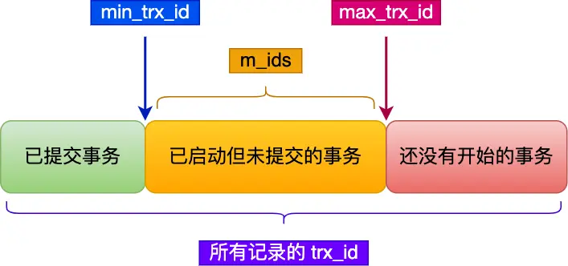

**MVCC（多版本并发控制）**
MVCC（Multi-Version Concurrency Control，多版本并发控制）是一种用于解决数据库中并发事务问题的机制。它通过为每个事务提供数据库中数据的一个快照（Snapshot），允许多个事务同时读取和写入数据，从而实现高效的并发控制和事务隔离。

事务是由 MySQL 的引擎来实现的，我们常见的 InnoDB 引擎它是支持事务的。

不过并不是所有的引擎都能支持事务，比如 MySQL 原生的 MyISAM 引擎就不支持事务，也正是这样，所以大多数 MySQL 的引擎都是用 InnoDB。

事务看起来感觉简单，但是要实现事务必须要遵守 4 个特性，分别如下：

- **原子性（Atomicity）**：一个事务中的所有操作，要么全部完成，要么全部不完成，不会结束在中间某个环节，而且事务在执行过程中发生错误，会被回滚到事务开始前的状态，就像这个事务从来没有执行过一样，就好比买一件商品，购买成功时，则给商家付了钱，商品到手；购买失败时，则商品在商家手中，消费者的钱也没花出去。
- **一致性（Consistency）**：是指事务操作前和操作后，数据满足完整性约束，数据库保持一致性状态。
- **隔离性（Isolation）**：数据库允许多个并发事务同时对其数据进行读写和修改的能力，隔离性可以防止多个事务并发执行时由于交叉执行而导致数据的不一致，因为多个事务同时使用相同的数据时，不会相互干扰，每个事务都有一个完整的数据空间，对其他并发事务是隔离的。也就是说，消费者购买商品这个事务，是不影响其他消费者购买的。
- **持久性（Durability）**：事务处理结束后，对数据的修改就是永久的，即便系统故障也不会丢失。

InnoDB 引擎通过以下技术来保证事务的这四个特性

- 持久性是通过  `redo log` （重做日志）来保证的；
- 原子性是通过 `undo log`（回滚日志） 来保证的；
- 隔离性是通过 `MVCC`（多版本并发控制） 或锁机制来保证的；
- 一致性则是通过持久性+原子性+隔离性来保证；

## 数据库的四种隔离级别

| 隔离级别              | 脏读      | 不可重复读 | 幻读      |
|-----------------------|-----------|------------|-----------|
| **READ UNCOMMITTED**：未提交读 | 可能发生   | 可能发生    | 可能发生   |
| **READ COMMITTED**：已提交读   | 解决       | 可能发生    | 可能发生   |
| **REPEATABLE READ**：可重复读  | 解决       | 解决        | 可能发生   |
| **SERIALIZABLE**：可串行化     | 解决       | 解决        | 解决       |

**为什么没有脏写？**  
四种问题按照严重性排序：脏写 > 脏读 > 不可重复读 > 幻读  
脏写这个问题太严重了，不论是哪种隔离级别，都不允许脏写的情况发生。

SQL 标准提出了四种隔离级别来规避这些现象，隔离级别越高，性能效率就越低，这四个隔离级别如下：

- **读未提交（_read uncommitted_）**，指一个事务还没提交时，它做的变更就能被其他事务看到；
- **读提交（_read committed_）**，指一个事务提交之后，它做的变更才能被其他事务看到；
- **可重复读（_repeatable read_）**，指一个事务执行过程中看到的数据，一直跟这个事务启动时看到的数据是一致的，**MySQL InnoDB 引擎的默认隔离级别**；
- **串行化（_serializable_ ）**；会对记录加上读写锁，在多个事务对这条记录进行读写操作时，如果发生了读写冲突的时候，后访问的事务必须等前一个事务执行完成，才能继续执行；

所以，要解决脏读现象，就要升级到「读提交」以上的隔离级别；要解决不可重复读现象，就要升级到「可重复读」的隔离级别，要解决幻读现象不建议将隔离级别升级到「串行化」。

不同的数据库厂商对 SQL 标准中规定的 4 种隔离级别的支持不一样，有的数据库只实现了其中几种隔离级别，**我们讨论的 MySQL 虽然支持 4 种隔离级别，但是与SQL 标准中规定的各级隔离级别允许发生的现象却有些出入**。

MySQL 在「可重复读」隔离级别下，可以很大程度上避免幻读现象的发生（注意是很大程度避免，并不是彻底避免），所以 MySQL 并不会使用「串行化」隔离级别来避免幻读现象的发生，因为使用「串行化」隔离级别会影响性能。

**MySQL InnoDB 引擎的默认隔离级别虽然是「可重复读」，但是它很大程度上避免幻读现象（并不是完全解决了**。解决的方案有两种：

- 针对**快照读**（普通 select 语句），是**通过 MVCC 方式解决了幻读**，因为可重复读隔离级别下，事务执行过程中看到的数据，一直跟这个事务启动时看到的数据是一致的，即使中途有其他事务插入了一条数据，是查询不出来这条数据的，所以就很好了避免幻读问题。
- 针对**当前读**（select ... for update 等语句），是**通过 next-key lock（记录锁+间隙锁）方式解决了幻读**，因为当执行 select ... for update 语句的时候，会加上 next-key lock，如果有其他事务在 next-key lock 锁范围内插入了一条记录，那么这个插入语句就会被阻塞，无法成功插入，所以就很好了避免幻读问题。

### 隔离级别实现方式
- 对于「读未提交」隔离级别的事务来说，因为可以读到未提交事务修改的数据，所以直接读取最新的数据就好了；
- 对于「串行化」隔离级别的事务来说，通过加读写锁的方式来避免并行访问；
- 对于「读提交」和「可重复读」隔离级别的事务来说，它们是通过 **Read View 来实现的，它们的区别在于创建 Read View 的时机不同，大家可以把 Read View 理解成一个数据快照，就像相机拍照那样，定格某一时刻的风景。**「读提交」隔离级别是在「每个语句执行前」都会重新生成一个 Read View，而「可重复读」隔离级别是「启动事务时」生成一个 Read View，然后整个事务期间都在用这个 Read View**。
## Read View

Read View 主要有以下两部分组成：

- Read View 中四个字段作用；
- 聚簇索引记录中两个跟事务有关的隐藏列；

Read View 有四个重要的字段：

- m_ids ：指的是在创建 Read View 时，当前数据库中「活跃事务」的**事务 id 列表**，注意是一个列表，**“活跃事务”指的就是，启动了但还没提交的事务**。
- min_trx_id ：指的是在创建 Read View 时，当前数据库中「活跃事务」中事务 **id 最小的事务**，也就是 m_ids 的最小值。
- max_trx_id ：这个并不是 m_ids 的最大值，而是**创建 Read View 时当前数据库中应该给下一个事务的 id 值**，也就是全局事务中最大的事务 id 值 + 1；
- creator_trx_id ：指的是**创建该 Read View 的事务的事务 id**。

对于使用 InnoDB 存储引擎的数据库表，它的聚簇索引记录中都包含下面两个隐藏列：

- trx_id，当一个事务对某条聚簇索引记录进行改动时，就会**把该事务的事务 id 记录在 trx_id 隐藏列里**；
- roll_pointer，每次对某条聚簇索引记录进行改动时，都会把旧版本的记录写入到 undo 日志中，然后**这个隐藏列是个指针，指向每一个旧版本记录**，于是就可以通过它找到修改前的记录。
- row_id，行ID，唯一标识一条记录（如果定义主键，它就没有啦）

在创建 Read View 后，我们可以将记录中的 trx_id 划分这三种情况：

一个事务去访问记录的时候，除了自己的更新记录总是可见之外，还有这几种情况：

- 如果记录的 trx_id 值小于 Read View 中的 `min_trx_id` 值，表示这个版本的记录是在创建 Read View **前**已经提交的事务生成的，所以该版本的记录对当前事务**可见**。
- 如果记录的 trx_id 值大于等于 Read View 中的 `max_trx_id` 值，表示这个版本的记录是在创建 Read View **后**才启动的事务生成的，所以该版本的记录对当前事务**不可见**。
- 如果记录的 trx_id 值在 Read View 的 `min_trx_id` 和 `max_trx_id` 之间，需要判断 trx_id 是否在 m_ids 列表中：
    - 如果记录的 trx_id **在** `m_ids` 列表中，表示生成该版本记录的活跃事务依然活跃着（还没提交事务），所以该版本的记录对当前事务**不可见**。
    - 如果记录的 trx_id **不在** `m_ids`列表中，表示生成该版本记录的活跃事务已经被提交，所以该版本的记录对当前事务**可见**。

**这种通过「版本链」来控制并发事务访问同一个记录时的行为就叫 MVCC（多版本并发控制）。**

**对于可重复读**
**可重复读隔离级别是启动事务时生成一个 Read View，然后整个事务期间都在用这个 Read View**。

**对于读已提交**
**读提交隔离级别是在每次读取数据时，都会生成一个新的 Read View**。
