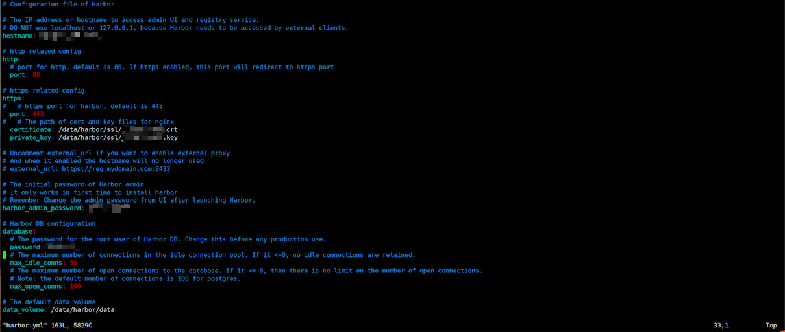

> [yum安装慢的解决方法，修改yum源为阿里云](https://developer.aliyun.com/mirror/centos?spm=a2c6h.13651102.0.0.3e221b1175Oh74)

## 1.Docker安装配置

### 1.1 防火墙配置

禁用防火墙

```sh
systemctl disable firewalld
```

关闭防火墙

```sh
systemctl stop firewalld
```

禁用 SELinux，目的是让容器可以读取主机文件系统

```sh
setenforce 0
```

配置禁用 SELinux,修改 SELINUX 为 disabled

```sh
vi /etc/sysconfig/selinux

SELINUX=disabled 
#SELINUX=enforcing
```

禁用 swap 分区

```sh
#禁用当前的 
swap sudo swapoff -a 
#同时永久禁掉swap分区，打开如下文件注释掉swap那一行 
sudo vi /etc/fstab
```

### 1.2 挂载磁盘

> **挂载磁盘，参考：** [Linux 不重启(动态)挂载磁盘以及简单的数据迁移](https://blog.csdn.net/isea533/article/details/94393429)

一般购买服务器的时候会挂载一个100G以上的硬盘，需要先对硬盘进行格式化和挂载配置，然后修改 docker 配置为该挂载的路径。下面是磁盘的相关操作步骤。

1. 通过 `fdisk -l` 查看系统挂载的磁盘，阿里云中通常第二个磁盘为 `/dev/vdb` ，如果磁盘没有分区和格式化，先进行第 2 步操作。

2. 对磁盘分区，执行 `fdisk /dev/vdb` 进入配置后，输入 `n` ，后续提示全部使用默认设置，最后输入 `w` 写入配置进行保存。

3. 格式化磁盘，使用 `mkfs.ext4 /dev/vdb1` 进行格式化。
4. 输入命令编辑配置文件 `vi /etc/fstab` ，在最后一行添加如下配置：

```sh
/dev/vdb1 			/data ext4 defaults 			1 			2
```

​      手工和上面的配置对齐好看就行。

   5 .挂载目录，在根目录创建 `/data` 目录，然后使用命令 `mount -a`  或 ` mount /dev/vdb1 /data`进行挂载，这种方式重启后会失效，还需继续下一步配置。

6. 接下来就可以使用 `/data` 目录了。

### 1.3 安装docker

在阿里巴巴开源镜像站搜docker-ce。帮助中给了一个地址：

>https://developer.aliyun.com/article/110806

使用官方安装脚本自动安装 （仅适用于公网环境）

```sh
curl -fsSL https://get.docker.com | bash -s docker --mirror Aliyun
```

安装完成后先别着急设置 docker 自动启动和启动服务。没有启动过 docker 的情况下，配置目录还不存在，先创建 `mkdir -p /etc/docker` ，然后在 `/data`下面创建一个 docker 目录（命令： `mkdir /data/docker` ），然后编辑配置文件 `vi /etc/docker/daemon.json` 添加如下配置：

```json
{
	"registry-mirrors": ["https://dockerhub.azk8s.cn", "https://reg-mirror.qiniu.com"],
	"graph": "/data/docker"
}
```

配置好docker 后，可以设置开机启动和启动服务了。

```sh
# 开机启动 
systemctl enable docker 
# 启动服务 
systemctl start docker
```

#### 1.4 docker离线安装

在没有外网连接的特殊环境下安装docker的步骤

> 参考自：https://www.centlinux.com/2019/02/install-docker-ce-on-offline-centos-7-machine.html

首先找到一台有外网的linux服务器运行如下命令

1. Dockerce 需要一些在 EPEL (enterpriselinux 的额外包) yum 存储库中可用的软件包。因此，我们必须首先安装 epelyum 存储库。

   ```sh
   yum install -y epel-release.noarch
   ```

2. 使用yum-config-manager安装 Docker CE yum 存储库

   ```sh
   yum-config-manager --add-repo=https://download.docker.com/linux/centos/docker-ce.repo
   ```

3. 启用 dockerce (Nightly) yum 存储库。

   ```sh
   yum-config-manager --enable docker-ce-nightly
   ```

4. 我们在 Linux 服务器中添加了两个 yum 存储库，因此，我们应该为 yum 包管理器构建缓存。

   ```sh
   yum makecache fast
   ```

5. 下载 Docker CE 和软件依赖

   ```sh
   # 创建一个下载 dockerce 和相关软件包的目录。
   mkdir ~/docker
   cd ~/docker
   # 执行命令下载 dockerce 和依赖包。
   yumdownloader --resolve docker-ce
   # 压缩
   tar cvzf ~/docker.tar.gz *
   ```

6. 将下载的这些包安装在没有外网链接的服务器上

   ```sh
   # 创建文件夹
   mkdir docker
   # 解压缩
   tar xvf docker.tar.gz -C ~/docker
   cd docker
   # 安装并忽略依赖关系
   rpm -ivh --replacefiles --replacepkgs *.rpm
   ```

### 1.5 修改hostname

根据本次安装的集群规模为每台服务器修改为规律的hostname

```sh
hostnamectl set-hostname master1
```


## 2. kubectl下载安装

> 国内直接使用阿里巴巴开源镜像站安装：
>
> https://opsx.alibaba.com/mirror
>
> 从列表找到 kubernetes，点击帮助，显示如下信息。
>
> **重要提示：**
>
> 可以从安裝列表去掉 kubeadm、kubelet，只安装 kubectl

**Debian / Ubuntu**

```sh
apt-get update && apt-get install -y apt-transport-https
curl https://mirrors.aliyun.com/kubernetes/apt/doc/apt-key.gpg | apt-key add -
cat <<EOF >/etc/apt/sources.list.d/kubernetes.list
deb https://mirrors.aliyun.com/kubernetes/apt/ kubernetes-xenial main
EOF
apt-get update
apt-get install -y kubectl
```

**CentOS / RHEL / Fedora**

```sh
cat <<EOF > /etc/yum.repos.d/kubernetes.repo 
[kubernetes] 
name=Kubernetes 
baseurl=https://mirrors.aliyun.com/kubernetes/yum/repos/kubernetes-el7-x86_64/ 
enabled=1 
gpgcheck=1 
repo_gpgcheck=1 
gpgkey=https://mirrors.aliyun.com/kubernetes/yum/doc/yum-key.gpg https://mirrors.aliyun.com/kubernetes/yum/doc/rpm-package-key.gpg 
EOF
```

> 如果需要离线安装的话,则在在线环境安装之后将可执行的二进制`kubectl`文件复制出来即可
>
> ```sh
> # 查找文件位置，找到后复制出来
> find / -name "kubectl"
> ```

## 3. rke下载安装

**下载RKE二进制文件**在您的工作站上，打开Web浏览器并导航到我们的[RKE版本页面](https://github.com/rancher/rke/releases/tag/v1.2.4)。下载适用于您的操作系统和体系结构的最新RKE安装程序：

- MacOS：rke_darwin-amd64
- Linux（Intel / AMD）：rke_linux-amd64
- Linux（ARM 32位）：rke_linux-arm
- Linux（ARM 64位）：rke_linux-arm64
- Windows（32位）：rke_windows-386.exe
- Windows（64位）：rke_windows-amd64.exe 

将RKE二进制文件复制到您的文件夹中 $PATH 并重命名 rke（或 rke.exe 用于 Windows）。

```sh
# MacOS 
$ mv rke_darwin-amd64 rke 
# 增加可执行权限 
$ chmod +x rke 

# Linux 
$ mv rke_linux-amd64 rke 
# 增加可执行权限 
$ chmod +x rke 

# Windows PowerShell 
> mv rke_windows-amd64.exe rke.exe

# 验证安装：
$ rke --version 
# 输出类似下面版本信息 rke version v1.0.5
```

## 4. helm3 下载安装

> 官方文档：[Installing Helm](https://helm.sh/docs/intro/install/)

针对 Linux 系统，使用下面的命令进行安装：

```sh
$ curl -fsSL -o get_helm.sh https://raw.githubusercontent.com/helm/helm/master/scripts/get-helm-3
$ chmod 700 get_helm.sh
$ ./get_helm.sh
```

## 5. ssh-key各个节点的配置

假设分别为 NODE1, NODE2, NODE3 3个节点。使用的 *root* 账号生成ssh-key。

```sh
$ ssh-keygen -t rsa 
# 之后会有一些默认选项和可以手工配置的选项，可以自行配制，或者一直回车用默认值 
# 执行完成后，会生成两个文件 
Your identification has been saved in /root/.ssh/id_rsa. 
Your public key has been saved in /root/.ssh/id_rsa.pub.
```

查看 `id_rsa.pub` 文件，**复制文件内容**。在每个节点上，切换到rancher用户，然后执行如下命令

```sh
# 创建 rancher 用户
$ useradd rancher
# 添加到 docker 组
$ usermod -aG docker rancher

# 切换到前面创建的用户
$ su rancher
# 进入自己的 home 目录
$ cd ~
# 创建 .ssh 目录
$ mkdir .ssh

# 写入NODE1的root用户的公钥
$ echo "复制的内容" >> .ssh/authorized_keys
# 设置权限
$ chmod 700 .ssh
$ chmod 644 .ssh/authorized_key

# 配置后可以在 NODE1 测试
# 连接成功后通过 exit 退出
$ ssh rancher@NODE2 
```

> **特别注意！**
>
> 两个潜在的坑，ssh配置authorized_keys后仍然需要输入密码的问题
>
> 1. 注意 $HOME/.ssh 目录 或 $HOME目录的权限 最好是700，我就在这里栽跟头了。
>
> 2. 注意 uthorized_keys 的权限 chmod 644 authorized_keys 这个也是要注意的。

## 6.  rke 配置集群

### 6.1 rke配置离线集群

在离线环境当中安装集群时，要求您使用一个 Linux 工作站，它可以访问互联网和您的私有镜像库。请确保至少有 20GB 的磁盘空间可用。如果要使用 ARM64 主机，则镜像仓库必须支持 Docker Manifest。截至 2020 年 4 月，Amazon Elastic Container Registry 不支持 Docker Manifest 功能。

> #### 查找您用的 Rancher 版本所需要的资源
>
> 1. 浏览我们的[版本发布页面](https://github.com/rancher/rancher/releases)，查找您想安装的 Rancher v2.x.x 版本。不要下载标记为 `rc` 或 `Pre-release` 的版本，因为它们在生产环境下是不稳定的。
>
> 2. 从发行版 **Assets** 部分下载以下文件，这些文件是离线环境下安装 Rancher 所必需的：
>
>    | Release 文件             | 描述                                                         |
>    | ------------------------ | ------------------------------------------------------------ |
>    | `rancher-images.txt`     | 此文件包含安装 Rancher、创建集群和运行 Rancher 工具所需的镜像列表。 |
>    | `rancher-save-images.sh` | 这个脚本会从 DockerHub 中拉取在文件`rancher-images.txt`中描述的所有镜像，并将它们保存为文件`rancher-images.tar.gz`。 |
>    | `rancher-load-images.sh` | 这个脚本会载入文件`rancher-images.tar.gz`中的镜像，并将它们推送到您自己的私有镜像库。 |
>
> #### 收集 cert-manager 镜像
>
> 如果您使用自己的证书，或者要在外部负载均衡器上终止 TLS，请跳过此步骤。
>
> 在安装高可用过程中，如果选择使用 Rancher 默认的自签名 TLS 证书，则还必须将 [`cert-manager`](https://hub.helm.sh/charts/jetstack/cert-manager) 镜像添加到 `rancher-images.txt` 文件中。如果使用自己的证书，则跳过此步骤。
>
> 1. 获取最新的`cert-manager` Helm chart，解析模板,获取镜像详细信息：
>
>    > **注意：** 由于`cert-manager`最近的改动，您需要升级`cert-manager`版本。如果您要升级 Rancher 并且使用`cert-manager`的版本低于 v0.12.0，请看我们的[升级文档](https://docs.rancher.cn/docs/rancher2/installation_new/options/upgrading-cert-manager/_index)。
>
>    ```sh
>    helm repo add jetstack https://charts.jetstack.io
>    helm repo update
>    helm fetch jetstack/cert-manager --version v0.12.0
>    helm template ./cert-manager-<version>.tgz | grep -oP '(?<=image: ").*(?=")' >> ./rancher-images.txt
>    ```
>
> 2. 对镜像列表进行排序和唯一化，去除重复的镜像源：
>
>    ```sh
>    sort -u rancher-images.txt -o rancher-images.txt
>    ```
>
> #### 将镜像保存到您的工作站中
>
> 1. 为`rancher-save-images.sh` 文件添加可执行权限：
>
>    ```sh
>    chmod +x rancher-save-images.sh
>    ```
>
> 2. 执行脚本`rancher-save-images.sh`并以`--image-list ./rancher-images.txt` 作为参数，创建所有需要镜像的压缩包：
>
>    ```sh
>    ./rancher-save-images.sh --image-list ./rancher-images.txt
>    ```
>
>    **结果：** Docker 会开始拉取用于离线安装所需的镜像。这个过程会花费几分钟时间。完成时，您的当前目录会输出名为`rancher-images.tar.gz`的压缩包。请确认输出文件是否存在。
>
> #### 推送镜像到私有镜像库
>
> 下一步，您将使用脚本将文件 `rancher-images.tar.gz` 中的镜像上传到您自己的私有镜像库。
>
> 文件 `rancher-images.txt` 和 `rancher-images.tar.gz` 应该位于工作站中运行 `rancher-load-images.sh` 脚本的同一目录下。
>
> 1. 登录私有镜像库：
>
>    ```sh
>    docker login <REGISTRY.YOURDOMAIN.COM:PORT>
>    ```
>
> 2. 为 `rancher-load-images.sh` 添加可执行权限：
>
>    ```sh
>    chmod +x rancher-load-images.sh
>    ```
>
> 3. 使用脚本 `rancher-load-images.sh`提取`rancher-images.tar.gz`文件中的镜像，根据文件`rancher-images.txt`中的镜像列表对提取的镜像文件重新打 tag 并推送到您的私有镜像库：
>
>    ```sh
>    ./rancher-load-images.sh --image-list ./rancher-images.txt --registry <REGISTRY.YOURDOMAIN.COM:PORT>	
>    ```
>
>  参考自[官方文档](https://docs.rancher.cn/docs/rancher2/installation_new/other-installation-methods/air-gap/prepare-nodes/_index)

参考下面的示例创建rancher-cluster.yml文件，替换 nodes 3个节点的配置信息。

```yml
nodes:
 - address: 192.168.0.28
   user: rancher
   role: [controlplane,worker,etcd]
 - address: 192.168.0.30
   user: rancher
   role: [worker,etcd]
 - address: 192.168.0.26
   user: rancher
   role: [worker,etcd]
services:
 etcd:
  snapshot: true
  creation: 6h
  retention: 24h
 kube-controller:
    # CIDR pool used to assign IP addresses to pods in the cluster
    cluster_cidr: 10.90.0.0/16
# 如果有私有的镜像仓库则可选该配置
private_registries:
  - url: <REGISTRY.YOURDOMAIN.COM:PORT> # 私有镜像库地址
    user: rancher
    password: "*********"
    is_default: true
```

> **常见的RKE节点选项**
>
> | **Option**       | **Required** | **Description**                                             |
> | ---------------- | ------------ | ----------------------------------------------------------- |
> | `address`        | yes          | 公共DNS或IP地址                                             |
> | `user`           | yes          | 可以运行docker命令的用户                                    |
> | `role`           | yes          | 分配给节点的Kubernetes角色列表                              |
> | internal_address | no           | 内部集群流量的私有DNS或IP地址                               |
> | ssh_key_path     | no           | 用于对节点进行身份验证的SSH私钥的路径（默认`~/.ssh/id_rsa`) |
>
> **高级配置**
>
> RKE有许多配置选项可用于自定义安装以适合您的特定环境。
>
> 有关选项和功能的完整列表，请参阅[RKE文档](https://rancher.com/docs/rke/latest/en/config-options/)。
>
> 要为**更大**的Rancher安装调整您的etcd集群，请参阅[etcd设置指南](https://rancher.com/docs/rancher/v2.x/en/installation/resources/advanced/etcd/)。
>
> **特别注意**：如果使用了阿里云等公有云环境时，确保主机之间端口能够互相访问，例如在阿里云
>
> 配置：
>
> 

根据自己的配置修改保存好` rancher-cluster.yml` 后，执行下面的命令：

```sh
rke up --config ./rancher-cluster.yml
```

该命令根据网速等多种情况，需要等待很久。这期间输出的部分日志如下：

```sh
[root@localhost ~]# rke up --config ./rancher-cluster.yml
INFO[0000] Initiating Kubernetes cluster
INFO[0000] [certificates] Generating admin certificates and kubeconfig
INFO[0000] Successfully Deployed state file at [./rancher-cluster.rkestate]
INFO[0000] Building Kubernetes cluster
INFO[0000] [dialer] Setup tunnel for host [192.168.0.1]
INFO[0000] [dialer] Setup tunnel for host [192.168.0.2]
INFO[0000] [dialer] Setup tunnel for host [192.168.0.3]
INFO[0000] [network] Deploying port listener containers
INFO[0000] [network] Pulling image [rancher/rke-tools:v0.1.34] on host
[10.10.1.238]
INFO[0000] [network] Pulling image [rancher/rke-tools:v0.1.34] on host
[10.10.1.241]
INFO[0000] [network] Pulling image [rancher/rke-tools:v0.1.34] on host
[10.10.1.242]
INFO[0030] [network] Successfully pulled image [rancher/rke-tools:v0.1.34]
on host [10.10.1.241]
```

集群创建成功后，在当前目录下面有以下文件：

```sh
-rw-r----- 1 root root 5382 Aug 1 16:17 kube_config_rancher-cluster.yml
-rw-r----- 1 root root 114422 Aug 1 16:18 rancher-cluster.rkestate
-rw-r--r-- 1 root root 423 Aug 1 15:50 rancher-cluster.yml
```

RKE 自动创建了一个 `kube_config_rancher-cluster.yml` ，这个文件有 `kubectl` 和 `helm` 的凭据。

> ### 保存您的文件
>
> **重要** 以下文件需要被维护，用来故障排查和升级集群。
>
> 将以下文件的副本保存在安全的位置：
>
> - `rancher-cluster.yml`：RKE 配置文件
> - `kube_config_rancher-cluster.yml`：[Kubeconfig 文件](https://docs.rancher.cn/docs/rke/kubeconfig/_index)
> - `rancher-cluster.rkestate`：[Kubernetes 集群状态文件](https://docs.rancher.cn/docs/rke/installation/_index)
>
> **注意：** 后两个文件名的“rancher-cluster”部分取决于您如何命名 RKE 集群的配置文件。

将` kube_config_rancher-cluster.yml` 复制到` $HOME/.kube/config` ，如果想在其他节点通过`kubectl `访问集群，将该文件复制到其他节点的相同路径下。
现在可以通过 `kubectl `来查看当前的节点状态：

```sh
$ kubectl get nodes
NAME STATUS ROLES AGE VERSION
192.168.0.1 Ready controlplane,etcd,worker 16m v1.14.3
192.168.0.2 Ready worker 16m v1.14.3
192.168.0.3 Ready worker 16m v1.14.3
```

## 7.helm安装rancher

> 参考文档：[helm-rancher](https://rancher.com/docs/rancher/v2.x/en/installation/k8s-install/helm-rancher/)
>
> 离线安装参考[文档](https://docs.rancher.cn/docs/rancher2/installation_new/other-installation-methods/air-gap/install-rancher/_index)

### 7.1 添加稳定版Helm Chart仓库

```sh
helm repo add rancher-stable https://releases.rancher.com/server-charts/stable
```

**如果为离线环境安装的话则参考以下步骤执行：**

从可以访问 Internet 的系统中，获取最新的 Rancher Helm Chart，然后将内容复制到可以访问 Rancher Server 集群的系统中。

1. 如果您还没有在有互联网访问的系统上安装`helm`。注意：请参考[Helm 版本要求](https://docs.rancher.cn/docs/rancher2/installation_new/options/helm-version/_index)来选择一个 Helm 版本来安装 Rancher。

2. 使用`helm repo add`来添加仓库，不同的地址适应不同的 Rancher 版本，请替换命令中的`<CHART_REPO>`，替换为`latest`，`stable`或`alpha`。更多信息请参考[如何选择 Rancher 版本](https://docs.rancher.cn/docs/rancher2/installation_new/options/server-tags/_index)。

   - `latest`： 最新版，建议在尝试新功能时使用。
   - `stable`：稳定版，建议生产环境中使用。
   - `alpha`：预览版， 未来版本的实验性预览。

   ```sh
   helm repo add rancher-<CHART_REPO> https://releases.rancher.com/server-charts/<CHART_REPO>
   ```

3. 获取最新的 Rancher Chart，您会看到对应的 tgz 文件下载到本地。

   ```sh
   helm fetch rancher-<CHART_REPO>/rancher
   ```

### 7.2 为Rancher创建名称空间

我们需要定义一个名称空间，应在该名称空间中安装由Chart创建的资源。这应该始终是`cattle-system`

```sh
kubectl create namespace cattle-system
```

### 7.3 选择您的SSL配置

Rancher Server 在默认情况下被设计为安全的，并且需要 SSL/TLS 配置。

当在离线环境的 Kubernetes 中安装 Rancher 时，推荐两种证书生成方式。

> **注意：**如果要在外部终止 SSL/TLS，请参阅[在外部负载均衡器上终止 TLS](https://docs.rancher.cn/docs/rancher2/installation_new/options/chart-options/_index)。

| 设置                     | Chart 选项                   | 描述                                                         | 是否需要 cert-manager？ |
| ------------------------ | ---------------------------- | ------------------------------------------------------------ | ----------------------- |
| Rancher 生成的自签名证书 | `ingress.tls.source=rancher` | 使用 Rancher 生成的 CA 签发的自签名证书 此项为**默认选项**。在渲染 Rancher Helm 模板时不需要传递此项。 | 是                      |
| 已有的证书               | `ingress.tls.source=secret`  | 通过创建 Kubernetes Secret（s）使用您已有的证书文件。 渲染 Rancher Helm 模板时必须传递此选项。 | 否                      |

> 重要
>
> Rancher 中国技术支持团队建议您使用“您已有的证书” `ingress.tls.source=secret` 这种方式，从而减少对 cert-manager 的运维成本。

**选择 CA 颁发的可靠证书。**

根据您自己的证书创建Kubernetes secrent，以供Rancher使用。

```
kubectl -n cattle-system create secret tls tls-rancher-ingress \
--cert=tls.crt \
--key=tls.key
```

> 大部分情况下会使用自生成的证书，自生成证书的步骤参考https://blog.csdn.net/isea533/article/details/106397248。
>
> **注意证书相关文件的名称只能是固定的`tls` 和`cacerts`**
>
> **`.crt` 和 `.pem` 的转换只需要修改后缀名称即可**。参考https://stackoverflow.com/questions/991758/how-to-get-pem-file-from-key-and-crt-files

**使用自生成的证书创建Kubernetes secrent**

> 参考 https://rancher.com/docs/rancher/v2.x/en/installation/resources/tls-secrets/

```sh
# 使用自己生成的证书。将泛域名证书的名称修改为tls
kubectl -n cattle-system create secret tls tls-rancher-ingress \
  --cert=tls.crt \
  --key=tls.key

# 将之前生成的 ca.crt 修改为 cacerts.pem
kubectl -n cattle-system create secret generic tls-ca \
  --from-file=cacerts.pem=./cacerts.pem
```

### 7.4 安装rancher

**在线环境直接运行以下命令即可**

```sh
helm install rancher rancher-stable/rancher \
--namespace cattle-system \
--set hostname=rancher.my.org \
--set ingress.tls.source=secret

# 使用自生成证书则使用以下命令
helm install rancher rancher-stable/rancher \
  --namespace cattle-system \
  --set hostname=lims-rancher.sh-tec.com \
  --set ingress.tls.source=secret \
  --set privateCA=true
```

#### 7.4.1 **离线环境安装步骤**

**渲染您的 Rancher Helm 模板**

设置 Rancher Helm 模板时，Chart 中有几个选项是专门为离线安装设计的。

| Chart 选项              | 值                               | 描述                                                         |
| ----------------------- | -------------------------------- | ------------------------------------------------------------ |
| `certmanager.version`   | ""                               | 根据运行的 cert-manager 版本配置适当的 Rancher TLS 颁发者。  |
| `systemDefaultRegistry` | `<REGISTRY.YOURDOMAIN.COM:PORT>` | 配置 Rancher，在创建集群时，Rancher Server 始终从私有镜像仓库中拉取镜像 |
| `useBundledSystemChart` | `true`                           | 配置 Rancher Server 使用内置的 system-chart，[system-chart](https://github.com/rancher/system-charts)中包含监控，日志，告警和全局 DNS 等功能所需的 Chart。这些 [Helm charts](https://github.com/rancher/system-charts) 位于 GitHub 中，但是由于您处于离线环境中，因此使用 Rancher 中内置的 Chart 比设置一个 Git 镜像简单得多。当然您也可以选择自己手动镜像 GitHub 中的 Rancher System Chart。*自 v2.3.0 起可用* |

**使用已有的证书**

根据您已有的证书创建 Kubernetes 密文，以供 Rancher 使用。证书的`common name`将需要与以下命令中的`hostname`选项匹配，否则 ingress controller 将无法为 Rancher 设置入口。

设置 Rancher 模板，声明您选择的选项。使用下面表中的参考选项，需要给 Rancher 配置使用私有镜像库。

| 占位符                           | 描述                 |
| -------------------------------- | -------------------- |
| `<VERSION>`                      | Rancher 版本         |
| `<RANCHER.YOURDOMAIN.COM>`       | 负载均衡器对应的 DNS |
| `<REGISTRY.YOURDOMAIN.COM:PORT>` | 私有镜像库对应的 DNS |

```sh
 helm template rancher ./rancher-<VERSION>.tgz --output-dir . \
    --namespace cattle-system \
    --set hostname=<RANCHER.YOURDOMAIN.COM> \
    --set rancherImage=<REGISTRY.YOURDOMAIN.COM:PORT>/rancher/rancher \
    --set ingress.tls.source=secret \
    --set systemDefaultRegistry=<REGISTRY.YOURDOMAIN.COM:PORT> \ # 自v2.2.0可用，设置默认的系统镜像仓库
    --set useBundledSystemChart=true # 自v2.3.0可用，使用内嵌的 Rancher system charts
```

如果您使用的是由私有 CA 签名的证书，则在`--set ingress.tls.source=secret`之后添加`--set privateCA=true`：

```sh
helm template rancher ./rancher-<VERSION>.tgz --output-dir . \
    --namespace cattle-system \
    --set hostname=<RANCHER.YOURDOMAIN.COM> \
    --set rancherImage=<REGISTRY.YOURDOMAIN.COM:PORT>/rancher/rancher \
    --set ingress.tls.source=secret \
    --set privateCA=true \
    --set systemDefaultRegistry=<REGISTRY.YOURDOMAIN.COM:PORT> \ # 自v2.2.0可用，设置默认的系统镜像仓库
    --set useBundledSystemChart=true # 自v2.3.0可用，使用内嵌的 Rancher system charts
# example
helm template rancher ./rancher-2.4.4.tgz --output-dir . \
    --namespace cattle-system \
    --set hostname=rancher.wx.com \
    --set ingress.tls.source=secret \
    --set privateCA=true \
    --set useBundledSystemChart=true
```

**可选**：要安装指定的 Rancher 版本，请设置`rancherImageTag`的值，例如：`--set rancherImageTag = v2.3.6`

然后请参考[添加 TLS 密文](https://docs.rancher.cn/docs/rancher2/installation_new/options/tls-secrets/_index)发布证书文件，以便 Rancher 和 ingress controller 可以使用它们。

安装rancher

```sh
kubectl -n cattle-system apply -R -f ./rancher
```

**验证 Rancher Server 是否已成功部署**

```sh
# 检查 Rancher Server 是否运行成功：
kubectl -n cattle-system rollout status deploy/rancher
Waiting for deployment "rancher" rollout to finish: 0 of 3 updated replicas are available...
deployment "rancher" successfully rolled out
```

> ```sh
> # 重置rancher密码
> kubectl --kubeconfig kube_config_rancher-cluster.yml -n cattle-system exec $(kubectl --kubeconfig kube_config_rancher-cluster.yml -n cattle-system get pods -l app=rancher | grep '1/1' | head -1 | awk '{   print $1 }') -- reset-password
> ```

# harbor安装

harbor系统需求docker 17.06.0-ce+、docker-compose 1.18.0+。docker-compose为二进制可执行文件

> docker-compose安装参考[官方文档](https://docs.docker.com/compose/install/)
>
> ```sh
> sudo curl -L "https://github.com/docker/compose/releases/download/1.27.4/docker-compose-$(uname -s)-$(uname -m)" -o /usr/local/bin/docker-compose
> # 添加可执行权限
> sudo chmod +x /usr/local/bin/docker-compose
> ```

harbor安装参照官方github[release](https://github.com/goharbor/harbor/releases)页面下载最新的安装包

harbor配置文件参考



参考官方[文档](https://goharbor.io/docs/2.0.0/install-config/quick-install-script/)

关于Harbor https 私有证书配置注意事项 https://blog.csdn.net/isea533/article/details/102872633

自生成证书的步骤参考https://blog.csdn.net/isea533/article/details/106397248。

`.crt` he `.pem` 的转换只需要修改后缀名称即可。参考https://stackoverflow.com/questions/991758/how-to-get-pem-file-from-key-and-crt-files

**注意，安装方式解决harbor不会自启动的问题参考https://www.cnblogs.com/kirito-c/p/11145881.html**